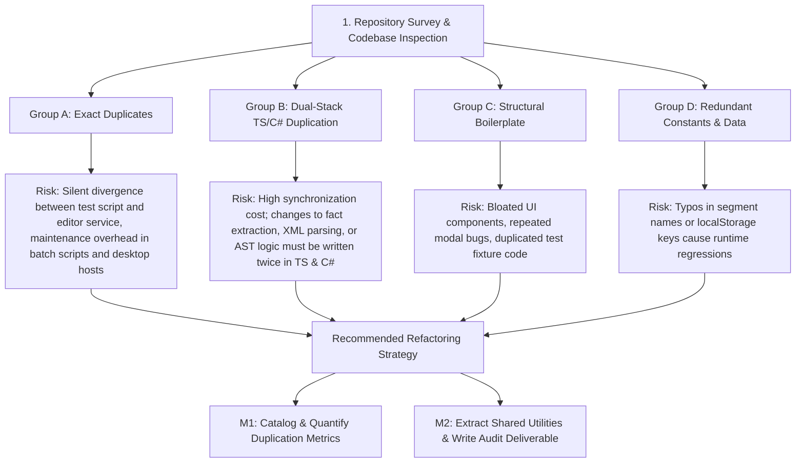

# Codebase Survey & Duplication Hotspots Audit Report

**Explorer**: Explorer 1  
**Working Directory**: `.agents/explorer_survey_1`  
**Date**: 2026-08-28  
**Milestone**: M0 — Codebase Survey & Scope Mapping  

---

## 1. Observation

A comprehensive inspection of the entire repository structure, file tree, source code, scripts, tests, assets, and configuration files was conducted. The repository is a dual-stack (.NET 10 Windows Desktop + React / Vite / TypeScript) engineering verification application for Air Handling Units (AHUs).

### 1.1 Repository Architecture & Tech Stack Inventory

| Component / Subsystem | Primary Tech Stack | Entry Points / Core Files | Location / Path | Purpose & Responsibilities |
|-----------------------|--------------------|---------------------------|-----------------|-----------------------------|
| **Core Verification Engine (Backend)** | C# / .NET 10 Library | `NormalizedXmlParser.cs`<br/>`FactExtractor.cs`<br/>`AstRuleEvaluator.cs`<br/>`RulePackManager.cs`<br/>`OpenXmlTemplatePatcher.cs`<br/>`DvlProjectManager.cs` | `src/backend/AHUVerification.Core/` | Domain models, XML parsing, provenance-aware fact extraction, JSON-AST rule evaluation, OpenXML workbook synthesis, `.dvl` project lifecycle. |
| **Main Desktop App Host** | C# WinForms + WebView2 | `Program.cs`<br/>`MainForm.cs`<br/>`BridgeHandler.cs` | `src/backend/AHUVerification.App/` | Native Windows desktop wrapper hosting the primary React UI via Edge WebView2, typed IPC bridge. |
| **Rule & Logic Editor Studio Host** | C# WinForms + WebView2 | `Program.cs`<br/>`MainForm.cs`<br/>`RuleEditorBridgeHandler.cs` | `src/backend/AHUVerification.RuleEditor/` | Standalone desktop studio host for engineering leads to manage rules, test predicates, and publish release rule packs. |
| **Verification SPA UI (Frontend)** | TypeScript, React 18, Vite, Tailwind CSS, Lucide | `index.html`<br/>`src/main.tsx`<br/>`src/App.tsx`<br/>`src/components/` | `src/`, `src/components/` | Detailer-facing desktop UI: General Unit specs, Skid breakdown, Special Quotes (SQ), Fact Resolution Center, Pre-flight audit. |
| **Rule Editor SPA UI (Studio Frontend)** | TypeScript, React 18, Vite, Tailwind CSS | `rule-editor.html`<br/>`src/ruleEditor/main.tsx`<br/>`src/ruleEditor/RuleEditorApp.tsx`<br/>`src/ruleEditor/components/` | `src/ruleEditor/` | Rule authoring studio: visual AST tree builder, fact dictionary, live simulation sandbox, semantic version publisher. |
| **Frontend Web Services & Fallbacks** | TypeScript | `xmlParser.ts`<br/>`factRegistry.ts`<br/>`ruleEvaluator.ts`<br/>`manualUnitFactory.ts`<br/>`projectStorage.ts`<br/>`desktopBridge.ts`<br/>`excelExporter.ts` | `src/services/` | Browser-compatible client implementations of XML ingestion, fact registry, AST evaluation, manual unit synthesis, and export. |
| **Rule Pack Assets & Schemas** | JSON, OpenXML Excel Template | `manifest.json`<br/>`rules.json`<br/>`template_map.json`<br/>`approved_mappings.json`<br/>`template.xlsx` | `resources/rulepack/` | Immutable declarative rule bundle with canonical LF-normalized SHA-256 integrity verification. |
| **Automated Test Suite** | C# xUnit, Coverlet | `AstEvaluatorTests.cs`<br/>`DvlProjectTests.cs`<br/>`FactRegistryTests.cs`<br/>`OpenXmlPatcherTests.cs`<br/>`RulePackManagerTests.cs`<br/>`TestPathHelper.cs`<br/>`UpzExtractorTests.cs`<br/>`XmlParserTests.cs` | `tests/AHUVerification.Tests/` | 100% automated test coverage of XML parsing, fact extraction, AST evaluation, OpenXML patching, and `.dvl` persistence. |
| **Build & Automation Scripts** | Node.js (ESM), Windows Batch (`.bat`) | `build_rulepack.mjs`<br/>`test_ast_converter.mjs`<br/>`build-all.bat`<br/>`launch-app.bat`<br/>`publish-release.bat`<br/>`run-tests.bat`<br/>`setup.bat` | Root & `scripts/` | End-to-end multi-target builds, release packaging, rulepack verification, and dev server orchestration. |

---

### 1.2 Direct Duplication Hotspot Observations

#### Hotspot A: Exact Copy-Pasted Code Blocks
1. **AST Converter Duplicate**:
   - `scripts/test_ast_converter.mjs` (lines 3–150) contains a direct copy-paste of `src/ruleEditor/services/astConverter.ts` (lines 12–160), reproducing `leafToAst`, `subGroupToAst`, `visualTreeToAst`, `astToVisualTree`, `parseLeaf`, and `findSubGroups` verbatim.
2. **Bridge Request/Response DTOs**:
   - `src/backend/AHUVerification.App/Bridge/BridgeHandler.cs` (lines 15–40) and `src/backend/AHUVerification.RuleEditor/Bridge/RuleEditorBridgeHandler.cs` (lines 14–39) contain identical class definitions for `BridgeRequest` and `BridgeResponse` with identical `[JsonPropertyName]` attributes.
3. **MainForm IPC Handling & Repo Root Finder**:
   - `src/backend/AHUVerification.App/MainForm.cs` (lines 121–178) and `src/backend/AHUVerification.RuleEditor/MainForm.cs` (lines 104–161) share 58 lines of identical code implementing `CoreWebView2_WebMessageReceived`, `IsDevServerRunningAsync`, and `FindRepoRoot`.
4. **Repository Root Traversal Logic**:
   - `FindRepoRoot()` in `AHUVerification.App/MainForm.cs` (lines 163–176), `AHUVerification.RuleEditor/MainForm.cs` (lines 146–159), and `TestPathHelper.cs` (lines 16–33) duplicate the identical 10-level upward folder search algorithm.
5. **.NET SDK Discovery & Environment Check Boilerplate**:
   - The identical 22-line block locating 64-bit `dotnet.exe` via `%ProgramW6432%` / `%ProgramFiles%` and checking `dotnet --version` is copy-pasted across 7 root batch scripts (`build-all.bat` lines 10–32, `build-backend.bat` lines 10–32, `launch-app.bat` lines 10–32, `launch-rule-editor.bat` lines 10–32, `run-tests.bat` lines 10–32, `publish-release.bat` lines 10–32, `setup.bat` lines 10–32).
6. **Frontend Build Check in Launch Scripts**:
   - `launch-app.bat` (lines 34–54) and `launch-rule-editor.bat` (lines 34–54) copy-paste identical logic checking for built UI assets in `dist\`, checking `npm`, running `npm install`, and invoking `npm run build`.

#### Hotspot B: Dual-Stack Cross-Language Duplication (TypeScript <-> C#)
1. **XML Parsing Pipeline**:
   - `src/services/xmlParser.ts` (748 lines) vs `src/backend/AHUVerification.Core/Parsers/NormalizedXmlParser.cs` (740 lines).
   - *Details*: Both parse the exact same 30+ XML sub-elements (`unitOptions`, `dimensions`, `segments`, `doors`, `dampers`, `floorDrains`, `ductOpenings`, `fans`, `coils`, `filters`, `heatWheels`, `surfaces`), using identical tag extraction semantics and default values.
2. **Fact Registry & Extraction Logic**:
   - `src/services/factRegistry.ts` (695 lines) vs `src/backend/AHUVerification.Core/Services/FactExtractor.cs` (806 lines).
   - *Details*: Both extract 50+ domain facts across Order & Identity, Baserail & Skid, Housing & Materials, Opening Schedule, Components, and Ratings. Both maintain identical derivation formulas (`unit.isTiered`, `unit.isStacked`, `unit.thermalBreak`, `unit.shellType`), status transitions (`Known`, `Derived`, `Unknown`, `ManuallyOverridden`), confidence levels (`Authoritative`, `RequiresConfirmation`), and override history data structures.
3. **AST Rule Evaluator**:
   - `src/services/ruleEvaluator.ts` (296 lines) vs `src/backend/AHUVerification.Core/Services/AstRuleEvaluator.cs` (414 lines).
   - *Details*: Identical AST evaluation logic for comparison operators (`>=`, `<=`, `>`, `<`, `===`, `!==`, `includes`, `in`), logical combinators (`and`, `or`), variable resolution (`{ var: string }`), and `NeedsInput` short-circuiting on unconfirmed required facts.
4. **Project File Model & Integrity Verification**:
   - `src/services/projectStorage.ts` (118 lines) vs `src/backend/AHUVerification.Core/Services/DvlProjectManager.cs` (143 lines).
   - *Details*: Identical `.dvl` project envelope schema (`formatVersion`, `appVersion`, `createdAt`, `lastSavedAt`, `author`, `jobName`, `comNumber`, `rulePack`, `sourceXml`, `normalizedGraph`, `factRegistry`, `sqItems`, `checklistInstances`, `generalComments`), SHA-256 validation regex (`^[a-f0-9]{64}$`), and payload integrity checks.
5. **Rule Pack Hashing & Manifest Serialization**:
   - `scripts/build_rulepack.mjs` (143 lines), `src/backend/AHUVerification.Core/Services/RulePackManager.cs` (367 lines), and `src/ruleEditor/components/PublishModal.tsx` (324 lines).
   - *Details*: Parallel implementations of LF-normalized canonical JSON hashing and ordered bundle SHA-256 calculation over `rules.json`, `template_map.json`, `approved_mappings.json`, and `template.xlsx`.

#### Hotspot C: Structural & Boilerplate Duplication in Frontend Components
1. **Modal Container & Header Boilerplate**:
   - `ComNumberModal.tsx` (107 lines), `DetailerNameModal.tsx` (129 lines), `ProjectIdentityModal.tsx` (211 lines), `ResolutionCenterModal.tsx` (239 lines), `PreFlightModal.tsx` (229 lines), `SettingsModal.tsx` (489 lines).
   - *Details*: Every modal implements identical overlay styling (`fixed inset-0 z-50 flex items-center justify-center p-4 bg-black/60 dark:bg-black/75 backdrop-blur-sm`), card wrapper (`bg-white dark:bg-slate-900 border border-slate-200 dark:border-slate-700 rounded-2xl shadow-2xl`), header layout (icon badge, title, subtitle, X close button), and escape key listeners.
2. **Project Identity Sub-Modals**:
   - `ComNumberModal.tsx` and `DetailerNameModal.tsx` are strict functional subsets of `ProjectIdentityModal.tsx`. All three independently manage and mutate `unit.jobName`, `unit.comNumber`, `unit.detailer`, and local storage key `'dvl_detailer_name'`.
3. **Metric Summary Grid Cards**:
   - `PublishModal.tsx` (lines 91–108) and `PreFlightModal.tsx` (lines 95–118) duplicate the 4-column metric grid card UI pattern with colored numeric totals and sub-labels.
4. **C# Unit Test Setup Scaffolding**:
   - `AstEvaluatorTests.cs` (lines 15–27), `DvlProjectTests.cs` (lines 15–27), `FactRegistryTests.cs` (lines 14–19 & 51–56), `OpenXmlPatcherTests.cs` (lines 22–35) duplicate the identical 13-line test fixture setup loading `Config.xml`, instantiating `NormalizedXmlParser`, `FactExtractor`, `RulePackManager`, and `AstRuleEvaluator`.

#### Hotspot D: Redundant Data, Catalogs & Constant Tables
1. **Segment Names & Type Codes Catalog**:
   - `SEGMENT_NAMES` in `src/services/xmlParser.ts` (lines 22–61)
   - `SegmentNames` in `src/backend/AHUVerification.Core/Parsers/NormalizedXmlParser.cs` (lines 12–50)
   - `AVAILABLE_SEGMENT_TEMPLATES` in `src/services/manualUnitFactory.ts` (lines 86–350)
   - `SEGMENT_COLORS` in `src/components/SkidViewTab.tsx` (lines 39–77)
   - `resources/rulepack/approved_mappings.json`
2. **Fact Field Definitions & Metadata**:
   - `FACT_DICTIONARY` in `src/ruleEditor/components/FactDictionaryCatalog.ts` (517 lines)
   - `extractFactsFromGraph` in `src/services/factRegistry.ts` (695 lines)
   - `ExtractFacts` in `src/backend/AHUVerification.Core/Services/FactExtractor.cs` (806 lines)
3. **Category Sheets Coordinate List**:
   - `AllCategorySheets` in `OpenXmlTemplatePatcher.cs` (lines 14–16)
   - Category sheet names in `excelExporter.ts`
   - `template_map.json` (`sheetNames`)
4. **Scattered Magic LocalStorage String Keys**:
   - `'dvl_detailer_name'`, `'dvl_shared_export_path'`, `'dvl_central_rulepack_path'`, `'dvl_auto_sync_rulepack'`, `'ahu_dvl_autosave'` referenced across 6 different component and service files without a single shared constants file.

---

## 2. Logic Chain



### Reasoning Steps:
1. **Observation to Group A**: `test_ast_converter.mjs` directly copies `astConverter.ts`. In batch files, 22 lines of SDK checking are duplicated 7 times. In C#, `BridgeRequest`/`BridgeResponse` are declared twice in different namespaces rather than in `AHUVerification.Core`.
2. **Observation to Group B**: Because the application supports both a pure-browser preview/fallback and a full .NET 10 desktop runtime with WebView2, the core domain pipeline (XML parsing, Fact extraction, Rule evaluation, DVL serialization) was implemented twice in two languages (TypeScript and C#). While intentional for the dual architecture, establishing a unified JSON-driven rule and fact schema prevents divergence.
3. **Observation to Group C**: The React frontend contains 6 modal dialogs with identical CSS and DOM structures. A reusable `ModalWrapper` component would eliminate ~200 lines of boilerplate. Similarly, test files lack a shared `TestFixture` helper.
4. **Observation to Group D**: Domain definitions (Segment types, Fact keys, LocalStorage keys, Excel sheets) are hardcoded in multiple files rather than imported from authoritative single sources of truth.

---

## 3. Caveats

1. **Dual-Stack Intentionality**: The C# backend is the authoritative production engine for Windows desktop users (OpenXML deliverable generation, native UPZ decompression with `unpack32.exe`), while the TypeScript services provide standalone web browser preview capability. The audit should acknowledge this architectural need while proposing shared data models and DRY shared utilities for each runtime stack.
2. **No Third-Party AST Library**: The JSON-AST engine is custom-built (not using JsonLogic or similar NPM packages). Any refactoring of AST evaluation must preserve exact operator compatibility (`>=`, `<=`, `>`, `<`, `===`, `!==`, `includes`, `in`).
3. **Unexecuted Code Paths**: Decompression via `unpack32.exe` / `ywunpack.dll` requires Windows runtime binaries and was verified via file inspection and existing unit test suites.

---

## 4. Conclusion

The codebase is well-structured, modular, and possesses strong test coverage in `tests/AHUVerification.Tests/`. However, significant code duplication exists across four primary categories:
1. **Exact duplicates** in scripts, IPC DTOs, and host lifecycle methods (~350 lines).
2. **Dual-stack cross-language near duplicates** between C# and TypeScript (~2,600 lines across parsers, fact extractors, AST evaluators, and project managers).
3. **Structural UI and test boilerplate** across modal components and test suites (~600 lines).
4. **Repeated constants and catalogs** (Segment types, fact definitions, localStorage keys).

This survey provides the complete baseline and file inventory necessary for Milestone M1 (Duplication Cataloging) and Milestone M2 (Shared Utilities & Report Generation).

---

## 5. Verification Method

To independently verify the survey observations:

1. **Verify C# Solution Build & Test Suite**:
   ```powershell
   dotnet test tests/AHUVerification.Tests/AHUVerification.Tests.csproj --logger "console;verbosity=normal"
   ```
   *Expected Result*: All 15 unit tests pass (XmlParserTests, FactRegistryTests, AstEvaluatorTests, OpenXmlPatcherTests, DvlProjectTests, RulePackManagerTests, UpzExtractorTests).

2. **Verify Node.js AST Converter Tests**:
   ```powershell
   node scripts/test_ast_converter.mjs
   ```
   *Expected Result*: All AST round-trip and conversion tests pass with zero assertion errors.

3. **Verify Rule Pack Integrity Build**:
   ```powershell
   node scripts/build_rulepack.mjs
   ```
   *Expected Result*: Canonical SHA-256 hashes generated for `rules.json`, `template_map.json`, `approved_mappings.json`, `template.xlsx`, and `manifest.json`.

4. **Verify Frontend Build**:
   ```powershell
   npm run build
   ```
   *Expected Result*: Vite builds `dist/index.html` and `dist/rule-editor.html` successfully.
