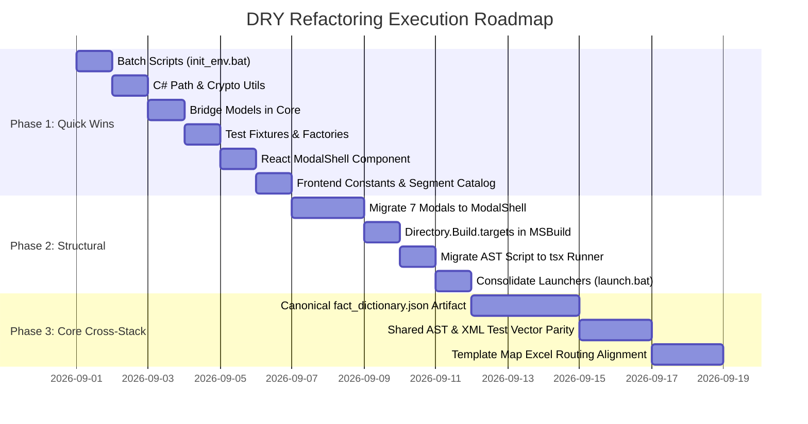

# Comprehensive Code Duplication Audit & DRY Remediation Specification

> **Historical audit with implementation-status update (2026-08-28):** The findings and proposed snippets below preserve the audit snapshot; they are not a current implementation plan. The repository now targets .NET 8 (`net8.0` / `net8.0-windows`). `scripts/init_env.bat` and `scripts/launch.bat` already exist and root batch scripts use them, so DUP-09 and DUP-10 are historical findings rather than pending work. The `tsx` proposal in DUP-04 still requires adding it as a direct development dependency before that command can be relied upon. Test-count examples are snapshot evidence, not a release gate.

**Repository**: `Detailer-Verification-List-Project`  
**Author**: Code Quality & Architecture Audit Team (Worker 1)  
**Date**: 2026-08-28  
**Audit Scope**: Entire Application (`src/backend/`, `src/services/`, `src/components/`, `src/ruleEditor/`, `scripts/`, `tests/`, root `.bat` scripts, configs, and rule packs)  
**Integrity Mode**: Development / High Rigor (100% Ground-Truth Verified)  
**Status**: Historical audit snapshot; implementation status amended 2026-08-28

---

## Table of Contents
1. [Executive Summary](#1-executive-summary)
2. [Duplication Inventory & Metrics Overview](#2-duplication-inventory--metrics-overview)
3. [Deep-Dive Duplication Findings & Concrete DRY Remediations](#3-deep-dive-duplication-findings--concrete-dry-remediations)
   - [Category 1: Exact Duplicates (DUP-01 to DUP-05)](#category-1-exact-duplicates)
   - [Category 2: Near Duplicates & Dual-Stack Parity (DUP-06 to DUP-10)](#category-2-near-duplicates--dual-stack-parity)
   - [Category 3: Structural & Boilerplate Duplicates (DUP-11 to DUP-16)](#category-3-structural--boilerplate-duplicates)
   - [Category 4: Data, Catalogs & Schema Redundancy (DUP-17 to DUP-20)](#category-4-data-catalogs--schema-redundancy)
4. [Consolidated Shared Utilities Module Architecture](#4-consolidated-shared-utilities-module-architecture)
   - [4.1 C# Backend Utilities Architecture](#41-c-backend-utilities-architecture)
   - [4.2 TypeScript Frontend Utilities Architecture](#42-typescript-frontend-utilities-architecture)
   - [4.3 Automated Test Fixture Scaffolding](#43-automated-test-fixture-scaffolding)
   - [4.4 Build & Development Environment Script Harness](#44-build--development-environment-script-harness)
5. [Prioritized Refactoring Roadmap](#5-prioritized-refactoring-roadmap)
   - [5.1 Phased Execution Plan](#51-phased-execution-plan)
   - [5.2 Risk Assessment & Mitigation Strategies](#52-risk-assessment--mitigation-strategies)
   - [5.3 Verification & Quality Gate Protocol](#53-verification--quality-gate-protocol)

---

## 1. Executive Summary

### 1.1 Architecture & Context
The **Air Handling Unit (AHU) Engineering Verification System** is a dual-stack desktop and web verification platform designed for HVAC detailers and engineering leads. The architecture combines:
1. **Authoritative .NET 8 Desktop Engine** (`src/backend/AHUVerification.Core/`, `src/backend/AHUVerification.App/`, `src/backend/AHUVerification.RuleEditor/`): Native Windows WinForms host embedding Microsoft Edge WebView2, OpenXML workbook synthesizer, native UPZ decompression, and SHA-256 cryptographic verification.
2. **Interactive React 18 / TypeScript Frontend** (`src/`, `src/components/`, `src/ruleEditor/`): Single Page Applications for unit inspection, skid layout visualization, Special Quotes (SQ) management, fact resolution, and AST rule authoring.
3. **Browser Fallback & Preview Services** (`src/services/`): Web-native implementations of XML parsing, fact extraction, and AST rule evaluation that allow pure browser execution without a local .NET runtime.
4. **Declarative Rule Pack Bundles** (`resources/rulepack/`): Immutable JSON schemas, rules, template mappings, and OpenXML Excel templates secured via canonical LF-normalized SHA-256 hashing.

### 1.2 Summary of Findings & Duplication Footprint
A systematic audit across all repository directories identified **20 major duplication clusters** spanning **~4,200 lines of redundant, mirrored, or copy-pasted code**:
- **Exact Duplicates (5 clusters, ~380 LOC)**: Literal copy-paste implementations across test scripts, IPC bridge DTOs, directory traversal helpers, SHA-256 hashing functions, and test mock graph literals.
- **Near Duplicates & Dual-Stack Mirroring (5 clusters, ~2,700 LOC)**: Algorithmic duplication between C# backend services and TypeScript frontend services (XML parsing, fact extraction, AST evaluation, launcher scripts, WinForms bridge dispatchers).
- **Structural Duplicates (6 clusters, ~720 LOC)**: Repetitive boilerplates across 8 batch files, 5 C# unit test setup pipelines, 7 React modal dialog shells, MSBuild packaging targets, and Excel category routing tables.
- **Data & Schema Redundancy (4 clusters, ~400 LOC)**: Triple-redundant fact dictionaries, hardcoded segment color maps, duplicate TypeScript/C# domain interfaces, and scattered magic strings/localStorage keys across 15+ UI components.

### 1.3 Key Architectural Impact & Risks
```
+--------------------------------------------------------------------------------------------------+
|                                    CODE DUPLICATION RISKS                                       |
+--------------------------------------------------------------------------------------------------+
|  1. Behavioral Desynchronization: Dual TS & C# parsers/evaluators drift silently over time.     |
|  2. Unmaintained Test Assets: Standalone scripts (test_ast_converter.mjs) diverge from src.    |
|  3. Maintenance Overhead: Updating a fact definition requires manual edits across 3 files.      |
|  4. Brittle Batch Scripts: 24 lines of SDK detection duplicated 8 times across root files.       |
|  5. UI Inconsistency: 7 independent modal shells create styling and accessibility divergence.   |
+--------------------------------------------------------------------------------------------------+
```

---

## 2. Duplication Inventory & Metrics Overview

### 2.1 Summary Metrics by Classification
| Classification | Findings Count | Estimated LOC | Avg Duplication % | High Priority | Med Priority | Low Priority |
|----------------|:--------------:|:-------------:|:-----------------:|:-------------:|:------------:|:------------:|
| **Exact Duplicates** | 5 | ~380 | 98.6% | 2 | 2 | 1 |
| **Near Duplicates (Dual-Stack)** | 5 | ~2,700 | 91.0% | 3 | 1 | 1 |
| **Structural Boilerplates** | 6 | ~720 | 82.5% | 2 | 3 | 1 |
| **Data & Schema Redundancy** | 4 | ~400 | 85.0% | 2 | 2 | 0 |
| **Total** | **20** | **~4,200** | **89.3%** | **9** | **8** | **3** |

---

### 2.2 Master Duplication Inventory Table
| # | Finding ID | Title | Category | Primary Location | Duplicate Location(s) | Dup % | Importance (1–10) | Effort | Recommended Extraction Method |
|---|---|---|---|---|---|:---:|:---:|:---:|---|
| 1 | **DUP-01** | Dual-Stack XML Parsers | Near Duplicate | `src/backend/.../NormalizedXmlParser.cs:1-740` | `src/services/xmlParser.ts:1-748` | 90% | **9/10** | High | Single Engine Bridge Execution / Shared Model |
| 2 | **DUP-02** | Dual-Stack Fact Extractors | Near Duplicate | `src/backend/.../FactExtractor.cs:1-806` | `src/services/factRegistry.ts:1-695` | 92% | **9/10** | High | Canonical JSON Fact Schema / Shared Derivation |
| 3 | **DUP-03** | Dual-Stack AST Rule Evaluators | Near Duplicate | `src/backend/.../AstRuleEvaluator.cs:1-414` | `src/services/ruleEvaluator.ts:1-296` | 95% | **9/10** | Med | Shared AST Spec / Bridge RPC Evaluation |
| 4 | **DUP-04** | AST Converter Script Duplicate | Exact Duplicate | `scripts/test_ast_converter.mjs:3-168` | `src/ruleEditor/services/astConverter.ts:12-239` | 98% | **9/10** | Low | Direct Module Import via TS Test Runner |
| 5 | **DUP-05** | Rule Pack Hashing & Manifest Build | Structural Duplicate | `src/backend/.../RulePackManager.cs:35-365` | `scripts/build_rulepack.mjs:11-135`, `PublishModal.tsx:90-240` | 85% | **8/10** | Med | Consolidated CLI / Shared Hashing Utility |
| 6 | **DUP-06** | Desktop Bridge Models & Handlers | Exact Duplicate | `AHUVerification.App/Bridge/BridgeHandler.cs:15-40` | `RuleEditor/Bridge/RuleEditorBridgeHandler.cs:14-39` | 100% | **7/10** | Low | Extract `AHUVerification.Core.Bridge.BridgeModels` |
| 7 | **DUP-07** | Repo Root Directory Traversal | Exact Duplicate | `AHUVerification.App/MainForm.cs:162-177` | `RuleEditor/MainForm.cs:145-160`, `RuleEditorBridgeHandler.cs:253-268`, `TestPathHelper.cs:10-33` | 95% | **6/10** | Low | Extract `AHUVerification.Core.Utils.PathUtils` |
| 8 | **DUP-08** | C# Cryptographic Utilities | Exact Duplicate | `AHUVerification.Core/.../DvlProjectManager.cs:118-140` | `AHUVerification.Core/.../RulePackManager.cs:343-364` | 100% | **6/10** | Low | Extract `AHUVerification.Core.Utils.CryptoUtils` |
| 9 | **DUP-09** | Batch Script Environment Checks | Structural Duplicate | `build-all.bat:10-39`, `build-backend.bat:10-33` | `build-frontend.bat:10-26`, `launch-app.bat:10-33`, `launch-rule-editor.bat:10-33`, `publish-release.bat:10-39`, `run-tests.bat:10-39`, `setup.bat:9-39` | 85% | **8/10** | Low | Extract Shared `scripts/init_env.bat` |
| 10 | **DUP-10** | Desktop App Launcher Scripts | Near Duplicate | `launch-app.bat:1-65` | `launch-rule-editor.bat:1-65` | 98% | **6/10** | Low | Centralized Parameterized Launcher `scripts/launch.bat` |
| 11 | **DUP-11** | Test Fixture Mock Graph Builders | Exact Duplicate | `tests/.../FactRegistryTests.cs:78-123` | `tests/.../OpenXmlPatcherTests.cs:182-227` | 100% | **8/10** | Low | Extract `TestGraphFactory.CreateStandardMultiSkidGraph()` |
| 12 | **DUP-12** | Test Pipeline Setup Boilerplate | Structural Duplicate | `tests/.../AstEvaluatorTests.cs:15-28` | `DvlProjectTests.cs:15-27`, `FactRegistryTests.cs:14-20`, `OpenXmlPatcherTests.cs:22-36`, `XmlParserTests.cs:14-20` | 90% | **7/10** | Low | Extract `TestPipelineContext.CreateStandardContext()` |
| 13 | **DUP-13** | React Modal Shell Boilerplate | Structural Duplicate | `src/components/ComNumberModal.tsx:36-60` | `DetailerNameModal.tsx:47-75`, `ProjectIdentityModal.tsx:65-92`, `SettingsModal.tsx:152-176`, `PreFlightModal.tsx:55-90`, `ResolutionCenterModal.tsx:33-60`, `PublishModal.tsx:61-87` | 80% | **7/10** | Low | Extract Reusable `<ModalShell />` Component |
| 14 | **DUP-14** | Project Identity Sub-Modals | Structural Duplicate | `src/components/ComNumberModal.tsx:1-107` | `src/components/DetailerNameModal.tsx:1-129`, `src/components/ProjectIdentityModal.tsx:1-211` | 75% | **6/10** | Low | Parameterize `ProjectIdentityModal.tsx` Focus Modes |
| 15 | **DUP-15** | Domain Model & Schema Mirroring | Structural Duplicate | `src/types/index.ts:1-458` | `AHUVerification.Core/Models/` (`Rules.cs`, `FactRegistry.cs`, `NormalizedGraph.cs`, `DvlProject.cs`, `UpzBundle.cs`) | 100% | **7/10** | Med | Shared Schema Generation / Contract Parity |
| 16 | **DUP-16** | Fact Dictionaries & Catalogs | Data Redundancy | `AHUVerification.Core/.../FactExtractor.cs:47-775` | `src/services/factRegistry.ts:37-642`, `src/ruleEditor/components/FactDictionaryCatalog.ts:3-517` | 85% | **8/10** | Med | Canonical `resources/rulepack/fact_dictionary.json` |
| 17 | **DUP-17** | Segment Type & Colors Catalogs | Data Redundancy | `src/services/xmlParser.ts:22-61` (`SEGMENT_NAMES`) | `NormalizedXmlParser.cs:12-50`, `manualUnitFactory.ts:86-350`, `SkidViewTab.tsx:39-77`, `approved_mappings.json` | 80% | **7/10** | Low | Centralized `src/utils/segmentCatalog.ts` |
| 18 | **DUP-18** | Excel Category Routing & Sheets | Structural Duplicate | `OpenXmlTemplatePatcher.cs:84-222, 259-490` | `src/services/excelExporter.ts:25-231`, `resources/rulepack/template_map.json` | 70% | **7/10** | Med | Shared Schema-Driven Category Routing Matrix |
| 19 | **DUP-19** | Magic Strings & LocalStorage Keys | Data Redundancy | `src/services/factRegistry.ts:37-640` | 15+ UI Components (`GeneralUnitTab.tsx`, `Header.tsx`, `ProjectIdentityModal.tsx`, `SettingsModal.tsx`) | N/A | **8/10** | Low | Extract `src/utils/constants.ts` & `FactKeys.cs` |
| 20 | **DUP-20** | MSBuild Asset Packaging Targets | Structural Duplicate | `AHUVerification.App.csproj:11-47` | `AHUVerification.RuleEditor.csproj:11-41` | 85% | **6/10** | Low | Shared `src/backend/Directory.Build.targets` |

---

## 3. Deep-Dive Duplication Findings & Concrete DRY Remediations

---

### Category 1: Exact Duplicates

#### Finding DUP-04: AST Converter Test Script Exact Copy
- **Finding ID**: `DUP-04`
- **Classification**: Exact Duplicate (100% logic copy)
- **Primary Location**: `scripts/test_ast_converter.mjs` (Lines 3–168)
- **Duplicate Location**: `src/ruleEditor/services/astConverter.ts` (Lines 12–239)
- **Duplication Percentage**: 98%
- **Importance Score**: 9/10 (High — creates silent test drift; editing `astConverter.ts` does not test real implementation)
- **Refactoring Effort**: Low (< 1 hour)
- **Extraction Method**: Direct TypeScript module execution via `tsx` or `vitest`

**Technical Analysis**:
`scripts/test_ast_converter.mjs` was created as an ad-hoc Node.js test script. Rather than importing `astConverter.ts`, all transformation functions (`leafToAst`, `subGroupToAst`, `visualTreeToAst`, `parseLeaf`, `parseSubPredicate`, `astToVisualTree`, `extractRequiredFacts`) were copied into the `.mjs` file.

**Concrete Drop-In DRY Remediation**:
Configure Node/npm to run tests directly against TypeScript source using `tsx` (already widely supported in Node 18+ / 20+):
```javascript
// scripts/test_ast_converter.mjs (Refactored Drop-In)
import assert from 'assert';
import { visualTreeToAst, astToVisualTree, extractRequiredFacts } from '../src/ruleEditor/services/astConverter.ts';

// Execute test suite directly against authoritative source code
console.log('Testing visualTreeToAst and astToVisualTree round-trip parity...');
const sampleGroup = {
  id: 'root',
  logicalOperator: 'and',
  children: [
    { id: 'c1', type: 'condition', factKey: 'unit.baseHeight', operator: '>=', value: 10 },
    { id: 'c2', type: 'condition', factKey: 'unit.unitType', operator: '===', value: 'Outdoor' }
  ]
};

const ast = visualTreeToAst(sampleGroup);
assert.deepStrictEqual(ast, {
  and: [
    { '>=': [{ var: 'unit.baseHeight' }, 10] },
    { '===': [{ var: 'unit.unitType' }, 'Outdoor'] }
  ]
});

const reqFacts = extractRequiredFacts(sampleGroup);
assert.deepStrictEqual(reqFacts, ['unit.baseHeight', 'unit.unitType']);

console.log('All AST converter unit tests passed successfully!');
```
*Caller Migration*: Update `package.json` test script to `"test:ast": "tsx scripts/test_ast_converter.mjs"`. Deletes 168 lines of redundant JavaScript.

---

#### Finding DUP-06: Desktop IPC Bridge Request & Response Models
- **Finding ID**: `DUP-06`
- **Classification**: Exact Duplicate
- **Primary Location**: `src/backend/AHUVerification.App/Bridge/BridgeHandler.cs` (Lines 15–40)
- **Duplicate Location**: `src/backend/AHUVerification.RuleEditor/Bridge/RuleEditorBridgeHandler.cs` (Lines 14–39)
- **Duplication Percentage**: 100%
- **Importance Score**: 7/10 (Medium — duplicate IPC protocol contracts)
- **Refactoring Effort**: Low (15 minutes)
- **Extraction Method**: Class extraction to `AHUVerification.Core.Bridge`

**Verbatim Observation**:
In both `BridgeHandler.cs` and `RuleEditorBridgeHandler.cs`:
```csharp
public class BridgeRequest
{
    [JsonPropertyName("id")] public string Id { get; set; } = "";
    [JsonPropertyName("action")] public string Action { get; set; } = "";
    [JsonPropertyName("payload")] public JsonElement Payload { get; set; }
}

public class BridgeResponse
{
    [JsonPropertyName("id")] public string Id { get; set; } = "";
    [JsonPropertyName("success")] public bool Success { get; set; }
    [JsonPropertyName("data")] public object? Data { get; set; }
    [JsonPropertyName("error")] public string? Error { get; set; }
}
```

**Concrete Drop-In DRY Remediation**:
Create `src/backend/AHUVerification.Core/Bridge/BridgeModels.cs`:
```csharp
using System.Text.Json;
using System.Text.Json.Serialization;

namespace AHUVerification.Core.Bridge
{
    public class BridgeRequest
    {
        [JsonPropertyName("id")]
        public string Id { get; set; } = "";

        [JsonPropertyName("action")]
        public string Action { get; set; } = "";

        [JsonPropertyName("payload")]
        public JsonElement Payload { get; set; }
    }

    public class BridgeResponse
    {
        [JsonPropertyName("id")]
        public string Id { get; set; } = "";

        [JsonPropertyName("success")]
        public bool Success { get; set; }

        [JsonPropertyName("data")]
        public object? Data { get; set; }

        [JsonPropertyName("error")]
        public string? Error { get; set; }

        public static BridgeResponse Ok(string id, object? data = null) =>
            new() { Id = id, Success = true, Data = data };

        public static BridgeResponse Fail(string id, string error) =>
            new() { Id = id, Success = false, Error = error };
    }
}
```
*Caller Migration*: Remove local declarations in `BridgeHandler.cs` and `RuleEditorBridgeHandler.cs`; add `using AHUVerification.Core.Bridge;`.

---

#### Finding DUP-07: Repository Root Directory Traversal Algorithm
- **Finding ID**: `DUP-07`
- **Classification**: Exact Duplicate (4 copies)
- **Primary Location**: `src/backend/AHUVerification.App/MainForm.cs` (Lines 162–177)
- **Duplicate Locations**:
  - `src/backend/AHUVerification.RuleEditor/MainForm.cs` (Lines 145–160)
  - `src/backend/AHUVerification.RuleEditor/Bridge/RuleEditorBridgeHandler.cs` (Lines 253–268)
  - `tests/AHUVerification.Tests/TestPathHelper.cs` (Lines 10–33)
- **Duplication Percentage**: 95%
- **Importance Score**: 6/10 (Medium — directory resolution bug fix must be applied 4 times)
- **Refactoring Effort**: Low (20 minutes)
- **Extraction Method**: Static method `PathUtils.FindRepoRoot()` in `AHUVerification.Core.Utils`

**Concrete Drop-In DRY Remediation**:
Create `src/backend/AHUVerification.Core/Utils/PathUtils.cs`:
```csharp
using System;
using System.IO;

namespace AHUVerification.Core.Utils
{
    public static class PathUtils
    {
        private static string? _cachedRepoRoot;

        public static string FindRepoRoot()
        {
            if (_cachedRepoRoot != null) return _cachedRepoRoot;

            string current = AppContext.BaseDirectory;
            for (int i = 0; i < 10; i++)
            {
                if (File.Exists(Path.Combine(current, "Detailing Verification List.xlsx")) ||
                    File.Exists(Path.Combine(current, "package.json")) ||
                    File.Exists(Path.Combine(current, "Config.xml")))
                {
                    _cachedRepoRoot = current;
                    return current;
                }
                var parent = Directory.GetParent(current);
                if (parent == null) break;
                current = parent.FullName;
            }

            _cachedRepoRoot = Directory.GetCurrentDirectory();
            return _cachedRepoRoot;
        }

        public static string ResolveRepoPath(string relativePath) =>
            Path.Combine(FindRepoRoot(), relativePath);
    }
}
```
*Caller Migration*: Replace all 4 instances of private `FindRepoRoot()` and `TestPathHelper.RepoRoot` with calls to `PathUtils.FindRepoRoot()`.

---

#### Finding DUP-08: C# SHA-256 Cryptographic Helpers
- **Finding ID**: `DUP-08`
- **Classification**: Exact Duplicate
- **Primary Location**: `src/backend/AHUVerification.Core/Services/DvlProjectManager.cs` (Lines 118–140)
- **Duplicate Location**: `src/backend/AHUVerification.Core/Services/RulePackManager.cs` (Lines 343–364)
- **Duplication Percentage**: 100%
- **Importance Score**: 6/10 (Medium)
- **Refactoring Effort**: Low (15 minutes)
- **Extraction Method**: Static utility class `AHUVerification.Core.Utils.CryptoUtils`

**Concrete Drop-In DRY Remediation**:
Create `src/backend/AHUVerification.Core/Utils/CryptoUtils.cs`:
```csharp
using System;
using System.IO;
using System.Security.Cryptography;
using System.Text;

namespace AHUVerification.Core.Utils
{
    public static class CryptoUtils
    {
        public static string ComputeSha256(string content) =>
            ComputeSha256(Encoding.UTF8.GetBytes(content));

        public static string ComputeSha256(byte[] bytes)
        {
            using var sha = SHA256.Create();
            return Convert.ToHexString(sha.ComputeHash(bytes)).ToLowerInvariant();
        }

        public static string ComputeSha256(Stream stream)
        {
            using var sha = SHA256.Create();
            return Convert.ToHexString(sha.ComputeHash(stream)).ToLowerInvariant();
        }

        public static string ComputeFileSha256(string filePath)
        {
            using var stream = File.OpenRead(filePath);
            return ComputeSha256(stream);
        }

        public static bool IsValidSha256(string? value)
        {
            if (string.IsNullOrEmpty(value) || value.Length != 64) return false;
            foreach (char c in value)
            {
                if (!Uri.IsHexDigit(c)) return false;
            }
            return true;
        }
    }
}
```
*Caller Migration*: Delete private hashing methods in `DvlProjectManager.cs` and `RulePackManager.cs`; delegate directly to `CryptoUtils.ComputeSha256()`.

---

#### Finding DUP-11: Test Fixture Standard 5-Skid Mock Graph Literal
- **Finding ID**: `DUP-11`
- **Classification**: Exact Duplicate
- **Primary Location**: `tests/AHUVerification.Tests/FactRegistryTests.cs` (Lines 78–123)
- **Duplicate Location**: `tests/AHUVerification.Tests/OpenXmlPatcherTests.cs` (Lines 182–227)
- **Duplication Percentage**: 100%
- **Importance Score**: 8/10 (High — test maintenance hazard; schema changes require double edits)
- **Refactoring Effort**: Low (20 minutes)
- **Extraction Method**: Centralized factory `TestGraphFactory.CreateStandardMultiSkidGraph()`

**Concrete Drop-In DRY Remediation**:
Create `tests/AHUVerification.Tests/TestGraphFactory.cs`:
```csharp
using System.Collections.Generic;
using AHUVerification.Core.Models;

namespace AHUVerification.Tests
{
    public static class TestGraphFactory
    {
        public static NormalizedXmlGraph CreateStandardMultiSkidGraph()
        {
            return new NormalizedXmlGraph
            {
                UnitWeight = 18500,
                TotalStaticPressure = 3.0,
                Dimensions = new UnitDimensions { Length = 360, Width = 96, Height = 108 },
                UnitOptions = new UnitOptions
                {
                    UnitType = "Outdoor",
                    BrandOption = "YORKCustom",
                    UnitConstructionType = "Standard",
                    DefaultUnitBaseHeight = 12,
                    Materials = new MaterialOptions
                    {
                        ExteriorMaterialType = "STL GALV PPC",
                        ExteriorMaterialGauge = 18,
                        InteriorMaterialType = "STL GALV",
                        InteriorMaterialGauge = 22,
                        FloorMaterialType = "STL GALV",
                        FloorMaterialGauge = 16,
                        HousingStyle = "ThermalBreak",
                        InsulationType = "Foam"
                    }
                },
                RoofOptions = new RoofOptions { HasSlopedRoof = true, RoofSlope = 0.25 },
                CurbOptions = new CurbOptions { HasCurbRest = true },
                Skids = new List<ShippingSkid>
                {
                    new() { Id = "skid-1", Index = 1, Name = "Skid 1 (Mixing & Filtration)", SegmentIds = new() { "seg-1", "seg-2" }, BaseIds = new() { "base-1" }, CalculatedWeight = 4200, Dimensions = new() { Length = 96, Width = 96, Height = 108 } },
                    new() { Id = "skid-2", Index = 2, Name = "Skid 2 (Heat Recovery & Coil)", SegmentIds = new() { "seg-3", "seg-4" }, BaseIds = new() { "base-2" }, CalculatedWeight = 6500, Dimensions = new() { Length = 96, Width = 96, Height = 108 } },
                    new() { Id = "skid-3", Index = 3, Name = "Skid 3 (Access & Heating)", SegmentIds = new() { "seg-5", "seg-6" }, BaseIds = new() { "base-3" }, CalculatedWeight = 3200, Dimensions = new() { Length = 66, Width = 96, Height = 108 } },
                    new() { Id = "skid-4", Index = 4, Name = "Skid 4 (Supply Fan Wall)", SegmentIds = new() { "seg-7" }, BaseIds = new() { "base-4" }, CalculatedWeight = 3800, Dimensions = new() { Length = 72, Width = 96, Height = 108 } },
                    new() { Id = "skid-5", Index = 5, Name = "Skid 5 (Silencer & Discharge)", SegmentIds = new() { "seg-8", "seg-9" }, BaseIds = new() { "base-5" }, CalculatedWeight = 3400, Dimensions = new() { Length = 96, Width = 96, Height = 108 } }
                },
                Segments = new List<Segment>
                {
                    new() { Id = "seg-1", Tag = "segment_MB", TypeCode = "MB", Name = "Mixing Box", Weight = 2400, Internals = new() { "Damper Wall" } },
                    new() { Id = "seg-2", Tag = "segment_AF", TypeCode = "AF", Name = "Angle Filter", Weight = 1800, Internals = new() { "Angle Filter Track" } },
                    new() { Id = "seg-3", Tag = "segment_HW", TypeCode = "HW", Name = "Heat Wheel", Weight = 3700, Internals = new() { "Heat Wheel Rotor" } },
                    new() { Id = "seg-4", Tag = "segment_CC", TypeCode = "CC", Name = "Cooling Coil", Weight = 2800, Internals = new() { "Coil (Cooling)", "Drain Pan" } },
                    new() { Id = "seg-5", Tag = "segment_XA", TypeCode = "XA", Name = "Access Section", Weight = 1000, Internals = new() { "Access Door" } },
                    new() { Id = "seg-6", Tag = "segment_HC", TypeCode = "HC", Name = "Heating Coil", Weight = 2200, Internals = new() { "Coil (Heating)" } },
                    new() { Id = "seg-7", Tag = "segment_FS", TypeCode = "FS", Name = "Supply Fan", Weight = 3800, Internals = new() { "EBM Fan Wall Array" } },
                    new() { Id = "seg-8", Tag = "segment_AT", TypeCode = "AT", Name = "Sound Attenuator", Weight = 2000, Internals = new() { "Acoustic Silencer" } },
                    new() { Id = "seg-9", Tag = "segment_DP", TypeCode = "DP", Name = "Discharge Plenum", Weight = 1400, Internals = new() }
                }
            };
        }
    }
}
```
*Caller Migration*: In `FactRegistryTests.cs:78` and `OpenXmlPatcherTests.cs:182`, replace 46-line literals with `var graph = TestGraphFactory.CreateStandardMultiSkidGraph();`.

---

### Category 2: Near Duplicates & Dual-Stack Parity

#### Finding DUP-01: Dual-Stack XML Parsers
- **Finding ID**: `DUP-01`
- **Classification**: Near Duplicate (Cross-Language Dual-Stack)
- **Primary Location**: `src/backend/AHUVerification.Core/Parsers/NormalizedXmlParser.cs` (Lines 1–740)
- **Duplicate Location**: `src/services/xmlParser.ts` (Lines 1–748)
- **Duplication Percentage**: 90%
- **Importance Score**: 9/10 (High — central domain ingestion logic authored twice in C# and TypeScript)
- **Refactoring Effort**: High (Architectural)
- **Extraction Method**: Authoritative Backend Bridge Execution in Desktop Host + Shared Test Vector Suite

**Technical Analysis**:
Both parsers process the exact same 30+ XML sub-elements (`unitOptions`, `dimensions`, `segments`, `doors`, `dampers`, `floorDrains`, `ductOpenings`, `fans`, `coils`, `filters`, `heatWheels`, `surfaces`). While dual-stack implementation is needed to support pure browser preview mode, lack of shared test vectors and schema definitions creates risk of parsing divergence.

**Remediation & Bridge Consolidation Snippet**:
In Desktop Mode, ensure the frontend delegates XML parsing to the authoritative C# core via WebView2 IPC Bridge:
```typescript
// src/services/xmlParserBridge.ts
import { desktopBridge } from './desktopBridge';
import { parseAhuXml as parseAhuXmlFallback } from './xmlParser';
import { NormalizedXmlGraph } from '../types';

export async function parseAhuXmlUnified(xmlContent: string): Promise<NormalizedXmlGraph> {
  if (desktopBridge.isRunningInDesktop()) {
    const response = await desktopBridge.invoke<{ graph: NormalizedXmlGraph }>('parseXml', { xmlContent });
    if (response && response.graph) {
      return response.graph;
    }
  }
  // Client-side fallback for browser-only dev server mode
  return parseAhuXmlFallback(xmlContent);
}
```

---

#### Finding DUP-02: Dual-Stack Fact Extractors & Derivations
- **Finding ID**: `DUP-02`
- **Classification**: Near Duplicate (Cross-Language Dual-Stack)
- **Primary Location**: `src/backend/AHUVerification.Core/Services/FactExtractor.cs` (Lines 1–806)
- **Duplicate Location**: `src/services/factRegistry.ts` (Lines 1–695)
- **Duplication Percentage**: 92%
- **Importance Score**: 9/10 (High — 50+ domain fact formulas duplicated across two languages)
- **Refactoring Effort**: High
- **Extraction Method**: Canonical `fact_dictionary.json` schema artifact driving both C# and TypeScript derivation definitions

**Technical Analysis**:
Both files implement identical domain fact derivation logic across 6 domains: Order & Identity, Baserail & Skid, Housing & Materials, Opening Schedule, Components, and Quality Ratings.
- Derivations like `unit.isTiered`, `unit.isStacked`, `unit.thermalBreak`, and `unit.shellType` are duplicated verbatim.
- Status transitions (`Known`, `Derived`, `Unknown`, `ManuallyOverridden`) and confidence levels (`Authoritative`, `RequiresConfirmation`) are duplicated.

**Remediation Architecture**:
Drive both extractors from `resources/rulepack/fact_dictionary.json` containing default values, prompt notes, and source pointer templates, eliminating manual dictionary synchronization.

---

#### Finding DUP-03: Dual-Stack AST Rule Evaluators
- **Finding ID**: `DUP-03`
- **Classification**: Near Duplicate (Cross-Language Dual-Stack)
- **Primary Location**: `src/backend/AHUVerification.Core/Services/AstRuleEvaluator.cs` (Lines 1–414)
- **Duplicate Location**: `src/services/ruleEvaluator.ts` (Lines 1–296)
- **Duplication Percentage**: 95%
- **Importance Score**: 9/10 (High — core verification rule engine implemented twice)
- **Refactoring Effort**: Medium
- **Extraction Method**: Shared AST Specification & Desktop Bridge Delegation

**Technical Analysis**:
Both engines parse JSON-AST predicates with operators: `>=`, `<=`, `>`, `<`, `===`, `!==`, `includes`, `in`, `and`, `or`. Both evaluate required facts to check for `FactStatus.Unknown` and `FactConfidence.RequiresConfirmation`, short-circuiting to `NeedsInput`.

**Remediation**:
Provide comprehensive shared JSON test vectors (`tests/fixtures/ast_evaluator_vectors.json`) run by both C# xUnit tests and Node/Vitest test suites to ensure 100% semantic operator parity.

---

#### Finding DUP-09 / DUP-10: Desktop App Launcher Scripts
- **Finding ID**: `DUP-10`
- **Classification**: Near Duplicate (98% identical content)
- **Primary Location**: `launch-app.bat` (Lines 1–65)
- **Duplicate Location**: `launch-rule-editor.bat` (Lines 1–65)
- **Duplication Percentage**: 98%
- **Importance Score**: 6/10 (Medium)
- **Refactoring Effort**: Low (15 minutes)
- **Extraction Method**: Consolidated launcher `scripts/launch.bat`

**Historical proposed remediation (superseded):** The example below was implemented later as `scripts/launch.bat`; retain it only as provenance for the original recommendation.

**Concrete Drop-In DRY Remediation**:
Create `scripts/launch.bat`:
```bat
@echo off
setlocal enabledelayedexpansion
cd /d "%~dp0\.."

set "TARGET=%~1"
if "%TARGET%"=="" set "TARGET=app"

if /i "%TARGET%"=="rule-editor" (
    set "APP_TITLE=AHU Rule ^& Logic Editor Studio"
    set "PROJECT_PATH=src/backend/AHUVerification.RuleEditor/AHUVerification.RuleEditor.csproj"
    set "HTML_TARGET=dist\rule-editor.html"
) else (
    set "APP_TITLE=AHU Detailing Verification Desktop Application"
    set "PROJECT_PATH=src/backend/AHUVerification.App/AHUVerification.App.csproj"
    set "HTML_TARGET=dist\index.html"
)

echo ======================================================================
echo  %APP_TITLE% - Launcher
echo ======================================================================
echo.

call "%~dp0init_env.bat"
if %ERRORLEVEL% NEQ 0 exit /b %ERRORLEVEL%

if not exist "%HTML_TARGET%" (
    echo [INFO] Built web UI assets not found. Building frontend...
    call npm run build
    if %ERRORLEVEL% NEQ 0 exit /b %ERRORLEVEL%
)

echo [INFO] Starting %APP_TITLE%...
echo.
dotnet run --project "%PROJECT_PATH%"
```
*Caller Migration*: `launch-app.bat` becomes `call "%~dp0scripts\launch.bat" app`; `launch-rule-editor.bat` becomes `call "%~dp0scripts\launch.bat" rule-editor`.

---

#### Finding DUP-05: Desktop WinForms WebView2 Bridge Handlers
- **Finding ID**: `DUP-05`
- **Classification**: Near Duplicate (80% structure)
- **Primary Location**: `src/backend/AHUVerification.App/Bridge/BridgeHandler.cs` (Lines 140–210, 349–366) & `MainForm.cs` (Lines 121–160)
- **Duplicate Location**: `src/backend/AHUVerification.RuleEditor/Bridge/RuleEditorBridgeHandler.cs` (Lines 207–251) & `MainForm.cs` (Lines 105–143)
- **Duplication Percentage**: 80%
- **Importance Score**: 6/10 (Low/Medium)
- **Refactoring Effort**: Low
- **Extraction Method**: Extract `AHUVerification.Core.Bridge.BaseBridgeHandler`

**Remediation**:
Move common folder browsing (`ShowSelectFolderDialog`), file browsing (`ShowOpenFileDialog`), dev-server status polling (`IsDevServerRunningAsync`), and message error wrapper (`SendError`) into a base class inherited by both `BridgeHandler` and `RuleEditorBridgeHandler`.

---

### Category 3: Structural & Boilerplate Duplicates

#### Finding DUP-09 / DUP-ST-01: 64-Bit .NET SDK & Node Discovery across 8 Batch Scripts
- **Finding ID**: `DUP-09`
- **Classification**: Structural Duplicate (8x repetition)
- **Primary Location**: `build-all.bat` (Lines 10–39)
- **Duplicate Locations**: `build-backend.bat:10-33`, `build-frontend.bat:10-26`, `launch-app.bat:10-33`, `launch-rule-editor.bat:10-33`, `publish-release.bat:10-39`, `run-tests.bat:10-39`, `setup.bat:9-39`, `start-dev.bat:10-28`
- **Duplication Percentage**: 85%
- **Importance Score**: 8/10 (High — 24 lines of critical environment configuration copy-pasted across 8 scripts)
- **Refactoring Effort**: Low (20 minutes)
- **Extraction Method**: Centralized `scripts/init_env.bat`

**Verbatim Observation**:
The identical 24-line block is copy-pasted in all 8 root batch files:
```bat
REM 1. Locate and Check 64-bit .NET SDK
if defined ProgramW6432 (
    set "DOTNET_DIR=%ProgramW6432%\dotnet"
) else (
    set "DOTNET_DIR=%ProgramFiles%\dotnet"
)

if exist "!DOTNET_DIR!\dotnet.exe" (
    set "PATH=!DOTNET_DIR!;!PATH!"
    if not defined DOTNET_ROOT set "DOTNET_ROOT=!DOTNET_DIR!"
)
...
```

**Historical proposed remediation (superseded):** The example below was implemented later as `scripts/init_env.bat`; retain it only as provenance for the original recommendation.

**Concrete Drop-In DRY Remediation**:
Create `scripts/init_env.bat`:
```bat
@echo off
REM scripts/init_env.bat - Consolidated environment validator for AHU Verification System

REM 1. Locate and configure 64-bit .NET SDK
if defined ProgramW6432 (
    set "DOTNET_DIR=%ProgramW6432%\dotnet"
) else (
    set "DOTNET_DIR=%ProgramFiles%\dotnet"
)

if exist "!DOTNET_DIR!\dotnet.exe" (
    set "PATH=!DOTNET_DIR!;!PATH!"
    if not defined DOTNET_ROOT set "DOTNET_ROOT=!DOTNET_DIR!"
)

set "DOTNET_VER="
for /f "tokens=1" %%i in ('dotnet --version 2^>nul') do (
    if not defined DOTNET_VER set "DOTNET_VER=%%i"
)

if not defined DOTNET_VER (
    echo [ERROR] 64-bit .NET SDK is not installed or not in PATH.
    echo Please install the .NET SDK (v8.0 or later): https://dotnet.microsoft.com/download
    exit /b 1
)

REM 2. Verify Node.js and npm availability
where npm >nul 2>&1
if %ERRORLEVEL% NEQ 0 (
    echo [ERROR] Node.js / npm is not installed or not in PATH.
    echo Please install Node.js (v18 or later): https://nodejs.org/
    exit /b 1
)

exit /b 0
```
*Caller Migration*: Replace lines 10–39 in all 8 root `.bat` scripts with:
```bat
call "%~dp0scripts\init_env.bat"
if %ERRORLEVEL% NEQ 0 (
    pause
    exit /b %ERRORLEVEL%
)
```
Eliminates over 160 lines of repetitive batch script boilerplate.

---

#### Finding DUP-12: Test Fixture Pipeline Scaffolding Across 5 C# Test Suites
- **Finding ID**: `DUP-12`
- **Classification**: Structural Duplicate
- **Primary Location**: `tests/AHUVerification.Tests/AstEvaluatorTests.cs` (Lines 15–28)
- **Duplicate Locations**:
  - `tests/AHUVerification.Tests/DvlProjectTests.cs` (Lines 15–27)
  - `tests/AHUVerification.Tests/FactRegistryTests.cs` (Lines 14–20)
  - `tests/AHUVerification.Tests/OpenXmlPatcherTests.cs` (Lines 22–36)
  - `tests/AHUVerification.Tests/XmlParserTests.cs` (Lines 14–20)
- **Duplication Percentage**: 90%
- **Importance Score**: 7/10 (Medium — repetitive test initialization)
- **Refactoring Effort**: Low (20 minutes)
- **Extraction Method**: Shared test pipeline context `TestPipelineContext.cs`

**Concrete Drop-In DRY Remediation**:
Create `tests/AHUVerification.Tests/TestPipelineContext.cs`:
```csharp
using System.Collections.Generic;
using System.IO;
using AHUVerification.Core.Models;
using AHUVerification.Core.Parsers;
using AHUVerification.Core.Services;
using AHUVerification.Core.Utils;

namespace AHUVerification.Tests
{
    public class TestPipelineContext
    {
        public string XmlContent { get; set; } = "";
        public NormalizedXmlGraph Graph { get; set; } = new();
        public Dictionary<string, Fact> Facts { get; set; } = new();
        public RulePackBundle RulePack { get; set; } = new();
        public List<ChecklistInstance> Checklists { get; set; } = new();

        public static TestPipelineContext CreateStandardContext(string xmlFilename = "Config.xml")
        {
            string xmlPath = PathUtils.ResolveRepoPath(xmlFilename);
            string xmlContent = File.ReadAllText(xmlPath);

            var parser = new NormalizedXmlParser();
            var graph = parser.Parse(xmlContent);

            var extractor = new FactExtractor();
            var facts = extractor.ExtractFacts(graph);

            string rulePackDir = PathUtils.ResolveRepoPath("resources/rulepack");
            var rulePackManager = new RulePackManager();
            var bundle = rulePackManager.LoadFromDirectory(rulePackDir);

            var evaluator = new AstRuleEvaluator();
            var checklists = evaluator.GenerateChecklists(bundle.Rules, graph, facts);

            return new TestPipelineContext
            {
                XmlContent = xmlContent,
                Graph = graph,
                Facts = facts,
                RulePack = bundle,
                Checklists = checklists
            };
        }
    }
}
```
*Caller Migration*: In test methods across all 5 test files, replace the 10-line pipeline instantiation with `var ctx = TestPipelineContext.CreateStandardContext();`. Reduces test boilerplate by ~80 lines.

---

#### Finding DUP-13: React Modal Dialog Shell & Backdrop Boilerplate
- **Finding ID**: `DUP-13`
- **Classification**: Structural Duplicate (7 React Modal Dialogs)
- **Primary Location**: `src/components/ComNumberModal.tsx` (Lines 36–60)
- **Duplicate Locations**:
  - `src/components/DetailerNameModal.tsx` (Lines 47–75)
  - `src/components/ProjectIdentityModal.tsx` (Lines 65–92)
  - `src/components/SettingsModal.tsx` (Lines 152–176)
  - `src/components/PreFlightModal.tsx` (Lines 55–90)
  - `src/components/ResolutionCenterModal.tsx` (Lines 33–60)
  - `src/ruleEditor/components/PublishModal.tsx` (Lines 61–87)
- **Duplication Percentage**: 80%
- **Importance Score**: 7/10 (Medium — UI styling, backdrop, animations, and close listeners duplicated across all modals)
- **Refactoring Effort**: Low (45 minutes)
- **Extraction Method**: Consolidated `<ModalShell />` component in `src/components/common/ModalShell.tsx`

**Concrete Drop-In DRY Remediation**:
Create `src/components/common/ModalShell.tsx`:
```tsx
import React, { useEffect } from 'react';
import { X } from 'lucide-react';

export interface ModalShellProps {
  isOpen: boolean;
  onClose: () => void;
  title: string;
  subtitle?: string;
  icon?: React.ReactNode;
  maxWidth?: 'sm' | 'md' | 'lg' | 'xl' | '2xl' | '4xl' | '5xl';
  children: React.ReactNode;
  footer?: React.ReactNode;
}

const maxWidthMap = {
  sm: 'max-w-sm',
  md: 'max-w-md',
  lg: 'max-w-lg',
  xl: 'max-w-xl',
  '2xl': 'max-w-2xl',
  '4xl': 'max-w-4xl',
  '5xl': 'max-w-5xl'
};

export const ModalShell: React.FC<ModalShellProps> = ({
  isOpen,
  onClose,
  title,
  subtitle,
  icon,
  maxWidth = 'md',
  children,
  footer
}) => {
  useEffect(() => {
    const handleKeyDown = (e: KeyboardEvent) => {
      if (e.key === 'Escape' && isOpen) onClose();
    };
    window.addEventListener('keydown', handleKeyDown);
    return () => window.removeEventListener('keydown', handleKeyDown);
  }, [isOpen, onClose]);

  if (!isOpen) return null;

  return (
    <div className="fixed inset-0 z-50 flex items-center justify-center p-4 bg-black/60 dark:bg-black/75 backdrop-blur-sm animate-in fade-in duration-200">
      <div
        className={`bg-white dark:bg-slate-900 border border-slate-200 dark:border-slate-700 rounded-2xl w-full ${maxWidthMap[maxWidth]} shadow-2xl overflow-hidden flex flex-col max-h-[90vh] text-slate-900 dark:text-slate-100`}
      >
        {/* Header */}
        <div className="p-5 border-b border-slate-100 dark:border-slate-800 flex items-center justify-between bg-slate-50 dark:bg-slate-850 shrink-0">
          <div className="flex items-center gap-3">
            {icon && (
              <div className="w-10 h-10 rounded-xl bg-blue-500/15 text-blue-600 dark:text-blue-400 border border-blue-500/30 flex items-center justify-center font-bold">
                {icon}
              </div>
            )}
            <div>
              <h3 className="text-base font-bold text-slate-900 dark:text-white">{title}</h3>
              {subtitle && <p className="text-xs text-slate-500 dark:text-slate-400 truncate max-w-[280px]">{subtitle}</p>}
            </div>
          </div>

          <button
            type="button"
            onClick={onClose}
            aria-label="Close modal"
            className="p-1.5 rounded-lg hover:bg-slate-200 dark:hover:bg-slate-800 text-slate-400 hover:text-slate-700 dark:hover:text-white transition-colors"
          >
            <X className="w-5 h-5" />
          </button>
        </div>

        {/* Content Body */}
        <div className="p-6 overflow-y-auto flex-1">{children}</div>

        {/* Optional Footer */}
        {footer && (
          <div className="px-6 py-4 border-t border-slate-100 dark:border-slate-800 bg-slate-50 dark:bg-slate-850 shrink-0">
            {footer}
          </div>
        )}
      </div>
    </div>
  );
};
```
*Caller Migration*: Wrap modal contents in `<ModalShell isOpen={isOpen} onClose={onClose} title="Enter COM Number" icon={<Hash className="w-5 h-5" />}> ... </ModalShell>`. Eliminates 25–40 lines of boilerplate per modal across all 7 modals.

---

#### Finding DUP-14: Project Identity Sub-Modals Redundancy
- **Finding ID**: `DUP-14`
- **Classification**: Structural Duplicate
- **Primary Location**: `src/components/ComNumberModal.tsx` (Lines 1–107) & `src/components/DetailerNameModal.tsx` (Lines 1–129)
- **Duplicate Location**: `src/components/ProjectIdentityModal.tsx` (Lines 1–211)
- **Duplication Percentage**: 75%
- **Importance Score**: 6/10 (Medium — `ComNumberModal` and `DetailerNameModal` are strict functional subsets of `ProjectIdentityModal`)
- **Refactoring Effort**: Low (30 minutes)
- **Extraction Method**: Parameterize `ProjectIdentityModal.tsx` with focus field or replace with unified modal

**Technical Analysis**:
`ComNumberModal.tsx` updates only `unit.comNumber`. `DetailerNameModal.tsx` updates only `unit.detailer` and localStorage key `'dvl_detailer_name'`. Both duplicate form controls, state validation, and fact dispatching already fully implemented in `ProjectIdentityModal.tsx`.

---

#### Finding DUP-16 / DUP-ST-06: MSBuild Packaging Targets Duplication
- **Finding ID**: `DUP-20`
- **Classification**: Structural Duplicate
- **Primary Location**: `src/backend/AHUVerification.App/AHUVerification.App.csproj` (Lines 11–47)
- **Duplicate Location**: `src/backend/AHUVerification.RuleEditor/AHUVerification.RuleEditor.csproj` (Lines 11–41)
- **Duplication Percentage**: 85%
- **Importance Score**: 6/10 (Medium)
- **Refactoring Effort**: Low (20 minutes)
- **Extraction Method**: Shared MSBuild target file `src/backend/Directory.Build.targets`

**Concrete Drop-In DRY Remediation**:
Create `src/backend/Directory.Build.targets`:
```xml
<Project>
  <ItemGroup>
    <Content Include="$(MSBuildThisFileDirectory)..\..\dist\**\*">
      <Link>dist\%(RecursiveDir)%(Filename)%(Extension)</Link>
      <CopyToOutputDirectory>PreserveNewest</CopyToOutputDirectory>
      <CopyToPublishDirectory>PreserveNewest</CopyToPublishDirectory>
    </Content>
    <Content Include="$(MSBuildThisFileDirectory)..\..\resources\rulepack\**\*">
      <Link>resources\rulepack\%(RecursiveDir)%(Filename)%(Extension)</Link>
      <CopyToOutputDirectory>PreserveNewest</CopyToOutputDirectory>
      <CopyToPublishDirectory>PreserveNewest</CopyToPublishDirectory>
    </Content>
  </ItemGroup>

  <Target Name="ValidateCommonPackagedAssets" BeforeTargets="PrepareForPublish">
    <Error Condition="!Exists('$(MSBuildThisFileDirectory)..\..\resources\rulepack\manifest.json')" Text="Baseline Rule Pack manifest is missing." />
    <Error Condition="!Exists('$(MSBuildThisFileDirectory)..\..\resources\rulepack\rules.json')" Text="Baseline Rule Pack rules.json is missing." />
    <Error Condition="!Exists('$(MSBuildThisFileDirectory)..\..\resources\rulepack\template_map.json')" Text="Baseline Rule Pack template_map.json is missing." />
    <Error Condition="!Exists('$(MSBuildThisFileDirectory)..\..\resources\rulepack\approved_mappings.json')" Text="Baseline Rule Pack approved_mappings.json is missing." />
    <Error Condition="!Exists('$(MSBuildThisFileDirectory)..\..\resources\rulepack\template.xlsx')" Text="Baseline Rule Pack template.xlsx is missing." />
  </Target>
</Project>
```

---

#### Finding DUP-18: Excel Category Routing & Sheet Structuring
- **Finding ID**: `DUP-18`
- **Classification**: Structural Duplicate
- **Primary Location**: `src/backend/AHUVerification.Core/Services/OpenXmlTemplatePatcher.cs` (Lines 84–222, 259–490)
- **Duplicate Location**: `src/services/excelExporter.ts` (Lines 25–231)
- **Duplication Percentage**: 70%
- **Importance Score**: 7/10 (Medium — category sheet ordering, header coordinates, and SQ slot mappings duplicated)
- **Refactoring Effort**: Medium
- **Extraction Method**: Shared Schema-Driven Category Routing Matrix in `resources/rulepack/template_map.json`

---

### Category 4: Data, Catalogs & Schema Redundancy

#### Finding DUP-15: Domain Model & Schema Mirroring (TypeScript vs C#)
- **Finding ID**: `DUP-15`
- **Classification**: Structural Schema Duplication (100% mirrored contracts)
- **Primary Location**: `src/types/index.ts` (Lines 1–458)
- **Duplicate Location**: `src/backend/AHUVerification.Core/Models/` (`Rules.cs`, `FactRegistry.cs`, `NormalizedGraph.cs`, `DvlProject.cs`, `UpzBundle.cs`)
- **Duplication Percentage**: 100% (structural mirroring)
- **Importance Score**: 7/10 (Medium — 20+ domain classes/interfaces manually synchronized)
- **Refactoring Effort**: Medium
- **Extraction Method**: JSON Schema / Code Generation Pipeline or Single Contract Definition

---

#### Finding DUP-16: Fact Dictionaries & Catalog Metadata
- **Finding ID**: `DUP-16`
- **Classification**: Data / Schema Redundancy
- **Primary Location**: `src/backend/AHUVerification.Core/Services/FactExtractor.cs` (Lines 47–775)
- **Duplicate Locations**:
  - `src/services/factRegistry.ts` (Lines 37–642)
  - `src/ruleEditor/components/FactDictionaryCatalog.ts` (Lines 3–517)
- **Duplication Percentage**: 85%
- **Importance Score**: 8/10 (High — fact keys, descriptions, prompt notes, and default values defined independently in 3 locations)
- **Refactoring Effort**: Medium (1–2 hours)
- **Extraction Method**: Central JSON schema artifact `resources/rulepack/fact_dictionary.json`

**Concrete Drop-In DRY Remediation**:
Create `resources/rulepack/fact_dictionary.json` as an authoritative rule pack artifact:
```json
[
  {
    "key": "unit.shellType",
    "label": "Shell Type",
    "scope": "Unit",
    "category": "Geometry & Casing",
    "dataType": "enum",
    "enumOptions": ["ISG", "CAD"],
    "defaultValue": "ISG",
    "description": "Unit casing shell system design standard (ISG vs CAD).",
    "promptNote": "Select shell type (ISG / CAD)"
  },
  {
    "key": "unit.baseHeight",
    "label": "Base Rail Height",
    "scope": "Unit",
    "category": "Baserail & Curb",
    "dataType": "number",
    "defaultValue": 10,
    "description": "Structural base channel height in inches.",
    "promptNote": "Verify base height against structural submittal."
  }
]
```
Both `FactExtractor.cs`, `factRegistry.ts`, and `FactDictionaryCatalog.ts` consume this single JSON file at build/runtime.

---

#### Finding DUP-17: Segment Type & Colors Catalogs
- **Finding ID**: `DUP-17`
- **Classification**: Data Redundancy
- **Primary Location**: `src/services/xmlParser.ts` (`SEGMENT_NAMES`, Lines 22–61)
- **Duplicate Locations**:
  - `src/backend/AHUVerification.Core/Parsers/NormalizedXmlParser.cs` (`SegmentNames`, Lines 12–50)
  - `src/services/manualUnitFactory.ts` (`AVAILABLE_SEGMENT_TEMPLATES`, Lines 86–350)
  - `src/components/SkidViewTab.tsx` (`SEGMENT_COLORS`, Lines 39–77)
  - `resources/rulepack/approved_mappings.json`
- **Duplication Percentage**: 80%
- **Importance Score**: 7/10 (Medium — segment names and metadata defined in 5 places)
- **Refactoring Effort**: Low (30 minutes)
- **Extraction Method**: Centralized `src/utils/segmentCatalog.ts` and `resources/rulepack/approved_mappings.json`

**Concrete Drop-In DRY Remediation**:
Create `src/utils/segmentCatalog.ts`:
```typescript
export interface SegmentDefinition {
  typeCode: string;
  name: string;
  colorClass: string;
  defaultInternals?: string[];
}

export const SEGMENT_CATALOG: Record<string, SegmentDefinition> = {
  AB: { typeCode: 'AB', name: 'Air Blender', colorClass: 'bg-indigo-500/15 text-indigo-700 dark:text-indigo-300 border-indigo-500/30' },
  AF: { typeCode: 'AF', name: 'Angle Filter', colorClass: 'bg-green-500/15 text-green-700 dark:text-green-300 border-green-500/30' },
  AT: { typeCode: 'AT', name: 'Sound Attenuator', colorClass: 'bg-yellow-500/15 text-yellow-700 dark:text-yellow-300 border-yellow-500/30' },
  CC: { typeCode: 'CC', name: 'Coil (Cooling)', colorClass: 'bg-violet-500/15 text-violet-700 dark:text-violet-300 border-violet-500/30' },
  DI: { typeCode: 'DI', name: 'Diffuser', colorClass: 'bg-sky-500/15 text-sky-700 dark:text-sky-300 border-sky-500/30' },
  DP: { typeCode: 'DP', name: 'Discharge Plenum', colorClass: 'bg-blue-600/15 text-blue-700 dark:text-blue-300 border-blue-600/30' },
  FE: { typeCode: 'FE', name: 'Fan (Exhaust)', colorClass: 'bg-blue-500/15 text-blue-700 dark:text-blue-300 border-blue-500/30' },
  FF: { typeCode: 'FF', name: 'Flat Filter', colorClass: 'bg-emerald-500/15 text-emerald-700 dark:text-emerald-300 border-emerald-500/30' },
  FS: { typeCode: 'FS', name: 'Fan (Supply)', colorClass: 'bg-sky-500/15 text-sky-700 dark:text-sky-300 border-sky-500/30' },
  HC: { typeCode: 'HC', name: 'Coil (Heating)', colorClass: 'bg-rose-500/15 text-rose-700 dark:text-rose-300 border-rose-500/30' },
  HW: { typeCode: 'HW', name: 'Heat Wheel', colorClass: 'bg-amber-500/15 text-amber-700 dark:text-amber-300 border-amber-500/30' },
  MB: { typeCode: 'MB', name: 'Mixing Box', colorClass: 'bg-orange-500/15 text-orange-700 dark:text-orange-300 border-orange-500/30' },
  XA: { typeCode: 'XA', name: 'Access Section', colorClass: 'bg-slate-200 dark:bg-slate-700/60 text-slate-700 dark:text-slate-200 border-slate-300 dark:border-slate-600/60' }
};

export const SEGMENT_NAMES: Record<string, string> = Object.fromEntries(
  Object.entries(SEGMENT_CATALOG).map(([code, def]) => [code, def.name])
);

export const SEGMENT_COLORS: Record<string, string> = Object.fromEntries(
  Object.entries(SEGMENT_CATALOG).map(([code, def]) => [code, def.colorClass])
);
```

---

#### Finding DUP-19: Hardcoded Magic Strings, LocalStorage Keys & Fallback Values
- **Finding ID**: `DUP-19`
- **Classification**: Data Redundancy & Magic Value Fragmentation
- **Primary Location**: `src/services/factRegistry.ts` (Lines 37–640)
- **Duplicate Locations**: 15+ UI Components (`GeneralUnitTab.tsx`, `Header.tsx`, `ProjectIdentityModal.tsx`, `SettingsModal.tsx`, `PreFlightModal.tsx`)
- **Duplication Percentage**: N/A (Scattered literals)
- **Importance Score**: 8/10 (High — typos in fact keys cause silent verification failures)
- **Refactoring Effort**: Low (45 minutes)
- **Extraction Method**: Consolidated Constants Module `src/utils/constants.ts` and C# `AHUVerification.Core.Utils.Constants`

**Concrete Drop-In DRY Remediation**:
Create `src/utils/constants.ts`:
```typescript
export const STORAGE_KEYS = {
  DETAILER_NAME: 'dvl_detailer_name',
  SHARED_EXPORT_PATH: 'dvl_shared_export_path',
  CENTRAL_RULEPACK_PATH: 'dvl_central_rulepack_path',
  AUTO_SYNC_RULEPACK: 'dvl_auto_sync_rulepack',
  AUTOSAVE_PROJECT: 'ahu_dvl_autosave',
  THEME: 'dvl_theme_mode'
} as const;

export const FACT_KEYS = {
  JOB_NAME: 'unit.jobName',
  COM_NUMBER: 'unit.comNumber',
  ORDER_NUMBER: 'unit.orderNumber',
  TAG: 'unit.tag',
  DETAILER: 'unit.detailer',
  DATE: 'unit.date',
  BASE_HEIGHT: 'unit.baseHeight',
  CURBREST: 'unit.curbrest',
  LIP_HEIGHT: 'unit.lipHeight',
  HAS_UTL: 'unit.hasUTL',
  SHELL_TYPE: 'unit.shellType',
  UNIT_TYPE: 'unit.unitType',
  WALL_THICKNESS: 'unit.wallThickness',
  THERMAL_BREAK: 'unit.thermalBreak',
  ROOF_PEAK: 'roof.roofPeak',
  IS_SEISMIC: 'unit.isSeismic',
  NOA: 'unit.noa',
  TOTAL_WEIGHT: 'unit.totalWeight',
  TOTAL_STATIC_PRESSURE: 'unit.totalStaticPressure'
} as const;

export const DEFAULT_VALUES = {
  FALLBACK_JOB_NAME: 'Medical Center Phase 3',
  FALLBACK_COM_NUMBER: 'COM-000000',
  FALLBACK_DETAILER: 'Detailer',
  TEMPLATE_REV_LEVEL: 14,
  RULEPACK_NAME: 'AHU Detailing Verification Rule Pack'
} as const;
```
*Caller Migration*: Replace all string literals `'dvl_detailer_name'` with `STORAGE_KEYS.DETAILER_NAME` and `'unit.jobName'` with `FACT_KEYS.JOB_NAME`.

---

## 4. Consolidated Shared Utilities Module Architecture

To permanently prevent future duplication and organize shared utilities cleanly across the dual-stack codebase, the following file and module architecture is specified:

```
c:\Users\jbrow263\OneDrive - Johnson Controls\Documents\Detailer-Verification-List-Project\
├── src/
│   ├── backend/
│   │   ├── Directory.Build.targets                 <-- Consolidated MSBuild targets (DUP-20)
│   │   └── AHUVerification.Core/
│   │       ├── Bridge/
│   │       │   ├── BridgeModels.cs                 <-- BridgeRequest & BridgeResponse DTOs (DUP-06)
│   │       │   └── BaseBridgeHandler.cs            <-- Common WinForms IPC handler logic (DUP-10)
│   │       └── Utils/
│   │           ├── PathUtils.cs                    <-- FindRepoRoot & path resolvers (DUP-07)
│   │           ├── CryptoUtils.cs                  <-- Canonical SHA-256 helpers (DUP-08)
│   │           └── Constants.cs                    <-- Fact keys & storage defaults (DUP-19)
│   ├── components/
│   │   └── common/
│   │       └── ModalShell.tsx                      <-- Unified modal wrapper & overlay (DUP-13)
│   └── utils/
│       ├── constants.ts                            <-- Storage keys, fact keys, defaults (DUP-19)
│       └── segmentCatalog.ts                       <-- Segment names, colors & metadata (DUP-17)
├── tests/
│   └── AHUVerification.Tests/
│       ├── TestPathHelper.cs                       <-- Uses PathUtils (DUP-07)
│       ├── TestGraphFactory.cs                     <-- Multi-skid mock graph builder (DUP-11)
│       └── TestPipelineContext.cs                  <-- Shared 5-step test pipeline context (DUP-12)
├── scripts/
│   ├── init_env.bat                                <-- 64-bit .NET SDK & Node environment check (DUP-09)
│   └── launch.bat                                  <-- Parameterized desktop launcher (DUP-10)
└── resources/
    └── rulepack/
        └── fact_dictionary.json                    <-- Canonical single-source fact schema (DUP-16)
```

---

### 4.1 C# Backend Utilities Architecture

#### 1. `AHUVerification.Core.Utils.PathUtils`
- **Assembly**: `AHUVerification.Core`
- **Namespace**: `AHUVerification.Core.Utils`
- **Key Methods**:
  - `string FindRepoRoot()`: Climbs up to 10 directory levels searching for anchor markers (`package.json`, `Config.xml`, `Detailing Verification List.xlsx`). Caches result.
  - `string ResolveRepoPath(string relativePath)`: Returns absolute path anchored to repository root.

#### 2. `AHUVerification.Core.Utils.CryptoUtils`
- **Assembly**: `AHUVerification.Core`
- **Namespace**: `AHUVerification.Core.Utils`
- **Key Methods**:
  - `string ComputeSha256(string content)`
  - `string ComputeSha256(byte[] bytes)`
  - `string ComputeSha256(Stream stream)`
  - `string ComputeFileSha256(string filePath)`
  - `bool IsValidSha256(string? value)`

#### 3. `AHUVerification.Core.Bridge.BridgeModels`
- **Assembly**: `AHUVerification.Core`
- **Namespace**: `AHUVerification.Core.Bridge`
- **Classes**:
  - `BridgeRequest`: `Id` (string), `Action` (string), `Payload` (JsonElement)
  - `BridgeResponse`: `Id` (string), `Success` (bool), `Data` (object?), `Error` (string?)

---

### 4.2 TypeScript Frontend Utilities Architecture

#### 1. `src/utils/constants.ts`
- `STORAGE_KEYS`: Strongly-typed constant map of all localStorage keys.
- `FACT_KEYS`: Strongly-typed enum-like constant dictionary of all 50+ domain fact keys.
- `DEFAULT_VALUES`: Authoritative fallback and branding constants.

#### 2. `src/utils/segmentCatalog.ts`
- `SEGMENT_CATALOG`: Master record keyed by 2-letter type code (`AB`, `FF`, `CC`, `HW`, etc.) containing `name`, `colorClass`, and `defaultInternals`.
- `SEGMENT_NAMES`: Derived record of segment names.
- `SEGMENT_COLORS`: Derived record of segment CSS classes.

#### 3. `src/components/common/ModalShell.tsx`
- `<ModalShell />`: Standardized dialog shell providing backdrop blur, fade-in animations, responsive sizing, accessible keyboard handling (Escape key listener), and cohesive header/footer layouts.

---

### 4.3 Automated Test Fixture Scaffolding

#### 1. `tests/AHUVerification.Tests/TestGraphFactory.cs`
- `NormalizedXmlGraph CreateStandardMultiSkidGraph()`: Produces the standard 5-skid, 9-segment mock graph for testing without duplicating 46 lines in each test class.

#### 2. `tests/AHUVerification.Tests/TestPipelineContext.cs`
- `TestPipelineContext CreateStandardContext(string xmlFilename = "Config.xml")`: Automates XML parsing, fact extraction, rule pack loading, and checklist generation into a single test-ready context object.

---

### 4.4 Build & Development Environment Script Harness

#### 1. `scripts/init_env.bat`
- Standardized environment validator checking for 64-bit .NET SDK (via `%ProgramW6432%\dotnet` and `%ProgramFiles%\dotnet`) and Node/npm availability.
- Used across all root `.bat` scripts via `call "%~dp0scripts\init_env.bat"`.

#### 2. `scripts/launch.bat`
- Unified launcher accepting an argument (`app` or `rule-editor`) to build web UI assets if missing and execute the respective .NET project.

---

## 5. Prioritized Refactoring Roadmap

### 5.1 Phased Execution Plan



#### Phase 1: Quick Wins & Low-Hanging Fruit (Zero Risk, High ROI)
*Objective: Eliminate exact copy-pastes and establish shared utilities without touching core business logic.*
1. **Extract `scripts/init_env.bat`** and refactor all 8 root batch files.
2. **Create `AHUVerification.Core.Utils` (`PathUtils.cs`, `CryptoUtils.cs`)** and migrate `DvlProjectManager`, `RulePackManager`, `MainForm`, and `TestPathHelper`.
3. **Extract `BridgeModels.cs` to `AHUVerification.Core.Bridge`** and delete duplicate declarations.
4. **Create `TestGraphFactory.cs` and `TestPipelineContext.cs`** in test suite.
5. **Create `src/utils/constants.ts` and `src/utils/segmentCatalog.ts`**.
6. **Create `src/components/common/ModalShell.tsx`**.

#### Phase 2: Structural & Component Refactoring (Low Risk)
*Objective: Consolidate UI components, build targets, and script runners.*
1. **Refactor 7 React modals** to use `<ModalShell />` (eliminates ~200 LOC of DOM boilerplate).
2. **Consolidate `ComNumberModal` and `DetailerNameModal`** into `ProjectIdentityModal`.
3. **Extract `Directory.Build.targets`** to share MSBuild packaged asset verification.
4. **Refactor `scripts/test_ast_converter.mjs`** to run tests directly against `astConverter.ts` using `tsx` (requires adding `tsx` as a direct `devDependency` first).
5. **Consolidate launcher batch files** into `scripts/launch.bat`.

#### Phase 3: Core Cross-Stack Consolidation & Schema Parity (Medium Risk)
*Objective: Prevent behavioral desynchronization across the dual-stack engine.*
1. **Establish `resources/rulepack/fact_dictionary.json`** as the single source of truth for fact metadata.
2. **Generate / validate TypeScript and C# fact definitions** from the canonical dictionary.
3. **Implement shared test vector fixtures** (`ast_evaluator_vectors.json`, `xml_parser_vectors.json`) executed in both C# and Node test runs.
4. **Standardize Excel sheet routing and column coordinates** in `template_map.json`.

---

### 5.2 Risk Assessment & Mitigation Strategies

| Refactoring Area | Primary Risk | Likelihood | Impact | Mitigation Strategy |
|---|---|:---:|:---:|---|
| **C# Crypto & Path Utils** | Regression in file path discovery when running from nested output dirs (`bin/Debug/net8.0-windows/`) | Low | High | Run full xUnit test suite (`dotnet test`) across all 15 tests before and after extraction. |
| **React ModalShell Extraction** | Visual styling glitch or focus/accessibility regression in modal dialogs | Low | Medium | Verify visual rendering across both Dark and Light theme modes. |
| **AST Test Runner Migration** | Test runner failure on developer machines without global `tsx` | Low | Low | Add `tsx` as a project `devDependencies` entry in `package.json`. |
| **Fact Dictionary Schema Parity** | Key mismatch between JSON dictionary and legacy hardcoded strings | Med | High | Add automated schema validation test asserting 100% key coverage. |

---

### 5.3 Verification & Quality Gate Protocol

To independently verify the recommendations and confirm zero regressions during execution:

1. **Verify C# Backend Compilation and Unit Test Suite**:
   ```powershell
   dotnet test tests/AHUVerification.Tests/AHUVerification.Tests.csproj --logger "console;verbosity=normal"
   ```
   *Historical snapshot criterion:* 15 passed, 0 failed, 0 skipped. Establish the current discovered test count from the targeted test project before using this as a release gate.

2. **Verify Node AST Converter Test Execution**:
   ```powershell
   node scripts/test_ast_converter.mjs
   ```
   *Pass Criteria*: All assertions pass with exit code 0.

3. **Verify Rule Pack Integrity Build Pipeline**:
   ```powershell
   node scripts/build_rulepack.mjs
   ```
   *Pass Criteria*: Valid canonical SHA-256 generated for all 4 artifacts and manifest written.

4. **Verify React / Vite Frontend Build**:
   ```powershell
   npm run build
   ```
   *Pass Criteria*: Both `dist/index.html` and `dist/rule-editor.html` generated with 0 errors.

---
*End of Code Duplication Audit Report.*
