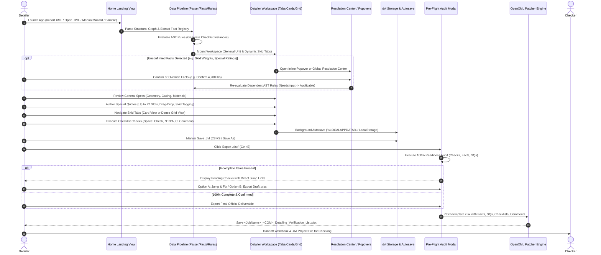

# AHU Detailing Verification System: End-to-End Workflow, Exposed Interfaces & Audit Specification

**Document Version:** 1.0.0  
**Classification:** Quality & Engineering Audit Specification  
**Application:** AHU Detailing Verification Desktop Application  
**Runtime Environment:** Windows Desktop (.NET 10 + WebView2) / Embedded React 18 + TypeScript SPA  
**Workbook Deliverable:** `Detailing Verification List.xlsx` (12 Worksheets, OpenXML 3.1.1 Engine)  
**Rule Pack Manifest:** Version 14.0.0 (104 Rules Total: 99 Active, 5 Archived; 22 Special Quote Slots)  

---

## 1. Executive Summary & Purpose

The **AHU Detailing Verification System** is a mission-critical engineering verification platform developed for Johnson Controls Custom Air Handling Unit (AHU) detailers and quality checkers. 

### 1.1. Core Objectives
1. **Automate Engineering Data Ingestion**: Parse complex bill-of-materials and parametric CAD configurations (`Config.xml` emitted by M.O.M. / Unit Editor selection tools) into a structured, relational object graph.
2. **Enforce Strict Fact Provenance**: Classify every unit and skid parameter under a 4-state provenance taxonomy (`Known`, `Derived`, `Unknown`, `ManuallyOverridden`) with 2-tier confidence gating (`Authoritative`, `RequiresConfirmation`).
3. **Execute Scoped AST Verification Rules**: Automatically evaluate 99 active fabrication, framing, casing, and component rules across Unit, Skid, Segment, and Component scopes to eliminate missed checks and fatal fabrication errors.
4. **Manage Special Quotes (SQs) & Deviations**: Author, sequence, and cross-link up to 22 custom customer engineering requirements to specific skids and rules.
5. **Generate Certified OpenXML Deliverables**: Inject verified facts, check statuses, initials, comments, and SQs into the official `Detailing Verification List.xlsx` template using `DocumentFormat.OpenXml`—dynamically pruning inactive category scratchpad sheets, adapting formula calculation chains on `Check Information` to prevent `#REF!` errors, and dynamically rendering structured skid-grouped verification rows.
6. **Guarantee Cryptographic Traceability**: Embed full SHA-256 hashes of the source XML and pinned Rule Pack bundle into self-contained `.dvl` project files for end-to-end auditability.

---

## 2. System Architecture & 4-Tier Data Pipeline

The system is organized into four distinct architectural layers, ensuring clear boundaries between uninterpreted raw data, business facts, rule logic, and physical Excel deliverables.

```mermaid
flowchart TD
    subgraph RulePack ["Rule Pack Distribution (v14.0.0)"]
        RPM[manifest.json<br/>SHA-256 Bundle Identity]
        RPR[rules.json<br/>AST Logic & Scope Rules]
        RPT[template_map.json<br/>Physical Excel Coordinates]
        RPA[approved_mappings.json<br/>Confirmed Code Mappings]
        RPX[template.xlsx<br/>Master Template]
        RPM --> RPR & RPT & RPA & RPX
    end

    subgraph Tier1 ["Tier 1: Ingestion & Relational Graph"]
        XML[Config.xml / UPZ / User Wizard] --> PARSER[NormalizedXmlParser / xmlParser.ts]
        PARSER --> GRAPH[Layer 1: NormalizedXmlGraph<br/>• Structural Hierarchy<br/>• Skids & Bases<br/>• Segments & Internals<br/>• Motor Controls]
    end

    subgraph Tier2 ["Tier 2: Provenance-Aware Fact Registry"]
        GRAPH --> EXTRACTOR[FactExtractor / factRegistry.ts]
        RPA -.->|Confirmed Only| EXTRACTOR
        EXTRACTOR --> FACTS[Layer 2: FactRegistry<br/>• 4-State Provenance<br/>• 2-Tier Confidence<br/>• Full Override History]
    end

    subgraph Tier3 ["Tier 3: Scoped AST Rule Engine"]
        FACTS --> EVAL[AstRuleEvaluator / ruleEvaluator.ts]
        RPR --> EVAL
        EVAL --> CHECKLISTS[Checklist Instances<br/>• Unit & Skid Scopes<br/>• Applicable | NotApplicable | NeedsInput<br/>• Fact Traces & Reasons]
    end

    subgraph Tier4 ["Tier 4: UI & OpenXML Synthesis"]
        CHECKLISTS & FACTS --> UI[Detailer Desktop UI<br/>WebView2 / React 18]
        UI <--> DVL[(.dvl Project File<br/>Header + Pinned Hashes + Facts + State)]
        UI --> PATCHER[OpenXmlTemplatePatcher<br/>DocumentFormat.OpenXml 3.1.1]
        RPT & RPX -.-> PATCHER
        PATCHER --> EXCEL[Detailing Verification List.xlsx<br/>Dynamic Pruning & Synthesis]
    end
```

### 2.1. Tier 1: Ingestion & Normalized Structural Graph (`NormalizedXmlGraph`)
- **Responsibility**: Ingests raw XML strings from engineering selection tools (or extracted from `.upz` archives) without mutating or guessing semantic meaning.
- **Entities Formed**:
  - **Unit Metadata**: MOM ID, Document Version, Generating Software Version, Total Unit Weight, Static Pressure, Length/Width/Height dimensions.
  - **Unit Options**: Housing style (`ThermalBreak` / `Standard`), Unit Type (`Outdoor` / `Indoor`), Brand Option (`YORKCustom`), Construction Type (`Standard`, `IBC`, `OSHPD`, `NOA`), Washdown, Knockdown, UTL lip presence.
  - **Materials & Gauges**: Interior liner material/gauge, Exterior skin material/gauge, Floor material/gauge, Insulation type.
  - **Roof & Curb Options**: Sloped roof parameters (slope, peak Z dimension, high-side orientation) and curb rest settings.
  - **Shipping Skids (`ShippingSkid[]`)**: Skid index, name, associated segment IDs, associated base IDs, calculated weight sum, authoritative weight, dimensions.
  - **Unit Bases (`UnitBase[]`)**: Height, lip height, material, base type, paint type, subfloor material/gauge.
  - **Segments (`Segment[]`)**: Segment ID, tag (`segment_IP`, `segment_CC`, `segment_FS`, etc.), type code, friendly name, air volume, pressure type, casing specs, internal component detection (coils, fans, filters, dampers, heat wheels, attenuators).
  - **Motor Controls (`MotorControl[]`)**: FLA, voltage, horsepower, disconnect size, service segment references.

### 2.2. Tier 2: Provenance-Aware Fact Registry (`FactRegistry`)
- **Responsibility**: Translates raw structural attributes into business facts evaluated against engineering rules.
- **4-State Status Taxonomy**:
  1. `Known`: Pulled directly 1:1 from an explicit XML element or UPZ order headers (`unit.jobName`, `unit.orderNumber`, `unit.tag`, `unit.productType`).
  2. `Derived`: Calculated through conditional logic, spatial calculations, or collection aggregation.
  3. `Unknown`: Encountered an unrecognized engineering code, missing parameter, or unresolvable option.
  4. `ManuallyOverridden`: Explicitly modified by the detailer. Retains original raw source value, timestamp, author, and reason.
- **2-Tier Confidence Model**:
  1. `Authoritative`: High-certainty fact that immediately evaluates dependent AST rules (`Applicable` / `NotApplicable`).
  2. `RequiresConfirmation`: Halts dependent rule evaluation, setting dependent rules to `NeedsInput` until confirmed or overridden by the detailer.

### 2.3. Tier 3: Scoped AST Rule Engine
- **Responsibility**: Evaluates declarative JSON-AST predicates from `rules.json` against scoped context dictionaries.
- **Scope Hierarchy**:
  - `Unit`: Evaluated once against unit-level facts (e.g., thermal break, roof slope, knockdown).
  - `Skid`: Evaluated once for *each* shipping skid against skid-specific facts (e.g., `skid.weight`, `skid.hasDrainPan`, `skid.hasFans`, `skid.hasCoils`, `skid.hasFilters`).
- **AST Operators Supported**:
  - Comparison: `>`, `<`, `>=`, `<=`, `===`, `!==`, `in`.
  - String Operations: `includes` (substring presence).
  - Logical Operations: `and`, `or`, `not`.
  - Variable Resolution: `{"var": "fact.key"}` dynamically resolved from the current scope context.
- **Outcome Matrix**:
  - If any required fact has `status: 'Unknown'` or `confidence: 'RequiresConfirmation'` $\rightarrow$ **`NeedsInput`** (Flagged in UI, triggers Fact Popovers).
  - If all facts are Authoritative and predicate evaluates to `true` $\rightarrow$ **`Applicable`** (Requires Detailer check-off).
  - If all facts are Authoritative and predicate evaluates to `false` $\rightarrow$ **`NotApplicable`** (Filtered out of dynamic deliverable rows).

### 2.4. Tier 4: Dynamic OpenXML Deliverable Synthesis (`OpenXmlTemplatePatcher.cs`)
- **Responsibility**: Patches official cell values and synthesizes verification deliverables using `DocumentFormat.OpenXml` v3.1.1+.
- **Dynamic Category Pruning**: Inactive category scratchpad sheets (`Base`, `Drain Pan`, `Housing`, `Paperwork`, `Internal`, `Coil Panels`, `Reconnects`, `MOM`) with zero applicable checks are removed from the workbook package.
- **Formula Adaptation**: Adapts `Check Information` formula calculation chains (`B8..B15`, `C8..C15`, `B19`, `B20`) replacing pruned category links with numeric `0` to prevent `#REF!` errors, and removes `CalculationChainPart` to force Excel to recalculate cleanly.
- **Dynamic Skid Row Generation**: Rebuilds `Verification List` rows $\ge 26$ dynamically with structured shipping skid and general unit section headers containing only applicable checks.
- **Shared String Management**: Manages Shared String Table (`SharedStringTablePart`) efficiently with unique string de-duplication.

---

## 3. End-to-End Operational Workflow

The application workflow progresses through 8 well-defined phases from initial project launch to checker sign-off.



### Phase 1: Ingestion & Onboarding Pathways
Detailers can onboard an AHU verification project through four distinct entry mechanisms:
1. **UPZ Unit Package Ingestion**:
   - Drag and drop or browse for a `.upz` unit archive.
   - Decompresses native container and authoritatively extracts `jobName`, `orderNumber`, `tag`, and `productType` from `OrderRev.xml`.
2. **XML File Import (`Config.xml`)**:
   - Ingests raw selection configuration XML.
   - Populates the Fact Registry and generates initial checklist instances.
3. **Open `.dvl` Project File**:
   - Opens previously saved `.dvl` project files.
   - Executes cryptographic integrity audit `inspectDvlIntegrity(...)`:
     - Verifies that embedded XML SHA-256 matches the embedded XML text.
     - Verifies that the pinned Rule Pack bundle hash matches the active runtime Rule Pack (v14.0.0 `020e8ef...`).
     - Flags unverified or legacy files with a persistent top banner while allowing seamless editing.
4. **Manual Unit Setup Wizard (`ManualUnitModal`)**:
   - Enables detailers to create a verified project from scratch when no XML is available.
   - Captures Job Name, COM#, Detailer Name, Environment (`Outdoor`/`Indoor`), Housing Style (`ThermalBreak`/`Standard`), Skid Count (1..6), Wall Thickness (2", 3", 4"), and Base Height (6", 8", 10", 12").
   - Synthesizes a valid structural graph with default Inlet Plenums, Access Sections, and Supply Fan sections, ensuring 100% downstream pipeline compatibility.
5. **Load Demo Dataset**:
   - Loads the reference 4-skid Medical Center Phase 3 dataset with pre-configured Special Quotes for rapid feature exploration and testing.
6. **Autosave Recovery**:
   - Detects any previous un-finalized session from local storage and displays a one-click **"Resume Previous Session"** banner with timestamp and job metadata.

### Phase 2: Fact Extraction, Classification & Traceability
The ingestion engine extracts over 22 unit-level facts and $N \times 7$ per-skid facts:
- **Order & Identity**: `unit.jobName`, `unit.comNumber`, `unit.detailer`, `unit.date`.
- **Geometry & Casing**: `unit.shellType`, `unit.unitType`, `unit.baseHeight`, `unit.wallThickness`, `unit.thermalBreak`, `unit.roofPeak`, `unit.curbrest`, `unit.utl`, `unit.totalWeight`, `unit.totalStaticPressure`.
- **Materials & Gauges**: `unit.skinMaterial`, `unit.skinGauge`, `unit.linerMaterial`, `unit.linerGauge`, `unit.floorMaterial`, `unit.floorGauge`.
- **Ratings & Regulatory**: `unit.noa`, `unit.isSeismic`, `unit.location`, `unit.knockdown`.
- **Per-Skid Features**: `skid.<id>.weight`, `skid.<id>.segmentCount`, `skid.<id>.hasDrainPan`, `skid.<id>.hasFans`, `skid.<id>.hasCoils`, `skid.<id>.hasFilters`, `skid.<id>.hasHeatWheel`.

### Phase 3: Fact Resolution & Engineering Confirmation
To prevent safety hazards (e.g. lifting lug failures) and compliance violations:
1. **Strict Skid Weight Semantics**:
   - Aggregate skid weight is computed by summing segment weights but flagged with `status: 'Derived'` and `confidence: 'RequiresConfirmation'`.
   - Dependent rules (e.g. `BASE-01`: Lifting lug support > 4,000 lbs) evaluate to `NeedsInput` until explicitly confirmed or overridden.
2. **Unrecognized Code Guard**:
   - Non-standard construction options (e.g. unknown wind load codes) default to `Unknown` / `RequiresConfirmation`, forcing detailer resolution before seismic/NOA rules can evaluate.
3. **Resolution Pathways**:
   - **Inline Fact Popovers (`InlineFactPopover`)**: Located directly on rule cards and skid overview headers for one-click in-context resolution.
   - **Global Fact Resolution Center (`ResolutionCenterModal`)**: Accessible via header/sidebar warning chips. Shows all pending facts, one-click confirmation buttons, and a **"Quick Action: Approve All Defaults"** button.

### Phase 4: General Unit Specifications & SQ Management
On the **General Unit** tab:
1. **Specification Review**:
   - 4-card balanced grid displaying Order & Identity, Geometry & Casing, Materials & Gauges, and Ratings & Regulatory.
   - Each row displays Field Label, Source XPath / pointer, editable Value Input, and Provenance Badge (`Auto: XML`, `Derived`, `Overridden` with 1-click Revert, or `Confirm` button).
2. **Special Quotes (SQ) & Deviations Manager**:
   - Supports authoring up to 22 Special Quotes mapped to the official 22-slot table on the Excel `Verification List` sheet.
   - Allows tagging each SQ to **General Unit**, a specific **Shipping Skid** (e.g. `Skid 3`), or a specific **Rule ID** (e.g. `BASE-01`).
   - Drag-and-drop grip handles enable instantaneous slot reordering.
   - Detailers can toggle verification status (`Verified` / `Pending`) per SQ slot.
3. **General Additional Comments**:
   - Multi-line textarea for overarching job notes, mapped to cell `D22` of the official `Verification List` sheet.

### Phase 5: Skid-Centric Verification Review
Detailers navigate through dynamic shipping skid tabs (`Skid 1`, `Skid 2`, ... `Skid N`):
1. **Skid Boundary Banner**:
   - Displays skid index, segment count, base count, dimensions ($L \times W \times H$), aggregate weight with provenance tag, completion percentage, and colorful segment palette chips (e.g., `IP` Inlet Plenum, `CC` Cooling Coil, `FS` Supply Fan).
   - Shows dedicated warning box for any Special Quotes tagged to this skid.
2. **Dual View Modes**:
   - **Card View (`viewMode: 'cards'`)**: Rich collapsible category accordions (`Base`, `Housing`, `Knockdown`, `UTL`, `Paperwork`, `MOM`, `Internals` with subgroups) featuring full rule text, specification references, AST evaluation logic traces, inline comment inputs, and action buttons.
   - **Dense Spreadsheet Grid (`viewMode: 'grid'`)**: High-density table designed for rapid inspection, displaying index, rule ID/scope, description, applicability badge, check-off button, N/A toggle, comment input, and linked SQ tag.
3. **Productivity & Keyboard Navigation Suite**:
   - `↑` / `↓` or `J` / `K`: Move focused rule up/down.
   - `Space`: Toggle rule check-off (`Incomplete` $\leftrightarrow$ `Passed`).
   - `N`: Toggle rule Not Applicable (`Incomplete` $\leftrightarrow$ `NA`).
   - `C`: Focus detailer comment input box for the active rule.
   - `Ctrl+K`: Open global omni-search modal.
   - `Ctrl+S`: Save `.dvl` project.
   - `Ctrl+Shift+S`: Save As `.dvl` project.
   - `Ctrl+E`: Open Pre-Flight verification export dialog.
   - `Ctrl+B`: Toggle left navigation sidebar collapse.
4. **Status Filter Chips**:
   - Filter instantly by `All`, `Incomplete`, `Needs Input`, `Applicable`, or `Passed`.

### Phase 6: Pre-Flight Verification Audit & Gating
When the detailer clicks **"Export .xlsx"** (`PreFlightModal`):
1. **Automated Readiness Audit**:
   - Evaluates total applicable checks, passed checks, pending checks, populated SQ slots, and unconfirmed facts.
   - Calculates overall readiness percentage.
2. **Interactive Jump Links**:
   - If incomplete checks exist, lists each pending rule with scope badges. Clicking any item automatically switches to the relevant skid/unit tab and focuses the rule.
3. **Gated Delivery Options**:
   - **Export Final .xlsx**: Enabled when 100% of applicable checks are passed and all facts are confirmed.
   - **Export Draft .xlsx**: Permitted if items remain incomplete; automatically applies `[DRAFT - INCOMPLETE AUDIT]` watermarks to the revision sheet, title block, and comment cells to prevent uncertified shop release.
   - **Download .dvl**: One-click project state export.

### Phase 7: Project Persistence & Crash Recovery
1. **`.dvl` Project Structure**:
   - Completely self-contained JSON schema storing format version, application version, author, timestamps, job name, COM number, pinned Rule Pack version and SHA-256 bundle hash, embedded raw `Config.xml` and its SHA-256 hash, full Normalized Graph, Fact Registry with override histories, Special Quotes array, Checklist Instances with comments and timestamps, and general comments.
2. **Desktop Atomic Save Semantics**:
   - First Save triggers native `SaveFileDialog`.
   - Subsequent Saves reuse the existing path atomically by writing to a temporary sibling file (`.dvl.tmp`) and replacing the destination only after flushing to disk.
   - Save As always prompts for a new destination.
3. **Continuous Background Autosave**:
   - Every modification automatically debounces and writes to `%LOCALAPPDATA%/AHUVerification/` (or browser storage), guaranteeing zero data loss on unexpected process termination.

### Phase 8: Deliverable Generation & Checker Handoff
1. **OpenXML Template Patching**:
   - The desktop C# engine loads `resources/rulepack/template.xlsx` and patches cell coordinates defined in `template_map.json`:
     - General unit specs $\rightarrow$ `Verification List!D3:D22` and `F19:F21`.
     - Special Quotes 1..22 $\rightarrow$ `Verification List!G4:H25`.
     - Verification checks $\rightarrow$ Columns S (N/A), T (Detailer Check), Y (Comments), Z (Initials).
   - Generates standardized deliverable filename: `<JobName>_<COM>_Detailing_Verification_List.xlsx`.
2. **Post-Export Instant Actions**:
   - Displays a success banner with direct action buttons: **"Open in Excel"** (launches Excel directly) and **"Show in Folder"** (opens Windows File Explorer with the exported file selected).

---

## 4. Complete Catalog of Exposed Interfaces & Controls

The following inventory details every view, component, modal, and control exposed in the application.

| Surface / Area | Component Name | Visual Controls & Elements Exposed | Trigger / Keyboard Shortcut |
| :--- | :--- | :--- | :--- |
| **Landing Screen** | `HomePage.tsx` | • Rule Pack version badge<br/>• Autosave resume banner (Job, COM, time, Resume button, Discard button)<br/>• 4 Launch Cards: "Import Config.xml", "Open .dvl Project", "Manual Unit Setup", "Load Demo Dataset"<br/>• Drag-and-drop file dropzone | Initial app state / "Home" button in header |
| **Setup Wizard** | `ManualUnitModal.tsx` | • Inputs: Job Name, COM#, Detailer Name<br/>• Toggle Buttons: Outdoor vs. Indoor, Thermal Break vs. Standard<br/>• Selects: Wall Thickness (2", 3", 4"), Base Height (6", 8", 10", 12")<br/>• Skid Selector: 1 to 6 shipping skids<br/>• Buttons: Cancel, Initialize Workspace | Click "Manual Unit Setup" on Home screen |
| **Navigation Rail** | `Sidebar.tsx` | • AHU Logo & Brand badge<br/>• Collapse/Expand button (`Ctrl+B`)<br/>• "General Unit Specs" tab with completion badge and NeedsInput alert pill<br/>• Dynamic Skid Tabs (`Skid 1..N`) with index, segment count, weight, progress percentage, mini progress bar, and completion checkmark<br/>• Special Quotes counter widget (`X / 22 slots`)<br/>• Footer metadata (Schema ver, Total weight, Enclosure dimensions) | Left sidebar (collapsible from 288px to 64px) |
| **Top Action Bar** | `Header.tsx` | • "Home" button<br/>• Job Name & COM# display<br/>• Autosave timestamp indicator<br/>• Pinned Rule Pack badge (`v14.0.0`)<br/>• Omni-Search bar (`Ctrl+K`)<br/>• Action Buttons: "Sample XML", "Upload" (XML/.dvl), "Save .dvl" (`Ctrl+S`), "Save As" (`Ctrl+Shift+S`), "Facts" Resolution button (with pending badge), "Export .xlsx" (`Ctrl+E`)<br/>• 3-Way Theme button (System / Dark / Light)<br/>• Settings button | Persistent top bar across all workspace views |
| **General Unit Tab** | `GeneralUnitTab.tsx` | • Ingestion Overview banner (software, schema, total weight, $L \times W \times H$ box)<br/>• Card 1: Order & Identity fields (`D3..D6`)<br/>• Card 2: Geometry & Casing Dimensions fields (`D7..D13`, `D18`)<br/>• Card 3: Materials & Gauges BOM fields (`D19..F21`)<br/>• Card 4: Ratings & Regulatory fields (`D14..D17`)<br/>• Special Quotes Manager: New SQ text input, scope tag selector, "Add SQ Slot" button, 22-slot table with drag handles, text editors, scope tags, verified buttons, and delete buttons<br/>• General Comments textarea (`D22`) | Sidebar -> Click "General Unit Specs" |
| **Skid View Tab** | `SkidViewTab.tsx` | • Skid Overview banner (index, segment count, base count, dimensions, derived weight with confirmation pill, passed checks counter)<br/>• Segment palette chips with type codes, names, and weights<br/>• Linked SQs alert box<br/>• Filter chips: `All`, `Incomplete`, `Needs Input`, `Applicable`, `Passed`<br/>• View Mode toggle: `Card View` vs. `Dense Grid`<br/>• Keyboard helper badge (`↑/↓`, `Space`, `N`, `C`)<br/>• **Card View**: Collapsible category accordions with progress counters, rule ID badges, rule text, reference standards, AST evaluation logic trace boxes, comment inputs, "Verified / Check Off" buttons, "N/A" buttons, and Inline Fact Popovers<br/>• **Dense Grid**: High-density table with row indexing, rule ID/scope, description, applicability badge, check-off button, N/A button, inline comment input, and SQ tag pill | Sidebar -> Click any `Skid 1..N` tab |
| **Inline Fact Popover** | `InlineFactPopover.tsx` | • Trigger button with alert triangle<br/>• Popover card: Fact label, status, confidence note, prompt guidance<br/>• Quick-resolve action buttons / input field<br/>• "Confirm" / "Update Fact" button | Click "Confirm", "Needs Input", or "Resolve Fact" anywhere in UI |
| **Resolution Center** | `ResolutionCenterModal.tsx` | • Modal header with pending facts count badge<br/>• "Quick Action: Approve All Defaults" batch button<br/>• List of pending facts (Seismic certifications, Miami-Dade NOA wind load ratings, Aggregate Skid Weights)<br/>• Explicit resolution buttons per fact: "Standard (Non-Seismic)" vs. "Seismic Certified", "Not Applicable" vs. "NOA 21-0428.03", "Approve Calculated Weight"<br/>• "Done & Return" button | Click "Facts" button in Header or Warning chips |
| **Pre-Flight Modal** | `PreFlightModal.tsx` | • Readiness status header & percentage badge<br/>• 4 Summary Metric Cards: Applicable Checks, Verified Checks, Pending Checks, SQs Populated<br/>• Interactive Jump-Links list for incomplete checks with scope tags and jump arrows<br/>• Pending Facts warning box with "Resolve Facts" redirect button<br/>• Actions: "Download .dvl", "Export Final .xlsx" (or "Export Draft .xlsx") | Click "Export .xlsx" in Header (`Ctrl+E`) |
| **Omni-Search Modal** | `OmniSearchModal.tsx` | • Search input with auto-focus and `ESC` dismiss<br/>• Categorized real-time search results: Verification Rules (with jump links), Specifications & Facts (with values), Shipping Skids (with segment counts), Special Quotes (with slot tags) | Header search bar or `Ctrl+K` |
| **Settings Modal** | `SettingsModal.tsx` | • Appearance Theme selector: System Default, Dark Theme, Light Theme<br/>• Detailer Identity input: Default Full Name (with auto-initials preview)<br/>• Pinned Rule Pack information: Version, rule count, OpenXML engine verification status<br/>• Workspace Storage: Autosave timestamp, "Clear Autosave" button | Settings gear icon in Header |

---

## 5. Complete Field Entry & User Interaction Inventory

This section details every parameter intended to be reviewed, confirmed, or entered by detailers.

### 5.1. General Specifications & Fact Registry Fields

| Field Key | UI Label | Category | Default / XML Source Pointer | Target Excel Cell | Input Type | Allowed Values / Format | User Action & Purpose |
| :--- | :--- | :--- | :--- | :--- | :--- | :--- | :--- |
| `unit.jobName` | Job Name | Order & Identity | XML: `"Medical Center Phase 3"` / Wizard | `Verification List!D5` | Text input | String (e.g. `"Hospital Tower B"`) | Enter official customer project title from MAPICS order packet. |
| `unit.comNumber` | COM # | Order & Identity | XML: `"COM-842910"` / Wizard | `Verification List!D6` | Text input | String (Format: `COM-XXXXXX`) | Enter manufacturing shop order COM number. |
| `unit.detailer` | Detailer Name | Order & Identity | `"Tanner Dean"` / Settings profile | `Verification List!D3` | Text input | String (e.g. `"John Smith"`) | Identifies responsible detailer. Auto-derives initials for column Z. |
| `unit.date` | Verification Date | Order & Identity | Current ISO Date (`YYYY-MM-DD`) | `Verification List!D4` | Text input | Date (`YYYY-MM-DD`) | Date verification checks were conducted. |
| `unit.shellType` | Shell Type | Geometry & Casing | `/root:AHU/.../housingStyle` | `Verification List!D7` | Text input | `ThermalBreak`, `Standard` | Verify thermal break casing vs. standard casing construction. |
| `unit.unitType` | Unit Type | Geometry & Casing | `/root:AHU/.../unitType` | `Verification List!D8` | Text input | `Outdoor`, `Indoor` | Governs roof weatherproofing and outdoor split seal rules. |
| `unit.baseHeight` | Base Height (in) | Geometry & Casing | `/root:AHU/.../defaultUnitBaseHeight` | `Verification List!D9` | Numeric text | Number (6, 8, 10, 12) | Structural base channel height. |
| `unit.wallThickness`| Wall Thickness (in)| Geometry & Casing | Derived from casing style (2.0) | `Verification List!D10` | Numeric text | Number (2.0, 3.0, 4.0) | Enclosure wall insulation thickness. |
| `unit.thermalBreak` | Thermal Break | Geometry & Casing | Derived: `housingStyle.includes('ThermalBreak')` | `Verification List!D11` | Text input | `Yes`, `No` | Controls thermal break CAD model parameter rules. |
| `unit.roofPeak` | Roof Peak (in) | Geometry & Casing | Derived from `<roofOptions>` (e.g. `97" (0.25"/ft)`) | `Verification List!D12` | Text input | String (e.g. `97" (0.25"/ft)` or `Flat`) | Roof slope profile for outdoor weather drainage. |
| `unit.curbrest` | Curbrest Option | Geometry & Casing | `/root:AHU/curbOptions/hasCurbRest` | `Verification List!D13` | Text input | `Yes`, `No` | Governs formed channel airflow opening rules. |
| `unit.noa` | Notice of Acceptance | Ratings & Options | Derived: `unitConstructionType` | `Verification List!D14` | Text / Resolution | `NOA`, `N/A`, `NOA 21-0428.03` | Explicitly confirm Miami-Dade / Florida wind load certification. |
| `unit.isSeismic` | Seismic Certification | Ratings & Options | Derived: `unitConstructionType` | `Verification List!D15` | Text / Resolution | `true`, `false`, `Yes`, `No` | Governs seismic reconnect rules (`RECON-01`). |
| `unit.location` | Installation Location| Ratings & Options | Derived: Outdoor $\rightarrow$ Exterior | `Verification List!D16` | Text input | `Rooftop / Exterior`, `Mechanical Room` | Installation environment. |
| `unit.knockdown` | Knockdown Construction | Ratings & Options | `/root:AHU/unitOptions/knockdown` | `Verification List!D17` | Text input | `Yes`, `No` | Governs knockdown subassembly weld rules (`KNOCK-01..04`). |
| `unit.utl` | Upturned Lip (UTL) | Geometry & Casing | Derived from `<upturnedLipHeight>` | `Verification List!D18` | Text input | `Yes (2.0" Lip)`, `No` | Governs upturned lip casing height rules (`UTL-01..07`). |
| `unit.linerMaterial`| Liner Material | Materials & Gauges | `/root:AHU/.../interiorMaterialType` | `Verification List!D19` | Text input | `STL GALV`, `AL`, `SS304`, `SS316` | Casing interior liner metal specification. |
| `unit.linerGauge` | Liner Gauge | Materials & Gauges | `/root:AHU/.../interiorMaterialGauge`| `Verification List!F19` | Numeric text | Number (18, 20, 22) | Sheet metal gauge for liner. |
| `unit.skinMaterial` | Skin Material | Materials & Gauges | `/root:AHU/.../exteriorMaterialType` | `Verification List!D20` | Text input | `STL GALV PPC`, `AL`, `SS304` | Casing exterior skin specification. |
| `unit.skinGauge` | Skin Gauge | Materials & Gauges | `/root:AHU/.../exteriorMaterialGauge`| `Verification List!F20` | Numeric text | Number (16, 18, 20) | Sheet metal gauge for skin. |
| `unit.floorMaterial`| Floor Material | Materials & Gauges | `/root:AHU/.../floorMaterialType` | `Verification List!D21` | Text input | `STL GALV`, `AL TREAD`, `SS304` | Unit walking floor plate material. |
| `unit.floorGauge` | Floor Gauge | Materials & Gauges | `/root:AHU/.../floorMaterialGauge` | `Verification List!F21` | Numeric text | Number (14, 16, 18) | Sheet metal gauge for floor. |
| `generalComments` | Additional Comments | Job Notes | Standard boilerplate | `Verification List!D22` | Textarea | Multi-line text | Overarching job remarks written directly to Excel. |

### 5.2. Per-Skid Feature Confirmation & Derived Weights

| Fact Key | Label | Scope | Derivation Logic | UI Resolution Control | User Action & Purpose |
| :--- | :--- | :--- | :--- | :--- | :--- |
| `skid.<id>.weight` | Skid Aggregate Weight | Skid | $\sum_{s \in \text{Skid}} s.\text{weight}$ | Inline Popover / Resolution Center | **Mandatory Action**: Detailer must review calculated weight sum and click "Approve Calculated Weight" or enter authoritative lifting weight to satisfy crane lifting lug rules (`BASE-01`). |
| `skid.<id>.hasDrainPan` | Has Drain Pan | Skid | Scans for `segment_CC` or `"drain"` internals | Auto-derived (Authoritative) | Triggers drain pan slope, support, and bulkhead rules (`BASE-08`, `BASE-15`, `BASE-17`, `BASE-19`, `BASE-20`). |
| `skid.<id>.hasFans` | Has Fans | Skid | Scans for `FS`, `FE`, `FR` segments or `<fan>` | Auto-derived (Authoritative) | Triggers fan wall framing and motor rail checks (`FAN-01..09`). |
| `skid.<id>.hasCoils` | Has Coils | Skid | Scans for `CC`, `HC`, `IC`, `VC` or `<coil>` | Auto-derived (Authoritative) | Triggers coil panel width and casing rules (`HOUS-06`, `COIL-01..07`). |
| `skid.<id>.hasFilters` | Has Filters | Skid | Scans for `FF`, `RF`, `AF`, `HF`, `EF` | Auto-derived (Authoritative) | Triggers filter stiffener roof channel support rules (`HOUS-19`, `FILT-01..06`). |
| `skid.<id>.hasHeatWheel`| Has Heat Wheel | Skid | Scans for `HW` energy recovery segments | Auto-derived (Authoritative) | Triggers heat wheel structural framing rules (`WHEEL-01..05`). |

### 5.3. Special Quotes (SQs) 22-Slot Table (`Verification List!G4:H25`)

| Field / Column | Slot Range | Target Excel Cell | Input Type | Allowed Values / Options | User Action & Purpose |
| :--- | :--- | :--- | :--- | :--- | :--- |
| **Slot Number** | 1 to 22 | `Verification List!G4:G25` | Auto-assigned / Drag handle | Integer ($1 \dots 22$) | Position of the Special Quote item in the official Excel table. |
| **Description Text** | 1 to 22 | `Verification List!H4:H25` | Text input | Free-form string (e.g. `"SQ-101: 3.5 in. copper drain downspout"`) | Specific non-standard customer requirement authored by engineering. |
| **Linked Scope** | 1 to 22 | Internal (`.dvl` only) | Dropdown selector | `General Unit`, `Skid 1..N`, `Rule ID` | Links SQ to relevant skid or rule, automatically displaying contextual warning badges on that skid's tab and rule cards. |
| **Verification State**| 1 to 22 | Internal (`.dvl` only) | Toggle button | `Verified` (Green) / `Pending` (Gray) | Tracks detailer completion of the special requirement. |

### 5.4. Verification Checklist Rules (104 Rules across 7 Categories)

For every applicable rule instance across Unit and Shipping Skids, the detailer interacts with the following controls:

| Check Action / Field | Shortcut | Excel Mapping | Target Values | Operational Purpose |
| :--- | :--- | :--- | :--- | :--- |
| **Check Off / Verified** | `Space` | `Verification List` Column T (`Detailer Check`) | `"Yes"` (when checked), `"0"` (when unchecked) | Certifies that the detailer has physically verified the drawing/model against the standard. |
| **Mark N/A** | `N` | `Verification List` Column S (`N/A`) | `"Yes"` (when N/A), `"0"` (when applicable) | Marks the check as non-applicable for this specific unit/skid (only available if `allowNA: true`). |
| **Detailer Comment** | `C` | `Verification List` Column Y (`Comments`) | String text (e.g. `"Verified per RFI-12"`) | Adds specific clarifying remarks or deviation references for the checker. |
| **Initials** | Auto | `Verification List` Column Z (`Initials`) | 2-letter uppercase initials (e.g. `"TD"`) | Automatically stamped from the detailer's profile name upon check-off. |

---

## 6. Comprehensive Verification Rule Catalog Reference

The application contains 104 standardized rules transcribed from the master Excel verification template. The table below summarizes the rule categories, counts, and primary engineering references.

| Category Key | Subgroup | Total Rules | Active Rules | Sample Rule IDs | Primary Engineering Reference |
| :--- | :--- | :---: | :---: | :--- | :--- |
| **Base** | Main Base Framing | 23 | 20 | `BASE-01` to `BASE-20` *(3 archived)* | ASSY Manual p.391-40206-003, Base Fab Dwg 391-10001-002, Drafting Std D-101 |
| **Housing** | Casing, Walls & Roof | 25 | 25 | `HOUS-01` to `HOUS-25` | Weatherproofing Std W-102, Unit Construction Rules p.23, Housing Std H-201 |
| **Knockdown** | Field Assembly | 4 | 4 | `KNOCK-01` to `KNOCK-04` | Knockdown Assembly Guide, Shipping Split Criteria |
| **UTL** | Upturned Lip Base | 7 | 7 | `UTL-01` to `UTL-07` | Upturned Lip Construction Standard UTL-100 |
| **Paperwork** | BOM & Schedules | 13 | 13 | `PAPER-01` to `PAPER-13` | Master BOM Scheduling Standard, Drafting Stamp Requirements |
| **MOM** | Selection Tool Models | 4 | 4 | `MOM-01` to `MOM-04` | MOM AHU Revision Serializer Integration Guide |
| **Internals** | Fan Segments | 9 | 8 | `FAN-01` to `FAN-09` *(1 archived)* | Fan Wall Array Manual, Motor Removal Rail Spec |
| **Internals** | Coil Segments | 7 | 6 | `COIL-01` to `COIL-07` *(1 archived)* | Coil Bulkhead Interface Standard, Coil Pull Schedule |
| **Internals** | Access Segments | 3 | 3 | `ACC-01` to `ACC-03` | Access Door & Interior Corridor Standard |
| **Internals** | Filter Segments | 6 | 6 | `FILT-01` to `FILT-06` | Filter Framing & Stiffener Loading Standard |
| **Internals** | Reconnects | 3 | 3 | `RECON-01` to `RECON-03` | Seismic Reconnect Master Model Standard |
| **TOTALS** | — | **104** | **99 Active** | — | **Rule Pack v14.0.0 (`020e8ef...`)** |

---

## 7. Quality & Audit Compliance Checklist

When conducting an official audit of a completed verification deliverable, auditors should verify the following 7 checkpoints:

- [ ] **1. Cryptographic File Integrity**: The `.dvl` project file contains valid 64-character SHA-256 hashes matching the embedded `Config.xml` and pinned Rule Pack bundle (`020e8ef38896efc9abcdb820b2dbde73ea251ddccbc646f63e06b337b2e1bc28`).
- [ ] **2. Fact Confirmation Provenance**: Zero facts remain in `Unknown` or `RequiresConfirmation` state. Every shipping skid has an explicitly confirmed aggregate lifting weight.
- [ ] **3. Rule Completion Fidelity**: All applicable checks across the General Unit and all Shipping Skids have status `Passed` or `NA` with matching detailer initials in column Z.
- [ ] **4. Special Quotes Reconciliation**: All customer deviations from the order packet are accounted for in the 22-slot SQ table and linked to their respective shipping skids.
- [ ] **5. Dynamic Excel Synthesis Fidelity**: The generated `Detailing Verification List.xlsx` workbook prunes inactive category sheets, dynamically adapts `Check Information` formulas without `#REF!` or `#VALUE!` corruption, and renders grouped shipping skid sections containing only applicable checks.
- [ ] **6. Data Validation Retention**: All 12 `DataValidations` elements (Yes/No/0/N/A dropdowns) remain intact across the patched Excel worksheets.
- [ ] **7. Non-Draft Certification**: For official manufacturing release, the workbook must not contain `[DRAFT - INCOMPLETE VERIFICATION AUDIT]` watermarks in cell `D22` or the `Revision List` sheet.
