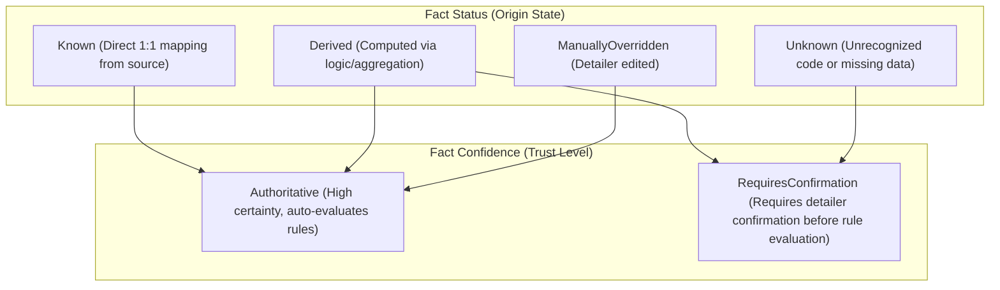
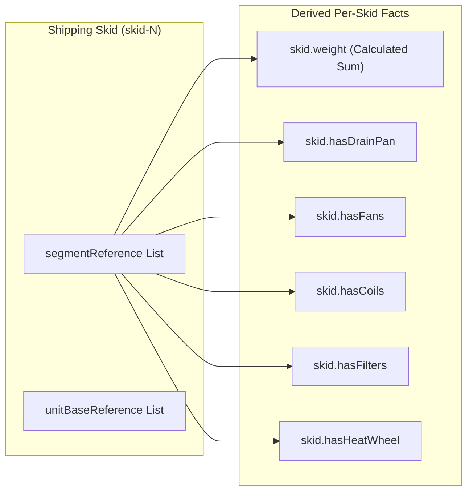
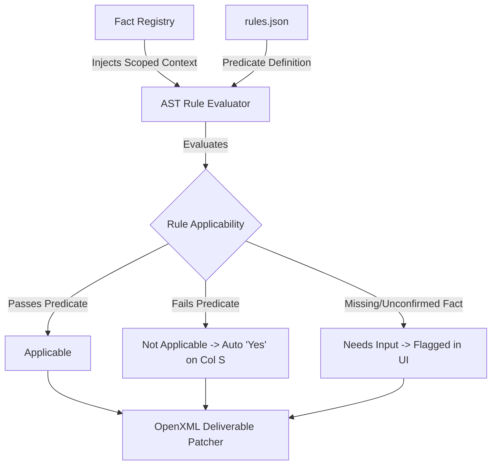

# AHU Detailing Verification: Field Derivation & Classification Report

## Executive Summary

The AHU Detailing Verification system ingests unit specifications and transforms them into a **Layer 2 Provenance-Aware Fact Registry** and **Scoped AST Checklist Instances**, which ultimately patch the official `Detailing Verification List.xlsx` workbook via OpenXML.

There are two distinct entry points for establishing project data:
1. **XML Import (`Config.xml`)**: Parses engineering XML data into a normalized structural graph (`NormalizedXmlGraph`), inspects internal hierarchies and geometry, and extracts facts with precise XPath source pointers and strict confidence boundaries.
2. **Manual Project Setup Wizard**: Synthesizes a baseline unit graph from a minimal set of user inputs, applies manual overrides to the fact registry, and initializes default skids, bases, and segments for manual checklist evaluation.

---

## 1. Provenance & Classification Taxonomy

Every field within the Fact Registry is assigned a dual classification determining its origin, editability, and trust tier:



- **`FactStatus`**:
  - `Known`: Field pulled verbatim from a designated XML element or user input.
  - `Derived`: Computed through conditional logic, string inspection, spatial geometry calculations, or collection aggregations.
  - `Unknown`: Unrecognized vendor code, invalid construction option, or unresolvable field.
  - `ManuallyOverridden`: Explicitly modified by the detailer; records previous values, timestamp, and author in `overrideHistory`.
- **`FactConfidence`**:
  - `Authoritative`: Evaluates dependent verification rules immediately (`Applicable` / `NotApplicable`).
  - `RequiresConfirmation`: Halts dependent AST rule evaluation and marks rules as `NeedsInput` until confirmed or overridden by the detailer.

---

## 2. Comparison Matrix: Manual Setup vs. XML / UPZ Ingestion

| Field Key | Label | Category | Manual Setup Origin & Logic | Ingestion Source Pointer & Logic | Status | Confidence | Target Excel Cell |
| :--- | :--- | :--- | :--- | :--- | :--- | :--- | :--- |
| `unit.jobName` | Job Name | Order & Identity | Wizard Input: `config.jobName` | UPZ: `/root:OrderRevision/jobName`<br/>XML: Default `"Medical Center Phase 3"` | `Known` | `Authoritative` | `Verification List!D5` |
| `unit.orderNumber` | Order Number | Order & Identity | Wizard Input: N/A | UPZ: `/root:OrderRevision/orderNumber`<br/>XML: Prompted | `Known` | `Authoritative` | Context / Header |
| `unit.tag` | Unit Tag | Order & Identity | Wizard Input: N/A | UPZ: `/root:OrderRevision/tagList/tag`<br/>XML: Prompted | `Known` | `Authoritative` | Context / Header |
| `unit.productType` | Product Type | Order & Identity | Wizard Input: `config.productType` (`SolutionYC`) | UPZ: `/root:OrderRevision/productType`<br/>XML: `/root:AHU/unitOptions/unitType` | `Known` | `Authoritative` | Context / Header |
| `unit.comNumber` | COM # | Order & Identity | Wizard Input: `config.comNumber` (Default: "COM-100001") | Default: `"COM-842910"` (Manual Entry from MAPICS Order Packet) | `Known` | `Authoritative` | `Verification List!D6` |
| `unit.detailer` | Detailer Name | Order & Identity | Wizard Input: `config.detailerName` (Default: "Detailer") | Default: `"Tanner Dean"` (Current detailer profile) | `Known` | `Authoritative` | `Verification List!D3` |
| `unit.date` | Verification Date | Order & Identity | Current ISO Date (`YYYY-MM-DD`) | Current UTC ISO Date (`YYYY-MM-DD`) | `Known` | `Authoritative` | `Verification List!D4` |
| `unit.shellType` | Shell Type | Geometry & Casing | Wizard Input: `config.housingStyle` (`ThermalBreak` / `Standard`) | `/root:AHU/unitOptions/defaultConstructionOptions/housingStyle` | `Known` | `Authoritative` | `Verification List!D7` |
| `unit.unitType` | Unit Type | Geometry & Casing | Wizard Input: `config.unitType` (`Outdoor` / `Indoor`) | `/root:AHU/unitOptions/unitType` | `Known` | `Authoritative` | `Verification List!D8` |
| `unit.baseHeight` | Base Height (in) | Geometry & Casing | Wizard Input: `config.baseHeight` (Default: `10.0`) | `/root:AHU/unitOptions/defaultUnitBaseHeight` (Fallback: `10`) | `Known` | `Authoritative` | `Verification List!D9` |
| `unit.wallThickness` | Wall Thickness (in) | Geometry & Casing | Wizard Input: `config.wallThickness` (Default: `2.0`) | `/root:AHU/unitOptions/defaultConstructionOptions/surfaceDetail_Front/housingThickness` | `Derived` | `Authoritative` | `Verification List!D10` |
| `unit.thermalBreak` | Thermal Break | Geometry & Casing | Derived: `housingStyle === 'ThermalBreak' ? 'Yes' : 'No'` | Derived: `housingStyle.includes('ThermalBreak') ? 'Yes' : 'No'` | `Derived` | `Authoritative` | `Verification List!D11` |
| `unit.roofPeak` | Roof Peak (in) | Geometry & Casing | Derived: `unitType === 'Outdoor' ? '97" (0.25"/ft)' : 'Flat'` | Derived: `hasSlopedRoof ? '${roofPeakZDim}" (${roofSlope}"/ft)' : 'Flat'` | `Derived` | `Authoritative` | `Verification List!D12` |
| `unit.curbrest` | Curbrest Option | Geometry & Casing | Derived: `unitType === 'Outdoor' ? 'Yes' : 'No'` | `/root:AHU/curbOptions/hasCurbRest` | `Known` | `Authoritative` | `Verification List!D13` |
| `unit.noa` | Notice of Acceptance | Ratings & Options | Default: `'N/A'` | Derived from `unitConstructionType`: If `'NOA'` -> `'NOA'`; if recognized (`Standard`/`IBC`/`OSHPD`) -> `'N/A'`; else `'Unknown'` | `Derived` / `Unknown` | `Authoritative` / `RequiresConfirmation` | `Verification List!D14` |
| `unit.isSeismic` | Seismic Certification | Ratings & Options | Default: `false` | Derived from `unitConstructionType`: If `'IBC'` or `'OSHPD'` -> `true`; if `'Standard'`/`'NOA'` -> `false`; else `Unknown` | `Derived` / `Unknown` | `Authoritative` / `RequiresConfirmation` | `Verification List!D15` |
| `unit.location` | Installation Location | Ratings & Options | Derived: `unitType === 'Outdoor' ? 'Rooftop / Exterior' : 'Mechanical Room'` | Derived: `unitType === 'Outdoor' ? 'Rooftop / Exterior' : 'Mechanical Room'` | `Derived` | `Authoritative` | `Verification List!D16` |
| `unit.knockdown` | Knockdown Construction | Ratings & Options | Default: `false` (`'No'`) | `/root:AHU/unitOptions/knockdown` (`'Yes'` / `'No'`) | `Known` | `Authoritative` | `Verification List!D17` |
| `unit.utl` | Upturned Lip (UTL) | Geometry & Casing | Default: `false` (`'No'`) | Derived: Scans all `unitBase/upturnedLipHeight` > 0. If found -> `'Yes (2.0" Lip)'`, else `'No'` | `Derived` | `Authoritative` | `Verification List!D18` |
| `unit.linerMaterial` | Liner Material | Materials & Gauges | Default: `'STL GALV'` | `/root:AHU/unitOptions/defaultConstructionOptions/interiorMaterialType` | `Known` | `Authoritative` | `Verification List!D19` |
| `unit.linerGauge` | Liner Gauge | Materials & Gauges | Default: `22` | `/root:AHU/unitOptions/defaultConstructionOptions/interiorMaterialGauge` | `Known` | `Authoritative` | `Verification List!F19` |
| `unit.skinMaterial` | Skin Material | Materials & Gauges | Default: `'STL GALV PPC'` | `/root:AHU/unitOptions/defaultConstructionOptions/exteriorMaterialType` | `Known` | `Authoritative` | `Verification List!D20` |
| `unit.skinGauge` | Skin Gauge | Materials & Gauges | Default: `18` | `/root:AHU/unitOptions/defaultConstructionOptions/exteriorMaterialGauge` | `Known` | `Authoritative` | `Verification List!F20` |
| `unit.floorMaterial` | Floor Material | Materials & Gauges | Default: `'STL GALV'` | `/root:AHU/unitOptions/defaultConstructionOptions/floorMaterialType` | `Known` | `Authoritative` | `Verification List!D21` |
| `unit.floorGauge` | Floor Gauge | Materials & Gauges | Default: `16` | `/root:AHU/unitOptions/defaultConstructionOptions/floorMaterialGauge` | `Known` | `Authoritative` | `Verification List!F21` |
| `unit.totalWeight` | Total Unit Weight | Geometry & Casing | Derived: `skidCount * 3500` lbs | `/root:AHU/unitWeight` | `Known` | `Authoritative` | Overview Banner / Context |
| `unit.totalStaticPressure` | Total Static Pressure | Geometry & Casing | Default: `2.5` in.w.g. | `/root:AHU/totalStaticPressure` | `Known` | `Authoritative` | Overview Banner / Context |
| `generalComments` | Additional Comments | Paperwork / Comments | Initialized with: `'Manual verification project created.'` | Initialized empty or populated during audit | `ManuallyOverridden` | `Authoritative` | `Verification List!D22` |

---

## 3. Detailed Derivation Logic by Functional Domain

### 3.1. Order & Identity Domain
- **In Manual Setup Mode**: `unit.jobName`, `unit.comNumber`, and `unit.detailer` are captured directly via the `ManualUnitModal` wizard fields. They are applied to the fact registry with `Status = ManuallyOverridden` and `Confidence = Authoritative`.
- **In UPZ Bundle Ingestion Mode**: Loading a `.upz` unit archive extracts `OrderRev.xml` via `UpzBundleExtractor`, authoritatively populating `unit.jobName`, `unit.orderNumber`, `unit.tag`, and `unit.productType` with `Status = Known` and `Confidence = Authoritative`.
- **In Standalone Config.xml Mode**: `Config.xml` does not contain order-level tags (only raw internal IDs). Order fields initialize with standard defaults and prompt notes directing the detailer to confirm against the MAPICS order packet.
- **COM # Boundary**: `unit.comNumber` (MAPICS COM #) is never stored in engineering selection files (`Config.xml` or `.upz`) and remains an explicit, prompt-guided manual entry field for detailers across all ingestion modes.

### 3.2. Geometry, Structural Casing & Thermal Break
- **`unit.shellType`**: Extracted directly from `<housingStyle>` (e.g., `ThermalBreak` or `Standard`).
- **`unit.wallThickness`**: Extracted from `<surfaceDetail_Front>/<housingThickness>` or derived as `2.0"` if standard thermal break casing is indicated.
- **`unit.thermalBreak`**: Evaluates `graph.unitOptions.materials.housingStyle.includes('ThermalBreak')`. If true, returns `'Yes'`; otherwise `'No'`.
- **`unit.roofPeak`**: Evaluated from `<roofOptions>`. When `<hasSlopedRoof>` is true, combines `<roofPeakZDim>` and `<roofSlope>` into formatted string `${roofPeakZDim}" (${roofSlope}"/ft)` (e.g., `97" (0.25"/ft)`). If false, returns `'Flat'`.
- **`unit.utl` (Upturned Lip)**:
  - Scans all `<unitBase>` elements in the XML.
  - Inspects `<upturnedLipHeight>`. If any base has `lipHeight > 0`, `graph.unitOptions.hasUTL` is set to `true`, and the fact resolves to `'Yes (2.0" Lip)'`.
  - In manual mode, defaults to `false` (`'No'`).

### 3.3. Ratings, Certifications & Regulatory Wind Load
The derivation logic enforces strict invariant compliance against speculative mapping:
- Reads `<unitConstructionType>` from `<unitOptions>`.
- **Recognized Types**:
  - `'Standard'`: `isSeismic = false`, `noa = 'N/A'`. Status: `Derived`, Confidence: `Authoritative`.
  - `'IBC'` or `'OSHPD'`: `isSeismic = true`, `noa = 'N/A'`. Status: `Derived`, Confidence: `Authoritative`.
  - `'NOA'`: `isSeismic = false`, `noa = 'NOA'`. Status: `Derived`, Confidence: `Authoritative`.
- **Unrecognized Type** (e.g., custom/legacy engineering code):
  - Status is flagged as **`Unknown`** and Confidence as **`RequiresConfirmation`**.
  - Sets `promptNote`: *"Unrecognized construction type '{constType}'. Specify Florida/Miami-Dade NOA wind load rating if applicable."*
  - This forces the detailer to explicitly confirm or override before seismic or NOA checklist rules can evaluate.

### 3.4. Materials, Gauges & BOM Schedules
- Extracted directly from `<unitOptions>/<defaultConstructionOptions>`:
  - Exterior Skin: `<exteriorMaterialType>` and `<exteriorMaterialGauge>` (Mapped to `D20` and `F20`).
  - Interior Liner: `<interiorMaterialType>` and `<interiorMaterialGauge>` (Mapped to `D19` and `F19`).
  - Floor: `<floorMaterialType>` and `<floorMaterialGauge>` (Mapped to `D21` and `F21`).
  - Base Subfloor: Extracted per base from `<subFloorMaterialType>` and `<subFloorMaterialGauge>`.
- In manual mode, standard production defaults are assigned (`STL GALV PPC 18ga` exterior, `STL GALV 22ga` interior liner, `STL GALV 16ga` floor).

---

## 4. Per-Skid & Internal Component Derivation Logic

When `Config.xml` is imported or a manual unit is synthesized, the parser builds relational associations between shipping skids, unit bases, and segments:



### 4.1. Strict Skid Weight Semantics
- **Extraction Logic**: For each skid, the parser iterates through referenced `segmentID`s and sums their individual `<weight>` properties:
  $$\text{calculatedWeight} = \sum_{s \in \text{SkidSegments}} s.\text{weight}$$
- **Provenance Invariant**:
  - `status`: **`Derived`**
  - `confidence`: **`RequiresConfirmation`**
  - `promptNote`: *"Sum of segments = X lbs. Confirm or override official lifting weight."*
  - **Rationale**: To prevent lifting lug failures and crane accidents, the system never assumes aggregate calculated segment weight is authoritative without detailer verification.

### 4.2. Internal Feature Detection
For every shipping skid, the system evaluates boolean presence flags derived from segment types and child nodes:
- **`skid.<id>.hasDrainPan`**: `true` if any segment tag is `segment_CC` (Cooling Coil) or contains internals matching `"drain"`.
- **`skid.<id>.hasFans`**: `true` if segment type code is `FE` (Exhaust Fan), `FR` (Return Fan), or `FS` (Supply Fan), or if child `<fan>` elements exist.
- **`skid.<id>.hasCoils`**: `true` if type code is `CC` or `HC` (Heating Coil), or if child `<coil>` elements exist.
- **`skid.<id>.hasFilters`**: `true` if type code is `FF` (Flat Filter), `RF` (Rigid Filter), or `AF` (Angle Filter).
- **`skid.<id>.hasHeatWheel`**: `true` if type code is `HW` (Heat Wheel / Energy Recovery).

### 4.3. Motor Controls Extraction
- Extracted from `<electricalOptions>/<motorControlList>/<motorControl>`.
- Extracts: `userDefinedName`, `unitSide`, `motorControlType`, `fla`, `voltage`, `horsePower`, `disconnectSize`, `weight`, and `serviceSegmentReferenceList/segmentID`.

---

## 5. Downstream Consumer: AST Rule Evaluation & Excel Mapping

The derived facts directly drive the declarative JSON-AST evaluation engine:



### Examples of AST Predicate Derivation:
1. **Rule `BASE-01` (Lifting Lug Support > 4000 lbs)**:
   - **Predicate**: `skid.weight > 4000`
   - **Required Fact**: `skid.weight`
   - If `skid.weight` is unconfirmed, evaluates to `NeedsInput`. Once confirmed, evaluates to `Applicable` (if > 4000 lbs) or `NotApplicable` (if $\le$ 4000 lbs).
2. **Rule `BASE-05` (Drain Pan Handing)**:
   - **Predicate**: `skid.hasDrainPan === true`
   - **Required Fact**: `skid.hasDrainPan`
   - Evaluates to `Applicable` only on skids containing cooling coils or drain pans.
3. **Rule `RECON-01` (Seismic Reconnect Master Model)**:
   - **Predicate**: `unit.isSeismic === true`
   - **Required Fact**: `unit.isSeismic`
   - If unit is standard construction, this rule evaluates to `NotApplicable`, automatically setting Column S (`N/A`) to `"Yes"` in the Excel workbook.

---

## 6. Synthesis Architecture in Manual Creation Mode

When a detailer initializes a unit without `Config.xml` (`manualUnitFactory.ts`):
1. **Skid & Segment Generation**: Creates $N$ shipping skids (based on `config.skidCount`).
   - Skid 1 is synthesized with an **Inlet Plenum** (`segment_IP`).
   - Intermediary Skids are synthesized with **Access Sections** (`segment_XA`).
   - Final Skid is synthesized with a **Supply Fan Section** (`segment_FS`).
2. **Base Geometry**: Synthesizes matching `unitBase` objects with height `config.baseHeight` (6", 8", 10", or 12") and housing style `config.housingStyle`.
3. **Synthetic XML Serialization**: Emits a clean, standard XML configuration header:
   ```xml
   <?xml version="1.0" encoding="utf-8"?>
   <AHU>
     <unitOptions>
       <unitType>Outdoor</unitType>
       <defaultConstructionOptions>
         <housingStyle>ThermalBreak</housingStyle>
       </defaultConstructionOptions>
     </unitOptions>
   </AHU>
   ```
4. **Fact Pipeline**: Feeds the synthesized graph into `extractFactsFromGraph(...)` and applies user overrides, ensuring 100% parity between manual and XML-backed workflows.
