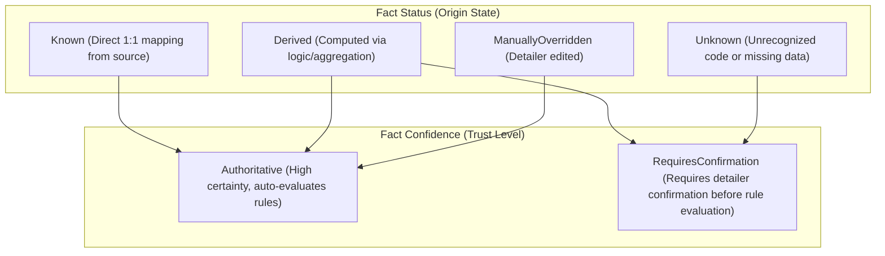
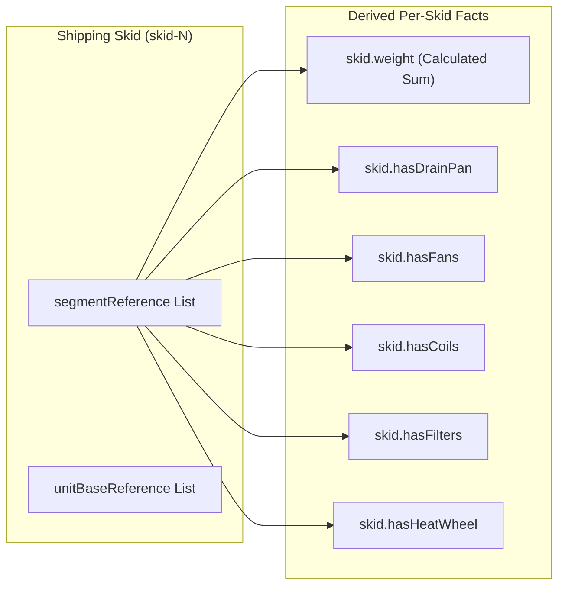
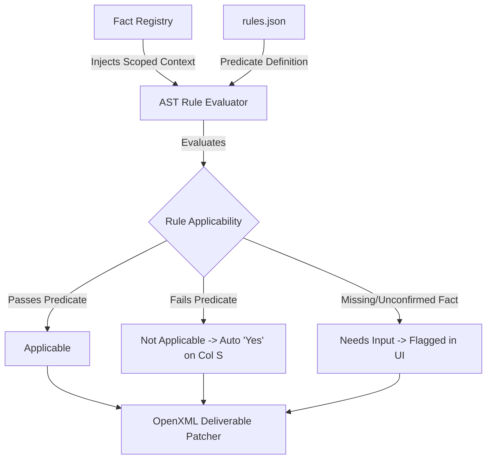

# AHU Detailing Verification: Field Derivation & Classification Report

> **Maintenance note (2026-08-28):** This catalog describes the current fact-extraction contract. It supersedes older audit language that treated calculated skid weight as a confirmation gate. The fact registry and rule pack remain the executable source of truth.

## Executive Summary

The AHU Detailing Verification system ingests unit specifications and transforms them into a **Layer 2 Provenance-Aware Fact Registry** and **Scoped AST Checklist Instances**, which ultimately patch the official `Detailing Verification List.xlsx` workbook via OpenXML.

There are two distinct entry points for establishing project data:
1. **XML Import (`Config.xml`)**: Parses engineering XML data into a normalized structural graph (`NormalizedXmlGraph`), inspects internal hierarchies and geometry, and extracts facts with precise XPath source pointers and strict confidence boundaries.
2. **Manual Project Setup Wizard**: Synthesizes a baseline unit graph from a minimal set of user inputs, applies manual overrides to the fact registry, and initializes default skids, bases, and segments for manual checklist evaluation.

---

## 1. Provenance & Classification Taxonomy

Every field within the Fact Registry is assigned a dual classification determining its origin, editability, and trust tier:



- **`FactStatus`**:
  - `Known`: Field pulled verbatim from a designated XML element or user input.
  - `Derived`: Computed through conditional logic, string inspection, spatial geometry calculations, or collection aggregations.
  - `Unknown`: Unrecognized vendor code, invalid construction option, or unresolvable field.
  - `ManuallyOverridden`: Explicitly modified by the detailer; records previous values, timestamp, and author in `overrideHistory`.
- **`FactConfidence`**:
  - `Authoritative`: Evaluates dependent verification rules immediately (`Applicable` / `NotApplicable`).
  - `RequiresConfirmation`: Halts dependent AST rule evaluation and marks rules as `NeedsInput` until confirmed or overridden by the detailer.

---

## 2. Fact Taxonomy & Provenance Catalog

| Field Key | Label | Category | Data Type | Ingestion Source & Logic | Status | Confidence |
| :--- | :--- | :--- | :--- | :--- | :--- | :--- |
| `unit.jobName` | Job Name | Order & Identity | `string` | UPZ: `/root:OrderRevision/jobName`<br/>XML: Default `"Medical Center Phase 3"` | `Known` | `Authoritative` |
| `unit.orderNumber` | Order Number | Order & Identity | `string` | UPZ: `/root:OrderRevision/orderNumber` | `Known` | `Authoritative` |
| `unit.tag` | Unit Tag | Order & Identity | `string` | UPZ: `/root:OrderRevision/tagList/tag` | `Known` | `Authoritative` |
| `unit.productType` | Product Type | Order & Identity | `string` | UPZ: `/root:OrderRevision/productType` | `Known` | `Authoritative` |
| `unit.comNumber` | COM # | Order & Identity | `string` | Manual Entry from MAPICS Order Packet | `Unknown` | `RequiresConfirmation` |
| `unit.detailer` | Detailer Name | Order & Identity | `string` | Current detailer profile (e.g. `"Tanner Dean"`) | `Known` | `Authoritative` |
| `unit.date` | Verification Date | Order & Identity | `string` | Current ISO Date (`YYYY-MM-DD`) | `Known` | `Authoritative` |
| `unit.unitType` | Unit Type | Housing & Materials | `string` | `/root:AHU/unitOptions/unitType` (`"Outdoor"` / `"Indoor"`) | `Known` | `Authoritative` |
| `unit.shellType` | Shell Type | Housing & Materials | `string` | `/root:AHU/unitOptions/defaultConstructionOptions/housingStyle` | `Known` | `Authoritative` |
| `unit.thermalBreak` | Thermal Break | Housing & Materials | `boolean` | Derived: `housingStyle.Contains("ThermalBreak")` | `Derived` | `Authoritative` |
| `unit.knockdown` | Knockdown Construction | Housing & Materials | `boolean` | `/root:AHU/unitOptions/knockdown` | `Known` | `Authoritative` |
| `unit.shippingProtection` | Shipping Protection | Housing & Materials | `string` | `/root:AHU/unitOptions/shippingProtection` (`"ShrinkWrap"`) | `Known` | `Authoritative` |
| `casing.thicknessFront` | Front Wall Thickness | Housing & Materials | `number` | `/root:AHU/unitOptions/defaultConstructionOptions/housingThicknessFront` (e.g. `2.0`) | `Known` | `Authoritative` |
| `casing.thicknessTop` | Roof Casing Thickness | Housing & Materials | `number` | `/root:AHU/unitOptions/defaultConstructionOptions/housingThicknessTop` (e.g. `2.0`) | `Known` | `Authoritative` |
| `casing.exteriorMaterial` | Skin Material | Housing & Materials | `string` | `/root:AHU/unitOptions/defaultConstructionOptions/exteriorMaterialType` | `Known` | `Authoritative` |
| `casing.exteriorGauge` | Skin Gauge | Housing & Materials | `number` | `/root:AHU/unitOptions/defaultConstructionOptions/exteriorMaterialGauge` | `Known` | `Authoritative` |
| `casing.interiorMaterial` | Liner Material | Housing & Materials | `string` | `/root:AHU/unitOptions/defaultConstructionOptions/interiorMaterialType` | `Known` | `Authoritative` |
| `casing.interiorGauge` | Liner Gauge | Housing & Materials | `number` | `/root:AHU/unitOptions/defaultConstructionOptions/interiorMaterialGauge` | `Known` | `Authoritative` |
| `casing.floorMaterial` | Floor Material | Housing & Materials | `string` | `/root:AHU/unitOptions/defaultConstructionOptions/floorMaterialType` | `Known` | `Authoritative` |
| `casing.floorGauge` | Floor Gauge | Housing & Materials | `number` | `/root:AHU/unitOptions/defaultConstructionOptions/floorMaterialGauge` | `Known` | `Authoritative` |
| `casing.insulationType` | Insulation Type | Housing & Materials | `string` | `/root:AHU/unitOptions/defaultConstructionOptions/insulationType` (`"Foam"`) | `Known` | `Authoritative` |
| `roof.hasSlopedRoof` | Has Sloped Roof | Housing & Materials | `boolean` | `/root:AHU/roofOptions/hasSlopedRoof` | `Known` | `Authoritative` |
| `roof.roofPeak` | Roof Peak Style | Housing & Materials | `string` | Mapped from `roofSlopeHighSide`: `'Center'`, `'Left'`, `'Right'`, `'Flat'` | `Derived` | `Authoritative` |
| `roof.roofSlope` | Roof Slope (in/ft) | Housing & Materials | `number` | `/root:AHU/roofOptions/roofSlope` (e.g. `0.25`) | `Known` | `Authoritative` |
| `unit.baseHeight` | Base Height (in) | Baserail & Skid | `number` | `/root:AHU/unitOptions/defaultUnitBaseHeight` (e.g. `10.0`) | `Known` | `Authoritative` |
| `unit.lipHeight` | Upturned Lip Height (in) | Baserail & Skid | `number` | Max of all `unitBase/upturnedLipHeight` (e.g. `2.0` or `0.0`) | `Known` | `Authoritative` |
| `unit.hasUTL` | Has Upturned Lip | Baserail & Skid | `boolean` | Derived: `unit.lipHeight > 0` | `Derived` | `Authoritative` |
| `unit.curbrest` | Curbrest Option | Baserail & Skid | `boolean` | `/root:AHU/curbOptions/hasCurbRest` | `Known` | `Authoritative` |
| `unit.isTiered` | Is Tiered Unit | Baserail & Skid | `boolean` | Derived: upper segment deck without independent base | `Derived` | `Authoritative` |
| `unit.isStacked` | Is Stacked Unit | Baserail & Skid | `boolean` | Derived: unit base elevated atop lower segment | `Derived` | `Authoritative` |
| `unit.hasFloorDrains` | Has Floor Drains | Baserail & Skid | `boolean` | Derived: presence of `<floorDrain>` openings | `Derived` | `Authoritative` |
| `unit.noa` | Notice of Acceptance | Ratings & Options | `boolean` | Derived: `unitConstructionType == "NOA"` | `Derived` | `Authoritative` |
| `unit.isSeismic` | Seismic Certification | Ratings & Options | `boolean` | Derived: `unitConstructionType` is `"IBC"` or `"OSHPD"` | `Derived` | `Authoritative` |
| `unit.deflectionTest` | Deflection Test Spec | Ratings & Options | `string` | `/root:AHU/testingOptions/deflectionTest` | `Known` | `Authoritative` |
| `unit.totalWeight` | Total Unit Weight (lbs) | Ratings & Options | `number` | `/root:AHU/unitWeight` | `Known` | `Authoritative` |
| `unit.totalStaticPressure` | Total Static Pressure | Ratings & Options | `number` | `/root:AHU/totalStaticPressure` (in.w.g.) | `Known` | `Authoritative` |

---

## 3. Detailed Derivation Logic by Functional Domain

### 3.1. Order & Identity Domain
- **In Manual Setup Mode**: `unit.jobName`, `unit.comNumber`, and `unit.detailer` are captured directly via the `ManualUnitModal` wizard fields. They are applied to the fact registry with `Status = ManuallyOverridden` and `Confidence = Authoritative`.
- **In UPZ Bundle Ingestion Mode**: Loading a `.upz` unit archive extracts `OrderRev.xml` via `UpzBundleExtractor`, authoritatively populating `unit.jobName`, `unit.orderNumber`, `unit.tag`, and `unit.productType` with `Status = Known` and `Confidence = Authoritative`.
- **In Standalone Config.xml Mode**: `Config.xml` does not contain order-level tags (only raw internal IDs). Order fields initialize with standard defaults and prompt notes directing the detailer to confirm against the MAPICS order packet.
- **COM # Boundary**: `unit.comNumber` (MAPICS COM #) is never stored in engineering selection files (`Config.xml` or `.upz`) and remains an explicit, prompt-guided manual entry field for detailers across all ingestion modes.

**Final-export boundary:** Standalone `Config.xml` imports may populate the documented placeholder/default identity values. The UI permits a detailer to replace them; this report does not treat a placeholder as evidence that an official order value was confirmed for final release.

### 3.2. Geometry, Structural Casing & Thermal Break
- **`unit.shellType`**: Extracted directly from `<housingStyle>` (e.g., `ThermalBreak` or `Standard`).
- **`unit.wallThickness`**: Extracted from `<surfaceDetail_Front>/<housingThickness>` or derived as `2.0"` if standard thermal break casing is indicated.
- **`unit.thermalBreak`**: Evaluates `graph.unitOptions.materials.housingStyle.includes('ThermalBreak')`. If true, returns `'Yes'`; otherwise `'No'`.
- **`unit.roofPeak`**: Evaluated from `<roofOptions>`. When `<hasSlopedRoof>` is true, combines `<roofPeakZDim>` and `<roofSlope>` into formatted string `${roofPeakZDim}" (${roofSlope}"/ft)` (e.g., `97" (0.25"/ft)`). If false, returns `'Flat'`.
- **`unit.utl` (Upturned Lip)**:
  - Scans all `<unitBase>` elements in the XML.
  - Inspects `<upturnedLipHeight>`. If any base has `lipHeight > 0`, `graph.unitOptions.hasUTL` is set to `true`, and the fact resolves to `'Yes (2.0" Lip)'`.
  - In manual mode, defaults to `false` (`'No'`).

### 3.3. Ratings, Certifications & Regulatory Wind Load
The derivation logic enforces strict invariant compliance against speculative mapping:
- Reads `<unitConstructionType>` from `<unitOptions>`.
- **Recognized Types**:
  - `'Standard'`: `isSeismic = false`, `noa = 'N/A'`. Status: `Derived`, Confidence: `Authoritative`.
  - `'IBC'` or `'OSHPD'`: `isSeismic = true`, `noa = 'N/A'`. Status: `Derived`, Confidence: `Authoritative`.
  - `'NOA'`: `isSeismic = false`, `noa = 'NOA'`. Status: `Derived`, Confidence: `Authoritative`.
- **Unrecognized Type** (e.g., custom/legacy engineering code):
  - Status is flagged as **`Unknown`** and Confidence as **`RequiresConfirmation`**.
  - Sets `promptNote`: *"Unrecognized construction type '{constType}'. Specify Florida/Miami-Dade NOA wind load rating if applicable."*
  - This forces the detailer to explicitly confirm or override before seismic or NOA checklist rules can evaluate.

### 3.4. Materials, Gauges & BOM Schedules
- Extracted directly from `<unitOptions>/<defaultConstructionOptions>`:
  - Exterior Skin: `<exteriorMaterialType>` and `<exteriorMaterialGauge>` (Mapped to `D20` and `F20`).
  - Interior Liner: `<interiorMaterialType>` and `<interiorMaterialGauge>` (Mapped to `D19` and `F19`).
  - Floor: `<floorMaterialType>` and `<floorMaterialGauge>` (Mapped to `D21` and `F21`).
  - Base Subfloor: Extracted per base from `<subFloorMaterialType>` and `<subFloorMaterialGauge>`.
- In manual mode, standard production defaults are assigned (`STL GALV PPC 18ga` exterior, `STL GALV 22ga` interior liner, `STL GALV 16ga` floor).

---

## 4. Per-Skid & Internal Component Derivation Logic

When `Config.xml` is imported or a manual unit is synthesized, the parser builds relational associations between shipping skids, unit bases, and segments:



### 4.1. Calculated Skid Weight Semantics
- **Extraction Logic**: For each skid, the parser iterates through referenced `segmentID`s and sums their individual `<weight>` properties:
  $$\text{calculatedWeight} = \sum_{s \in \text{SkidSegments}} s.\text{weight}$$
- **Runtime provenance:**
  - `status`: **`Derived`**
  - `confidence`: **`Authoritative`**
  - The extractor records the derivation as the sum of segment weights. There is no mandatory prompt note or confirmation action in the current extraction contract.
  - A detailer may manually override a fact when the calculated value is unsuitable; that override is distinct from an automatic confirmation requirement.

### 4.2. Internal Feature Detection
For every shipping skid, the system evaluates boolean presence flags derived from segment types and child nodes:
- **`skid.<id>.hasDrainPan`**: `true` if any segment tag is `segment_CC` (Cooling Coil) or contains internals matching `"drain"`.
- **`skid.<id>.hasFans`**: `true` if segment type code is `FE` (Exhaust Fan), `FR` (Return Fan), or `FS` (Supply Fan), or if child `<fan>` elements exist.
- **`skid.<id>.hasCoils`**: `true` if type code is `CC` or `HC` (Heating Coil), or if child `<coil>` elements exist.
- **`skid.<id>.hasFilters`**: `true` if type code is `FF` (Flat Filter), `RF` (Rigid Filter), or `AF` (Angle Filter).
- **`skid.<id>.hasHeatWheel`**: `true` if type code is `HW` (Heat Wheel / Energy Recovery).

### 4.3. Motor Controls Extraction
- Extracted from `<electricalOptions>/<motorControlList>/<motorControl>`.
- Extracts: `userDefinedName`, `unitSide`, `motorControlType`, `fla`, `voltage`, `horsePower`, `disconnectSize`, `weight`, and `serviceSegmentReferenceList/segmentID`.

### 4.4. Opening-Schedule Fact Families

The catalog in section 2 is not limited to unit-level fields. For each entity in the normalized graph, the extractor emits the following fact-key families. Unless noted, these are `Known` / `Authoritative` facts sourced from the parsed opening schedule.

| Family | Fact suffixes | Notes |
| :--- | :--- | :--- |
| `door.<id>` | `width`, `height`, `swing`, `hingeSide`, `hasWindow`, `segmentId` | One family per door. |
| `damper.<id>` | `type`, `actuator`, `width`, `height` | One family per damper. |
| `floorDrain.<id>` | `type`, `pipingMaterial`, `connectionDiameter`, `holeDiameter`, `segmentId` | `holeDiameter` is `Derived` / `Authoritative`; the remaining suffixes are known values. |
| Aggregate counts | `door.totalCount`, `damper.totalCount`, `floorDrain.totalCount` | Derived / Authoritative counts for the parsed graph. |

### 4.5. Component-Subtree Fact Families

Component facts are emitted only when the corresponding configuration exists on a segment. They are `Known` / `Authoritative` values from the parsed component subtree.

| Family | Fact suffixes |
| :--- | :--- |
| `fan.<segmentId>` | `isFanArray`, `arrayGrid`, `hasRedundancy`, `hasStand`, `hasRemovalRail`, `isolationType`, `motorHp`, `voltage` |
| `coil.<segmentId>` | `bulkheadMaterial`, `hasStackingRack`, `dripPanMaterial`, `staggeredOverlap`, `connectionHand` |
| `filter.<segmentId>` | `loadMethod`, `bulkheadMaterial`, `gaugeType`, `gaugeDoorId` |
| `wheel.<segmentId>` | `hasPurge`, `mediaType`, `allowVariableSpeed` |
| `motorControl.<name>` | `disconnectSize`, `fla`, `voltage`, `hp`, `unitSide` |

---

## 5. Downstream Consumer: AST Rule Evaluation & Excel Mapping

The derived facts directly drive the declarative JSON-AST evaluation engine:



### Examples of AST Predicate Derivation:
1. **Rule `BASE-01` (Lifting Lug Support > 4000 lbs)**:
   - **Predicate**: `skid.weight > 4000`
   - **Required Fact**: `skid.weight`
   - The runtime-derived `skid.weight` is `Authoritative`, so the rule evaluates to `Applicable` (if > 4000 lb) or `NotApplicable` (if $\le$ 4000 lb) without a confirmation gate. It becomes `NeedsInput` only when the required fact is missing, unknown, or otherwise marked `RequiresConfirmation`.
2. **Rule `BASE-05` (Drain Pan Handing)**:
   - **Predicate**: `skid.hasDrainPan === true`
   - **Required Fact**: `skid.hasDrainPan`
   - Evaluates to `Applicable` only on skids containing cooling coils or drain pans.
3. **Rule `RECON-01` (Seismic Reconnect Master Model)**:
   - **Predicate**: `unit.isSeismic === true`
   - **Required Fact**: `unit.isSeismic`
   - If unit is standard construction, this rule evaluates to `NotApplicable`, automatically setting Column S (`N/A`) to `"Yes"` in the Excel workbook.

---

## 6. Synthesis Architecture in Manual Creation Mode

When a detailer initializes a unit without `Config.xml` (`manualUnitFactory.ts`):
1. **Skid & Segment Generation**: Accepts explicitly configured `skids` and `segments`, including custom segment types, dimensions, weights, internals, and per-skid base/weight fields. The legacy `config.skidCount` path is only a fallback when an explicit skid list is absent.
   - The fallback creates $N$ shipping skids and distributes default segments as an **Inlet Plenum** (`segment_IP`) on the first skid, **Access Sections** (`segment_XA`) on intermediary skids, and a **Supply Fan Section** (`segment_FS`) on the final skid.
2. **Base Geometry**: Synthesizes matching `unitBase` objects with height `config.baseHeight` (6", 8", 10", or 12") and housing style `config.housingStyle`.
3. **Synthetic XML Serialization**: Emits a clean, standard XML configuration header:
   ```xml
   <?xml version="1.0" encoding="utf-8"?>
   <AHU>
     <unitOptions>
       <unitType>Outdoor</unitType>
       <defaultConstructionOptions>
         <housingStyle>ThermalBreak</housingStyle>
       </defaultConstructionOptions>
     </unitOptions>
   </AHU>
   ```
4. **Fact Pipeline**: Feeds the synthesized graph into `extractFactsFromGraph(...)` and applies user overrides, ensuring 100% parity between manual and XML-backed workflows.
