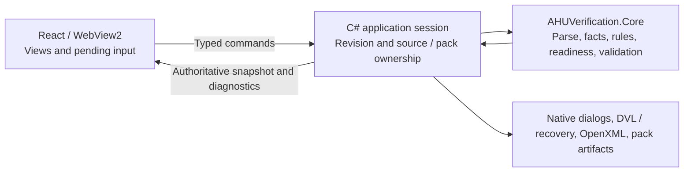

# C# authoritative engine migration plan

Date: 2026-09-06
Status: Planned; no migration implementation performed
Inspection baseline: `master`, HEAD `29836826b5cccedc8c2f3779b5dd8d5a35e19c22`, plus existing local changes.

## Outcome and scope

Make C# the only engine for imported and manual projects, verification, project persistence/recovery, Rule Editor validation/testing, and Excel output. Retain React/TypeScript inside WebView2 for rendering, input collection, navigation, accessibility, and transient form state. Retire standalone browser processing, including noncertifying fallback engines. A native draft remains a supported workflow; “draft” must no longer mean “processed in JavaScript.”

This is a follow-on migration to the [remediation plan](remediation-plan.md), not a restart of its accepted slices. Its identifiers below use **CE** to avoid colliding with existing phases. It explicitly replaces the future direction in [ADR 0011](../decisions/0011-certified-processing-authority.md) that retains a browser engine and a permanent cross-runtime parity obligation. Existing authority, integrity, and source-authenticity protections remain requirements.

No UI framework rewrite, cloud service, local HTTP server, new database, event-sourcing framework, or general plugin architecture is required. Node/Vite remain build tools. Static UI tests may run in a browser using fixed host-response fixtures; they do not implement application processing.

## Observed ownership gaps

Paths are relative to the repository root. These are current source observations, not claims that earlier release checks failed.

| Area | Current evidence | Required destination |
|---|---|---|
| Imported verification | `Core/Services/VerificationHostService.cs` parses/extracts/evaluates and computes final readiness; `App/Bridge/BridgeHandler.cs` controls native source and pack context | Retain Core pipeline; expand it to a complete host-owned project session |
| Project edits | `src/hooks/useProjectSession.ts` applies `overrideFact`/`revertFact`, regenerates checklists, and directly changes checklist/SQ/comment state | Validated C# commands; UI receives the resulting snapshot |
| Browser ingestion | `browserPreviewIngestion.ts`, `xmlParser.ts`, `factRegistry.ts`, `ruleEvaluator.ts` provide a second processing route | Remove once all production and test consumers migrate |
| Manual projects | `manualUnitFactory.ts` creates graph/facts/checklists in TypeScript; `handleManualCreate` uses it in desktop sessions too | C# manual-project creation and validation; retain wizard input state in React |
| Readiness | `App.tsx` calls `computeUnitReadiness`; Header, Sidebar, PreFlight and Resolution Center retain readiness imports/fallbacks | C# returns unit/scope readiness, blockers, permitted actions and display counts |
| Persistence/recovery | `projectStorage.ts` constructs/hashes/inspects DVL and stores `ahu_dvl_autosave`; native save still receives renderer-created project JSON | Host creates, validates, serializes, saves and recovers canonical state |
| Draft export | `desktopBridge.ts` contains browser implementations; `excelExporter.ts` uses SheetJS/file-saver | Both draft and final workbooks use C# OpenXML with explicit mode |
| Pack state | `useRulePackSession.ts` starts from bundled TypeScript catalog data; `projectSession.ts` derives pack identity/artifact claims | Host supplies validated pack identity and availability; UI displays them |
| Rule Editor | `RuleTestSandbox.tsx` calls `evaluateAstPredicate`; `RuleEditorApp.tsx` normalizes/validates/imports packs and has browser download behavior | Native editor uses the same Core evaluator and validation contract as the main app |

Backend paths in the first row are under `src/backend/AHUVerification.*`; frontend service names are under `src/services/` unless otherwise identified.

Architecture notes are currently flagged stale by Agent Ground. The current handoff records prior automated/package successes and an outstanding Windows lifecycle gate; those results were not rerun for this documentation task. Existing parser/material mapping edits and their tests must be preserved and assessed as part of the implementation baseline.

## Target boundary

- **Core owns semantics:** graph construction, mapping, fact types/provenance, override/revert, applicability, allowed checklist transitions, SQ validation/completion, readiness, rule validation and evaluation, canonical persistence and export data.
- **The Windows application layer owns lifecycle and capabilities:** active project/source/pack, current save path, revisions, dialog/file access, recovery scheduling and atomic writes. Keep WebView2/dialog dependencies outside pure domain operations.
- **React owns presentation:** selection, expansion, sorting/filtering of returned data, formatting, keyboard/focus, wizard navigation and unsent field buffers. Local input hints are fine; acceptance, unit conversion that affects stored values, and rule decisions belong to C#.
- **No bridge means no processing:** production displays a desktop-host-required/unavailable state. Host failure does not activate a TypeScript engine or show a false saved/ready state.

## CE0 — Lock the baseline and migration contract

**Dependencies:** none. **Size:** small.

1. Record current HEAD, dirty files, focused current test results and native-host limits. Do not overwrite the existing handoff's earlier acceptance history or assume its results certify the current dirty tree.
2. Add a successor ADR recording this user-directed removal of browser processing; retain historical ADRs and link the new decision from the index. Separate the architectural decision from implementation completion.
3. Inventory consumers of the retiring modules, including both frontend entries, scripts, browser tests, build checks and CI. Map every domain assertion to a retained C# test or a specific test to port.
4. Capture compatibility fixtures: existing imported/manual `.dvl`, old browser autosave, UPZ/XML metadata, overrides/revert/audit, rule-pack snapshots and draft/final workbooks. Include sparse and malformed inputs, Unicode, materials and tiered/stacked structures.
5. Resolve documentation contradictions against current accepted behavior before freezing expected results. For example, current `FactExtractor` treats positive summed segment weight as `Derived/Authoritative`, matching the accepted P1-B entry, while older ADR 0011 wording says calculated weight is diagnostic. This migration must not silently change weight policy. Preserve Seismic/NOA/Knockdown confirmation as a separate decision.

**Exit:** source-backed ownership/consumer list, compatibility fixtures, baseline results and successor ADR are recorded. Browser/native equality is not a prerequisite for starting; unresolved domain disagreements are explicit cases, not reasons to maintain two engines.

## CE1 — Establish the C# project session and command contract

**Dependencies:** CE0. **Size:** medium.

1. Extend the existing `VerificationHostService` boundary with a cohesive session service. Retain source bytes/identity, graph, facts, explicit edits, checklists, SQs/comments, validated pack identity and generation, integrity classification, and save/dirty state in C#.
2. Add action-specific request/response DTOs in the existing bridge models and handlers. Return a project snapshot containing session ID, revision, graph/display data, facts/provenance, checklists, readiness by unit/scope, blocking reasons, draft/final eligibility and pack identity. Names are design proposals, not existing APIs.
3. Use typed intent commands such as open project/source, create manual project, override/revert fact, edit checklist/SQ/comments, reset, activate pack, save and export. Do not accept reconstructed facts/rules/readiness as authoritative command payloads.
4. Serialize mutations per session. Carry expected revision and request ID; reject stale writes, ignore late responses from an old session, and deduplicate retried mutations within the active session. Do not automatically replay an ambiguous timed-out mutation. Reconnect/reload requests the current snapshot.
5. Keep existing origin checks, payload validation, path capabilities and source binding. Reset/close/pack activation invalidate pending work. A failed or cancelled operation preserves the previous accepted state.

The source-binding change is concrete: normal verify/export commands reference a host-created source/session handle, not XML supplied by the renderer. Current `BridgeHandler.VerifySource` accepts raw XML and Core returns `SourceIsTrusted = true`; these must not establish source authenticity. Test substituted XML, old-session replay and direct malformed WebView messages. The host must assign a monotonic pack generation on activation/sync and include it in every snapshot; test synchronization during verification. C# also owns transition timestamps, semantic fingerprints, applicability and audit history. Reject attempts to inject those fields; identity/checker values are explicit validated user inputs, never imported authority metadata.

**Exit:** an integration test opens native-held source, edits a fact, rejects a stale command and returns a consistent snapshot through the actual bridge. Core tests prove the session state transition without WebView2. Existing UI can remain on its current adapter for the next slice; no new browser semantics are added.

## CE2 — Move all project workflows onto the engine

**Dependencies:** CE1. **Size:** large; deliver as two slices.

**CE2-A: imported projects and edits.** Route Home/Header import through the same native command. Replace `useProjectSession` domain mutation with command dispatch and snapshot application. Send checklist status/comment, SQ creation/edit/deletion/completion, identity edits, batch defaults and reset to C#. Ensure readiness updates after every relevant edit. Replace all `readiness.ts` decision fallbacks, including Sidebar and PreFlight, with host projections. Scope-to-fact resolution that affects decisions belongs in Core.

**CE2-B: manual projects and pack changes.** Port manual graph/fact/checklist synthesis to C# and preserve the existing wizard. The renderer sends a manual configuration, not a trusted graph. Keep manual/untrusted projects editable and draft-capable under existing certification policy. Move pack-change reevaluation, checklist reconciliation and artifact-availability decisions into the session. Failed pack load blocks processing with a visible error instead of falling back to `RULES_CATALOG`.

Pending text may remain local while typing. Flush or reject pending edits before Save/Export; await acknowledged revisions. Avoid optimistic canonical-state mutation that can make the screen disagree with the engine. Keep long import/evaluation responsive with progress and cancellation at safe boundaries; start with complete snapshots and optimize only if measured size/latency requires it.

**Exit:** imported and manual project journeys run with TypeScript parsing/extraction/evaluation disabled. Override/revert restores provenance, invalid input leaves canonical state unchanged, stale responses cannot resurrect a closed project, and every displayed readiness count and allowed transition agrees with the same host revision. UI accessibility/interaction checks remain intact.

## CE3 — Move DVL, recovery and all Excel output into C#

**Dependencies:** CE2. **Size:** medium to large.

1. Use `DvlProjectManager` to construct and serialize state directly from the session. Save/Save As commands supply intent; the host owns path selection/reuse, complete-state hash, pinned artifact evidence and atomic replacement. Renderer-generated JSON is no longer the normal save interface.
2. Open/migrate DVL in C#, preserving source filename, UPZ status, OrderRev/Manifest XML, provenance, override history, checklist state, SQs/comments and pack identity. Continue to distinguish integrity from authentic source and final eligibility. Keep existing file-format compatibility unless an evidenced incompatibility requires a versioned migration; do not bump format solely because code moved.
3. Implement per-user native recovery using the same serialization rules. Separate recovery files from user Save paths, track acknowledged persisted revision, retain prior recoverable data on failure, and preserve interruption state through process restart. Recovery availability does not grant certification.
4. Transfer any old `ahu_dvl_autosave` payload as opaque data through a one-time compatibility bridge. C# validates/migrates it; delete the old entry only after durable native recovery succeeds. Invalid entries remain recoverable for diagnosis/export. This temporary byte-transfer adapter must not retain browser DVL parsing or hashing. Theme/sidebar preferences may stay in browser storage.
5. Route both draft and final output through the existing C# OpenXML path. Preserve draft labeling and final source/pack/readiness checks. Export the acknowledged session revision; cancellation and failed workbook validation/replacement must not damage an existing file or report success.

For historical artifacts, use verified template bytes embedded in new self-contained project snapshots, extending the existing snapshot contract as needed. This favors portable/offline DVL files over a new cache subsystem; measure file size in CE0. Resolve legacy snapshots against actual available artifacts and verify hashes before use. A persisted `TemplateRetrievable` flag is not evidence. Acceptance must reopen offline after the active pack changes and use the exact historical template, or visibly block final output if bytes cannot be recovered. Native open must run integrity/artifact classification, not merely deserialize. Remove the normal renderer-JSON save IPC after the one-time recovery compatibility path is isolated.

**Exit:** save → close process → reopen, recovery after interruption, Save As, native manual draft export and trusted final export pass. Tampered/legacy/missing-artifact projects remain appropriately unverified. Workbook assertions cover values, comments/initials, formulas, sheet pruning and SQ overflow. No normal project persistence, integrity or workbook generation runs in TypeScript.

## CE4 — Unify Rule Editor processing with Core

**Dependencies:** CE1; integrate after CE2–CE3. **Size:** medium.

1. Extend `RuleEditorBridgeHandler` with draft import/save, validation and sandbox evaluation using `FactContractValidator`, `RulePackManager` and `AstRuleEvaluator` as applicable. Return structured field errors and evaluation explanations/results.
2. Move rule normalization, operator/type support, uniqueness, required-fact checking and mapping integrity into C#. The sandbox may send explicit test inputs; Core validates/evaluates them without activating or publishing the draft.
3. Retain visual editor component state. Any retained visual-tree adapter is lossless transport/presentation only; semantic coercion and normalization belong in Core. Roundtrip unsupported legacy structures without silent loss, or report a precise unsupported-edit error.
4. Replace browser draft downloads with native draft save. Publish remains an explicit action using existing staging/hash/rollback behavior. Reload the exact published pack and let the main host decide activation/migration, including invalidation of stale session responses.

Remove `BridgeHandler` launch fallbacks to standalone `rule-editor.html` and `localhost:5173`. If the native Rule Editor executable is unavailable, report that failure with a useful recovery message; do not open a browser as a substitute. Test the missing-executable path.

**Exit:** a rule tested in the editor and evaluated by the application uses the same Core implementation and produces the same outcome. Cover malformed/unsupported rules, mappings retention, rename/uniqueness, draft roundtrip, failed publish rollback and published-pack activation using an isolated test destination.

## CE5 — Delete the duplicate engine and replace its test burden

**Dependencies:** CE2, CE3 and CE4. **Size:** medium.

1. Remove browser bridge implementations and production fallback selection. Retire `browserPreviewIngestion.ts`, `xmlParser.ts`, domain portions of `factRegistry.ts`/`factContract.ts`, `ruleEvaluator.ts`, `manualUnitFactory.ts`, `projectStorage.ts`, `excelExporter.ts`, and business decisions in `readiness.ts` after consumer checks. Split any still-needed UI types/helpers before deletion. Review `materialMapping.ts` and catalog imports similarly; preserve the pre-existing material fix in the C# behavior/fixtures.
2. Remove `xlsx`, `file-saver` and associated types only after both entry dependency graphs show no remaining consumers. Remove bundled frontend rule/pack semantics; retain host-supplied metadata needed for display. Update lockfile, bundle budgets and asset checks to the resulting graph.
3. Move valuable TypeScript domain/parity cases into C# production-function tests. Retire duplicate-engine parity runners only after recording replacement coverage. Keep historical DVL/canonical JSON fixtures as C# backward-compatibility tests; they still matter after the JavaScript implementation disappears.
4. Replace browser tests that upload XML and invoke browser processing with fixed host snapshot/command-response fixtures for interaction tests. Add real WebView2 tests for the critical engine-backed journeys. Fixture adapters must never parse, extract, evaluate or authorize; mocked interaction tests are not native E2E.
5. Update npm scripts, `run-tests.bat`, release gates and CI references together. Node-based asset/version tooling can remain; moving developer tooling to C# is not necessary unless it embeds a second runtime domain implementation.

**Exit:** static import/dependency checks prove both production entry graphs contain no second parser, fact extractor, rule evaluator, readiness engine, DVL serializer or workbook writer. Domain coverage resides in C#, UI coverage remains in frontend tests, and no deleted parity script remains in an active build/release gate.

## CE6 — Accept the desktop-only engine and update documentation

**Dependencies:** CE5. **Size:** medium, including target-host validation.

- Run `npm run build`, the revised `npm test`, full `dotnet test tests/AHUVerification.Tests/AHUVerification.Tests.csproj`, `npm run test:coverage`, dist/bundle/graph checks and the applicable full build/release preflight under the repository-supported toolchain. Run rule-pack generation/determinism checks if rule-pack assets or generation change. Preserve meaningful coverage floors.
- Record packaged Windows journeys through the real renderer/bridge: UPZ-first import and XML fallback; override/revert; checklist/SQ edits; save/reopen/recovery; native manual draft; final workbook; Rule Editor draft/test/publish/reload; offline startup; missing host/pack and rejected operations. Installation/uninstallation remains a separately authorized target-host gate where required.
- Compare both entry bundles and startup assets before/after; record actual removal rather than promising an arbitrary percentage or using a passing budget as evidence of improvement.
- Update architecture, development/test guidance, README/PROJECT, Rule Editor guide and handoff. Remove browser-processing instructions and distinguish UI fixture tests from real native workflow evidence. Refresh Agent Ground verification only after source/document review.

**Exit:** one C# engine serves every supported processing workflow, packaged desktop acceptance is recorded, and documentation contains no promise of a supported browser engine. External publication, issue closure and live shared-pack changes are separate actions, not automatic consequences of this plan.

## Execution and stopping points

Execute **CE0 → CE1 → CE2-A → CE2-B → CE3 → CE4 → CE5 → CE6**. Each slice must leave a buildable app and have independent acceptance before proceeding. Keep temporary compatibility at the boundary and delete it in CE5; do not build a permanent dual-engine switch. A slice rollback restores the previous implementation snapshot without discarding user projects or pre-existing work; preserve pre-migration data until recovery/roundtrip acceptance passes.

The first implementation slice is **CE0 plus CE1's native imported-project session/command/snapshot seam**, with stale-command and source-binding tests. This establishes the engine boundary before deleting code or broadly rewriting React. The largest unknowns are manual-project synthesis, recovery migration and editor semantic conversion; time estimates should follow CE0's consumer/test inventory rather than imply unsupported calendar precision.
