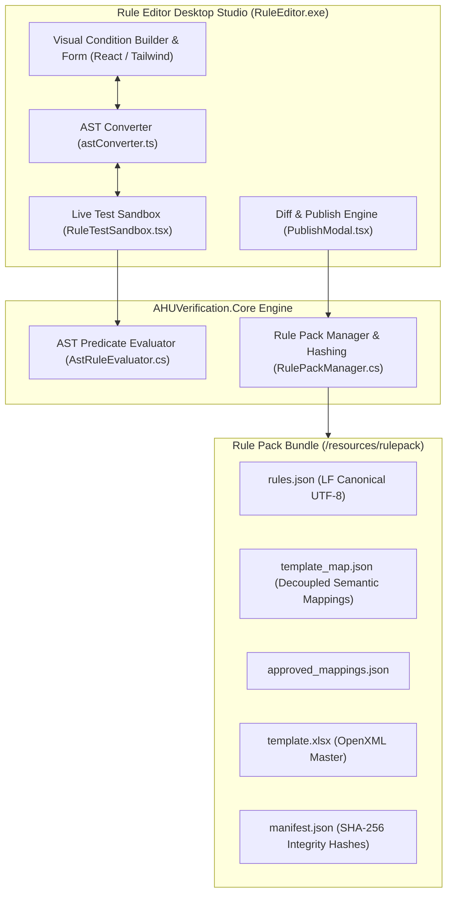
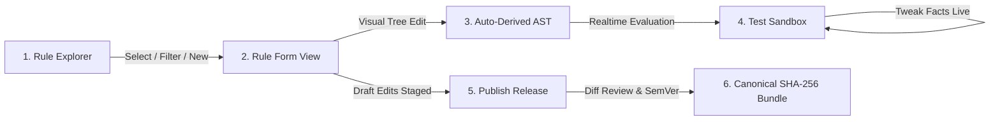
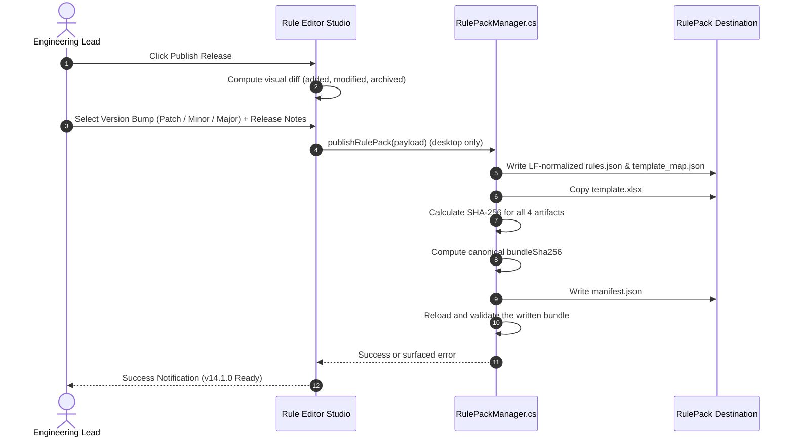

# AHU Verification Rule & Logic Editor Guide

A comprehensive reference for engineering leads and developers authoring, auditing, testing, and publishing verification rules for the **AHU Detailing Verification System**.

---

## Table of Contents
1. [System Architecture & Overview](#1-system-architecture--overview)
2. [Internal Naming Key & Data Dictionary](#2-internal-naming-key--data-dictionary)
   - [2.1 Rule Definition Data Model](#21-rule-definition-data-model)
   - [2.2 Scopes, Fact Statuses & Confidence States](#22-scopes-fact-statuses--confidence-states)
   - [2.3 Fact Dictionary Catalog](#23-fact-dictionary-catalog)
3. [Condition Operators & AST Specification](#3-condition-operators--ast-specification)
   - [3.1 Operator Mapping Key](#31-operator-mapping-key)
   - [3.2 AST Predicate JSON Structure](#32-ast-predicate-json-structure)
4. [Step-by-Step Logic Authoring Examples](#4-step-by-step-logic-authoring-examples)
   - [Example 1: Standard Universal Check (Always Applicable)](#example-1-standard-universal-check-always-applicable)
   - [Example 2: Numeric Threshold Comparison](#example-2-numeric-threshold-comparison)
   - [Example 3: Boolean Feature Flag Check](#example-3-boolean-feature-flag-check)
   - [Example 4: String / Enum Value Equality](#example-4-string--enum-value-equality)
   - [Example 5: Text Substring Search (`includes`)](#example-5-text-substring-search-includes)
   - [Example 6: Multi-Condition Conjunction (`ALL / AND`)](#example-6-multi-condition-conjunction-all--and)
   - [Example 7: Discrete List Membership (`in`)](#example-7-discrete-list-membership-in)
   - [Example 8: Nested Compound Logic (`AND` with nested `OR`)](#example-8-nested-compound-logic-and-with-nested-or)
   - [Example 9: Missing / Unconfirmed Data (`NeedsInput`)](#example-9-missing--unconfirmed-data-needsinput)
5. [Studio UI Walkthrough & Simulation Sandbox](#5-studio-ui-walkthrough--simulation-sandbox)
   - [5.1 Rule Explorer Panel](#51-rule-explorer-panel)
   - [5.2 Rule Form & Visual Condition Builder](#52-rule-form--visual-condition-builder)
   - [5.3 Live Simulation Sandbox](#53-live-simulation-sandbox)
6. [Publishing, Semantic Versioning & Integrity Pipeline](#6-publishing-semantic-versioning--integrity-pipeline)

---

## 1. System Architecture & Overview

The **Rule & Logic Editor** is delivered as a dedicated desktop studio (`AHUVerification.RuleEditor` / `RuleEditor.exe`) and web interface (`rule-editor.html`). It decouples engineering rule authoring from hardcoded program logic or manual JSON editing, allowing team leads to author, test, and publish rule packs safely with cryptographic integrity verification.



### Launching the Rule Editor
- Run `launch-rule-editor.bat` from the repository root, or select **Option 2** from `menu.bat`.
- To run the desktop host directly, first build the Vite bundle, then run `dotnet run --project src/backend/AHUVerification.RuleEditor/AHUVerification.RuleEditor.csproj`.
- For browser development, run `npm run dev` and open `http://localhost:5173/rule-editor.html`. Vite is configured with `rule-editor.html` as a separate Rollup entry point.

The web page is an authoring preview, not a local publishing host. It loads bundled rule-pack JSON and can export/import a draft JSON array. Only the WebView2 desktop host supplies `getRulePack`, folder selection, and `publishRulePack` bridge actions. In browser mode, **Publish Release** updates the in-memory editor baseline and displays a success notification, but it does not write a bundle or download one; use **Export Draft JSON** for handoff.

---

## 2. Internal Naming Key & Data Dictionary

### 2.1 Rule Definition Data Model

Every verification rule is defined using the internal `RuleDefinition` contract:

| UI Field Label | Internal Property Name | Data Type | Example / Allowed Values | Purpose & Description |
| :--- | :--- | :--- | :--- | :--- |
| **Rule ID** | `id` | `string` | `"BASE-01"`, `"HOUS-07"` | Unique alphanumeric rule code used across reports and checklists. |
| **Semantic Key** | `semanticKey` | `string` | `"BASE_LIFTING_LUG_SUPPORT"` | UPPER_SNAKE_CASE identifier decoupling rule logic from physical Excel cell addresses. |
| **Category** | `category` | `string` | `"Base"`, `"Housing"`, `"Drain Pan"`, `"Coil Panels"`, `"Internal"`, `"Reconnects"`, `"Paperwork"`, `"MOM"` | Primary checklist section and tab classification. |
| **Internal Subgroup** | `subgroup` | `string?` | `"Fan Segments"`, `"Coil Segments"`, `"Filter Segments"`, `"Access Segments"`, `"Damper Segments"` | Sub-classification within the `"Internal"` category. |
| **Scope** | `scope` | `RuleScope` | `'Unit'`, `'Skid'`, `'Segment'`, `'Component'` | Determines rule evaluation target multiplicity. |
| **Checklist Instruction Text** | `text` | `string` | `"Lifting lugs have proper support when the skid is over 4,000 lbs..."` | Clear, actionable instruction text presented to detailers and checkers. |
| **Standard Reference** | `reference` | `string?` | `"ASSY Manual p.391-40206-003"` | Standard assembly manual, drawing number, or engineering specification reference. |
| **Excel Row** | `excelRow` | `number?` | `29`, `61` | Output row index in `template.xlsx` (translated via `template_map.json`). |
| **Required Facts** | `requiredFacts` | `string[]` | `["skid.weight"]` | Set of XML fact keys required to evaluate this rule. Auto-derived from the AST condition tree. |
| **Applicability Logic** | `predicate` | `ASTPredicate?` | `AST JSON Object` or `undefined` | Boolean AST condition tree. When absent (`undefined`), rule is unconditionally applicable. |
| **Allow N/A Toggle** | `allowNA` | `boolean` | `true` / `false` | When `false`, detailers cannot mark the check N/A; it must be checked Pass/Fail. |
| **Verification Mode** | `verificationMode` | `string` | `'ManualCheckbox'`, `'AutoEvaluated'`, `'MeasurementVerify'` | The Rule Editor exposes all three values, but the detailer workspace has no mode-specific renderer or measurement-threshold engine. The shipped rules use `ManualCheckbox`; do not use the other values as if they automate a check. |
| **Archived** | `isArchived` | `boolean?` | `true` / `false` | When `true`, rule is soft-deleted and excluded from active checklist synthesis. |

---

### 2.2 Scopes, Fact Statuses & Confidence States

#### Scopes (`RuleScope`)
- **`Unit`**: Evaluated once globally for the overall AHU.
- **`Skid`**: Evaluated per discrete shipping section (Skid `1..N`).
- **`Segment`**: Evaluated per AHU casing segment (e.g. `segment_IP`, `segment_CC`).
- **`Component`**: Evaluated per individual internal mechanical or electrical device.

#### Fact Provenance Status (`FactStatus`)
- **`Known`**: Fact value was parsed authoritatively from unit XML.
- **`Derived`**: Fact value was synthesized from related unit geometry or segment features.
- **`Unknown`**: Fact was missing or unparseable in source data.
- **`ManuallyOverridden`**: Fact was manually entered or updated by the detailer.

#### Fact Confidence (`FactConfidence`)
- **`Authoritative`**: Safe for automatic rule evaluation.
- **`RequiresConfirmation`**: Fact value is uncertain; requires detailer confirmation before dependent rules evaluate.

#### Rule Applicability Outcomes (`RuleApplicability`)
- **`Applicable`**: Condition evaluated to `true`; check is active for the detailer.
- **`NotApplicable`**: Condition evaluated to `false`; check is automatically marked `NA`.
- **`NeedsInput`**: One or more `requiredFacts` are `Unknown` or `RequiresConfirmation`.

---

### 2.3 Fact Dictionary Catalog

`src/ruleEditor/components/FactDictionaryCatalog.ts` is the authoritative catalog for the visual condition-builder selector. It currently exposes a curated, static set; it does **not** enumerate every fact emitted by the backend extractor.

| Selector scope | Currently selectable key families |
| :--- | :--- |
| Unit | `unit.shellType`, `unit.unitType`, `unit.wallThickness`, `unit.baseHeight`, `unit.thermalBreak`, `unit.knockdown`, `unit.washdown`, `unit.hasUTL`, `unit.isSeismic`, `unit.unitConstructionType`, `unit.noa`, `unit.totalStaticPressure`, material/insulation keys, `unit.slopedRoof`, `unit.roofSlope`, `unit.curbrest`, `unit.brandOption`, and `unit.productType`; plus `roof.roofPeak`. |
| Skid | `skid.weight`, `skid.segmentCount`, dimensions, `skid.hasDrainPan`, `skid.hasFans`, `skid.hasCoils`, `skid.hasFilters`, `skid.hasHeatWheel`, and `skid.hasBaseSteel`. |
| Segment | `segment.typeCode`, `segment.airPressureType`, `segment.airVolume`, `segment.hasMotorRemovalRail`, and `segment.internals`. |
| Component | `motorControl.motorControlType`, `motorControl.fla`, `motorControl.hp`, and `motorControl.voltage`. |

The backend does extract additional, instance-keyed facts, including `door.{id}.width|height|swing|hingeSide|hasWindow|segmentId`, `damper.{id}.type|actuator|width|height`, `floorDrain.{id}.type|pipingMaterial|connectionDiameter|holeDiameter|segmentId`, `fan.{segmentId}.*`, `coil.{segmentId}.*`, `filter.{segmentId}.*`, `wheel.{segmentId}.*`, and `motorControl.{name}.disconnectSize|unitSide`. They are not offered by the current visual selector. Raw AST editing can reference an exact key only when the author knows the instance ID and verifies it against a real extracted fact registry; robust selector support for dynamic opening/component instances requires a code change to build the catalog from the loaded unit.

`unit.curbrest` is currently modeled by the selector as the enum `Yes`/`No`, not a boolean. Treat the catalog and a sample unit's fact registry as the authoring authority rather than the historical example values in older documents.

---

## 3. Condition Operators & AST Specification

### 3.1 Operator Mapping Key

The visual builder synchronizes bidirectionally with AST JSON predicates using standard operator tokens:

| Visual Builder Operator Label | Internal Operator Token | AST JSON Expression | Evaluation Semantics |
| :--- | :--- | :--- | :--- |
| **equals (===)** | `===` | `{"===": [{"var": "<key>"}, <value>]}` | Strict equality matching. |
| **not equal (!==)** | `!==` | `{"!==": [{"var": "<key>"}, <value>]}` | Strict inequality matching. |
| **greater than (>)** | `>` | `{">": [{"var": "<key>"}, <number>]}` | Number is strictly greater than target. |
| **greater or equal (>=)** | `>=` | `{">=": [{"var": "<key>"}, <number>]}` | Number is greater than or equal to target. |
| **less than (<)** | `<` | `{"<": [{"var": "<key>"}, <number>]}` | Number is strictly less than target. |
| **less or equal (<=)** | `<=` | `{"<=": [{"var": "<key>"}, <number>]}` | Number is less than or equal to target. |
| **contains text** | `includes` | `{"includes": [{"var": "<key>"}, "<text>"]}` | Case-insensitive substring match. |
| **is one of (list)** | `in` | `{"in": [{"var": "<key>"}, ["A", "B", ...]]}` | Discrete list item membership. |
| **is True** | `is_true` | `{"===": [{"var": "<key>"}, true]}` | Evaluates boolean fact is `true`. |
| **is False** | `is_false` | `{"===": [{"var": "<key>"}, false]}` | Evaluates boolean fact is `false`. |
| **is Defined** | `is_defined` | `{"!==": [{"var": "<key>"}, null]}` | Evaluates fact is not null or missing. |
| **ALL (AND)** | `and` | `{"and": [<condition1>, <condition2>, ...]}` | Conjunction: All child conditions must be true. |
| **ANY (OR)** | `or` | `{"or": [<condition1>, <condition2>, ...]}` | Disjunction: At least one condition must be true. |

### 3.2 AST Predicate JSON Structure

Variables are identified using the object notation `{"var": "factKey"}`. Static literals are represented as JSON strings, numbers, or booleans.

```json
{
  "and": [
    {
      "===": [
        { "var": "unit.unitType" },
        "Outdoor"
      ]
    },
    {
      ">=": [
        { "var": "unit.totalStaticPressure" },
        3.0
      ]
    }
  ]
}
```

---

## 4. Step-by-Step Logic Authoring Examples

### Example 1: Standard Universal Check (Always Applicable)
- **Plain English Intent**: A standard baseline verification check that applies to every unit without restriction (e.g. general drafting notes, dimension stamps).
- **Visual Condition Builder**: Empty group (0 conditions).
- **AST JSON**:
```json
{}
```
- **Required Facts**: `[]`
- **Evaluation Trace**: `"Standard check (Always applicable)"` $\rightarrow$ **`Applicable`**

---

### Example 2: Numeric Threshold Comparison
- **Rule ID**: `BASE-01`
- **Plain English Intent**: Lifting lug reinforcement check required only when shipping skid weight exceeds 4,000 lbs.
- **Visual Condition Builder**:
  - Match: `ALL (AND)`
  - Condition: `skid.weight` `>` `4000`
- **AST JSON**:
```json
{
  ">": [
    { "var": "skid.weight" },
    4000
  ]
}
```
- **Required Facts**: `["skid.weight"]`
- **Live Evaluation Traces**:
  - Skid weight = `4500` $\rightarrow$ `"Evaluated: 4500 > 4000 (True)"` $\rightarrow$ **`Applicable`**
  - Skid weight = `3200` $\rightarrow$ `"Evaluated: 3200 > 4000 (False)"` $\rightarrow$ **`NotApplicable`**

---

### Example 3: Boolean Feature Flag Check
- **Rule ID**: `BASE-08`
- **Plain English Intent**: Floor skin support check required only if the skid contains a drain pan.
- **Visual Condition Builder**:
  - Match: `ALL (AND)`
  - Condition: `skid.hasDrainPan` `is True`
- **AST JSON**:
```json
{
  "===": [
    { "var": "skid.hasDrainPan" },
    true
  ]
}
```
- **Required Facts**: `["skid.hasDrainPan"]`
- **Live Evaluation Traces**:
  - `skid.hasDrainPan = true` $\rightarrow$ `"Evaluated: true === true (True)"` $\rightarrow$ **`Applicable`**
  - `skid.hasDrainPan = false` $\rightarrow$ `"Evaluated: false === true (False)"` $\rightarrow$ **`NotApplicable`**

---

### Example 4: String / Enum Value Equality
- **Rule ID**: `HOUS-07`
- **Plain English Intent**: Skin hole removal at unit splits required only for outdoor units.
- **Visual Condition Builder**:
  - Match: `ALL (AND)`
  - Condition: `unit.unitType` `===` `"Outdoor"`
- **AST JSON**:
```json
{
  "===": [
    { "var": "unit.unitType" },
    "Outdoor"
  ]
}
```
- **Required Facts**: `["unit.unitType"]`

---

### Example 5: Text Substring Search (`includes`)
- **Rule ID**: `BASE-13`
- **Plain English Intent**: Aluminum floor drain support spacing applies whenever the floor skin material contains `"AL"` (matches `"Aluminum"` or `"Aluminum Diamond Plate"`).
- **Visual Condition Builder**:
  - Match: `ALL (AND)`
  - Condition: `unit.floorMaterial` `contains text` `"AL"`
- **AST JSON**:
```json
{
  "includes": [
    { "var": "unit.floorMaterial" },
    "AL"
  ]
}
```
- **Required Facts**: `["unit.floorMaterial"]`

---

### Example 6: Multi-Condition Conjunction (`ALL / AND`)
- **Rule ID**: `HOUS-26`
- **Plain English Intent**: High-pressure outdoor structural framing check required if unit is `Outdoor` **AND** Total Static Pressure is $\ge$ `3.0` in. w.g.
- **Visual Condition Builder**:
  - Match: `ALL (AND)`
    - Condition 1: `unit.unitType` `===` `"Outdoor"`
    - Condition 2: `unit.totalStaticPressure` `>=` `3.0`
- **AST JSON**:
```json
{
  "and": [
    {
      "===": [
        { "var": "unit.unitType" },
        "Outdoor"
      ]
    },
    {
      ">=": [
        { "var": "unit.totalStaticPressure" },
        3.0
      ]
    }
  ]
}
```
- **Required Facts**: `["unit.totalStaticPressure", "unit.unitType"]`
- **Evaluation Trace**: `"Evaluated: Outdoor === Outdoor (True) AND Evaluated: 3.5 >= 3.0 (True)"` $\rightarrow$ **`Applicable`**

---

### Example 7: Discrete List Membership (`in`)
- **Rule ID**: `INT-FAN-01`
- **Plain English Intent**: Overhead motor removal rail check applies if the segment is a supply (`FS`), return (`FR`), or exhaust (`FE`) fan segment.
- **Visual Condition Builder**:
  - Match: `ALL (AND)`
  - Condition: `segment.typeCode` `is one of (list)` `FS, FR, FE`
- **AST JSON**:
```json
{
  "in": [
    { "var": "segment.typeCode" },
    ["FS", "FR", "FE"]
  ]
}
```
- **Required Facts**: `["segment.typeCode"]`

---

### Example 8: Nested Compound Logic (`AND` with nested `OR`)
- **Rule ID**: `SPEC-01`
- **Plain English Intent**: Seismic tie-down verification required if unit has seismic requirements **AND** either (Wall Thickness $\ge$ 3" **OR** Knockdown is `true`).
- **Visual Condition Builder**:
  - Match: `ALL (AND)`
    - Condition 1: `unit.isSeismic` `is True`
    - Nested Group: `ANY (OR)`
      * Condition A: `unit.wallThickness` `>=` `3`
      * Condition B: `unit.knockdown` `is True`
- **AST JSON**:
```json
{
  "and": [
    {
      "===": [
        { "var": "unit.isSeismic" },
        true
      ]
    },
    {
      "or": [
        {
          ">=": [
            { "var": "unit.wallThickness" },
            3
          ]
        },
        {
          "===": [
            { "var": "unit.knockdown" },
            true
          ]
        }
      ]
    }
  ]
}
```
- **Required Facts**: `["unit.isSeismic", "unit.knockdown", "unit.wallThickness"]`

---

### Example 9: Missing / Unconfirmed Data (`NeedsInput`)
- **Scenario**: A rule requires `unit.isSeismic`, but the source XML lacked seismic data, marking the fact as `Unknown` or `RequiresConfirmation`.
- **AST JSON**:
```json
{
  "===": [
    { "var": "unit.isSeismic" },
    true
  ]
}
```
- **Required Facts**: `["unit.isSeismic"]`
- **Evaluator Outcome**:
  - `NeedsInput = true`
  - `Result = false`
  - `Trace = "Required fact 'Seismic Certification Requirement' requires confirmation or is unknown (Unknown)"`
  - The check displays in the checklist with an interactive resolution badge prompting detailer confirmation.

---

## 5. Studio UI Walkthrough & Simulation Sandbox



### 5.1 Rule Explorer Panel
Located on the left pane:
- **Category Tabs**: Switch between `Base`, `Housing`, `Drain Pan`, `Coil Panels`, `Internal`, `Reconnects`, `Paperwork`, and `MOM`.
- **Search Bar**: Live search across Rule IDs, instruction text, semantic keys, and fact keys.
- **Scope & Status Filters**: Filter by `Unit`, `Skid`, `Segment`, or `Component`; filter by `Active`, `Archived`, or `Modified (Uncommitted)`.
- **Reorder & Clone**: Move rules up/down within their category or duplicate rules with `-COPY` suffix.

### 5.2 Rule Form & Visual Condition Builder
Located in the center pane:
- **Auto-Generate Key**: Generates a clean `CATEGORY_FEATURE_NAME` semantic key.
- **Visual / JSON AST Toggle**: Switch seamlessly between no-code visual condition blocks and raw JSON AST editing with live syntax validation.
- **Auto-Derivation of `requiredFacts`**: Adding or modifying condition leaves automatically extracts and indexes referenced fact keys.

### 5.3 Live Simulation Sandbox
Located on the right pane:
- **Profile Presets**: Test against preconfigured models (e.g. *Standard 2-Skid Outdoor Unit*, *Heavy 4-Skid Washdown & Seismic Unit*).
- **Interactive Fact Tweakers**: Adjust numbers, toggles, or enums with immediate live recalculation of applicability outcomes and step-by-step logic traces.

---

## 6. Publishing, Semantic Versioning & Integrity Pipeline

When authoring is complete, clicking **Publish Release** opens the release modal:



### Semantic Versioning Rules
- **Patch (`14.0.1`)**: Typo corrections, reference document updates, or minor comment clarifications.
- **Minor (`14.1.0`)**: Added rules, modified conditions, or updated applicability logic.
- **Major (`15.0.0`)**: Template restructurings, new categories, or breaking OpenXML deliverable changes.

### Integrity & Hashing Invariants
1. **LF Normalization**: All JSON artifacts (`rules.json`, `template_map.json`, `approved_mappings.json`, `manifest.json`) are serialized with LF line endings (`\n`) and UTF-8 encoding (no BOM).
2. **Deterministic hashes**: `rules.json`, `template_map.json`, and `approved_mappings.json` are SHA-256 hashed after LF normalization; `template.xlsx` is hashed as bytes. `bundleSha256` is the SHA-256 of newline-separated, required artifact entries in this exact order: `rules.json:<hash>`, `template_map.json:<hash>`, `approved_mappings.json:<hash>`, `template.xlsx:<hash>`.
3. **Manifest is derived last**: `manifest.json` records those four artifact hashes and is then written in LF UTF-8. The release-notes field is sent by the UI but is not persisted by the current backend manifest contract.

### Publishing boundaries and recovery

Desktop publishing writes directly to the editor's active pack, then to repository `resources/rulepack` when that directory is found, and finally to an optional distribution folder. Each destination is written and reloaded independently; this path is **not** a staged, atomic multi-destination deployment. If the optional distribution write fails, the earlier local destinations may already have changed. Read the displayed error, inspect those local packs, and republish only after resolving the destination issue.

The main application uses a separate sync path for remote updates. That path validates a staging directory and can restore `%LOCALAPPDATA%\AHUVerification\lkg_rulepack` when promotion fails. It is not used by the Rule Editor's Publish button, so it does not make editor publishing transactional.

Before publishing, close any program that has `rules.json`, `template_map.json`, `approved_mappings.json`, `template.xlsx`, or `manifest.json` open. A write or template-copy failure is returned to the Publish modal; retain the draft (or export it as JSON) and retry after the lock or permissions problem is fixed.
