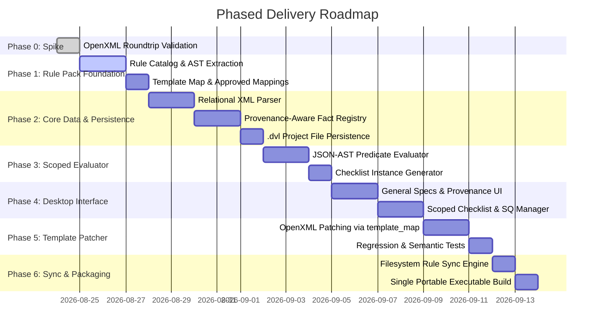

# Architectural Specification: AHU Detailing Verification Desktop Application (v3.0)

A modular, enterprise-grade Windows desktop application for Air Handling Unit (AHU) detailing verification.

---

## 1. System Architecture & Boundaries

```mermaid
flowchart TD
    subgraph Rule Pack Distribution ["Rule Pack (SharePoint / OneDrive / UNC)"]
        RP[Rule Pack Bundle<br/>• manifest.json<br/>• rules.json (Semantic Keys & AST)<br/>• template_map.json (Physical Cell Map)<br/>• approved_mappings.json (Confirmed Only)<br/>• template.xlsx]
    end

    subgraph Sync & Cache ["Sync Engine & Local Rule Store"]
        SYNC[Atomic Staging & Hash Validator] --> CACHE[(Local Rule Store<br/>Version Pinned / LKG Rollback)]
    end

    RP --> SYNC

    subgraph Data Pipeline
        XML[Config.xml] --> PARSER[Relational XML Parser & Schema Validator]
        PARSER --> RAW_MODEL[Layer 1: Normalized XML Graph<br/>Faithful Structural Representation]
        
        RAW_MODEL --> EXTRACTOR[Fact Extractor]
        CACHE -.->|Approved Mappings Only| EXTRACTOR
        
        EXTRACTOR --> FACT_REG[Layer 2: Provenance-Aware Fact Registry<br/>Known | Derived | Unknown | Overridden]
        
        CACHE --> EVAL[Scoped Rule Evaluator<br/>JSON-AST Predicates]
        FACT_REG --> EVAL
        
        EVAL --> CHECKLIST[Checklist Instance Generator<br/>Applicable | Not Applicable | Needs Input]
    end

    subgraph Project Persistence
        UI[Detailer Desktop UI<br/>Specs | SQs | Checklists | Overrides] <--> DVL[(.dvl Project File<br/>Header + Pinned RulePack + Raw Model + Facts + Checklist State)]
        CHECKLIST <--> UI
    end

    subgraph Handoff Deliverable
        UI --> PATCHER[OpenXML Template Patcher]
        CACHE -.->|Provides template.xlsx & template_map.json| PATCHER
        PATCHER --> OUT[Detailing Verification List.xlsx<br/>Official Deliverable for Checker]
    end
```

---

## 2. Core Decisions & Validation Results

### 2.1 Technology Stack
- **Target Platform**: Windows 10/11 (64-bit).
- **Core Desktop Runtime**: **.NET 8 / C# with Edge WebView2**.
- **Excel Engine**: **`DocumentFormat.OpenXml` (v3.1.1)**.
- **Deployment**: Single-file portable self-contained executable (`AHU_Verification.exe`).

### 2.2 Phase 0 Validation Results (Completed Spike)
The Phase 0 OpenXML roundtrip spike on `Detailing Verification List.xlsx` demonstrated:
- ✅ **100% Schema & Package Integrity**: `OpenXmlValidator` verified 0 schema errors across all 12 sheets.
- ✅ **Data Validation Extensions Preserved**: All 12 `DataValidations` elements remained 100% intact (no stripping).
- ✅ **Formula Chains Untouched**: All 23 formulas on `Check Information` (e.g. `='Drain Pan'!F1`, `=SUM(B8:B15)`) remained intact and operational.

---

## 3. Data Architecture: Two-Layer Separation

### 3.1 Layer 1: Normalized XML Graph (`NormalizedXmlGraph`)
A 1:1 structural representation of the parsed `Config.xml` without speculative business interpretations:
- **Unit Node**: Document version, generating software version, raw `<unitWeight>`, dimensions, shell options.
- **Shipping Skids**: Skid MOMID, resolved segment references (`segmentID`), resolved base references (`unitBaseID`). Raw XML attributes only.
- **Unit Bases**: Base ID, base height, raw `upturnedLipHeight` per base, insulation, housing style.
- **Segments**: Segment ID, tag code (`segment_IP`, `segment_FF`, `segment_HW`, `segment_FE`, etc.), pressure type, geometry.
- **Internals & Openings**: Raw component nodes, vendor codes (e.g. `vendorType="DDPG2"`), model numbers, geometry, and door openings.

### 3.2 Layer 2: Provenance-Aware Fact Registry (`FactRegistry`)
A focused, typed registry of the specific business facts required by verification rules:
```typescript
type FactStatus = 'Known' | 'Derived' | 'Unknown' | 'ManuallyOverridden';

interface Fact<T> {
  value: T | null;
  status: FactStatus;
  sourcePointer?: string;        // XPath / JSON Pointer into Layer 1 Normalized XML Graph
  sourceRawValue?: any;          // Exact uninterpreted XML value
  derivationName?: string;       // Name of approved derivation logic (if Derived)
  confidence: 'Authoritative' | 'RequiresConfirmation';
  overrideHistory?: Array<{
    previousValue: T | null;
    overriddenBy: string;
    timestamp: string;
    note?: string;
  }>;
}
```

### 3.3 Strict Weight & Code Mapping Semantics
1. **Skid Weight Semantics**:
   - The application does **not** assume an unverified formula (e.g. sum of segment + component + base) for skid weight.
   - If a skid has no explicit authoritative weight in the XML, `skid.weight` is marked `status: 'Unknown'`, and any rule requiring skid weight evaluates to **`Needs Input`** until confirmed or overridden by the detailer.
2. **No Speculative Code Mappings**:
   - Unknown/unconfirmed codes (e.g. `vendorType="DDPG2"`) are **not** guessed.
   - The Fact Registry records the raw code with `confidence: 'RequiresConfirmation'`.
   - Rules dependent on specific equipment classifications prompt the detailer for explicit confirmation.

---

## 4. Scoped Rules Engine & Semantic Key Decoupling

### 4.1 Separation of Semantic Keys from Excel Cell Addresses
- **Rule Definitions (`rules.json`)**:
  Rules reference purely **semantic keys** and structured JSON-AST predicates:
  ```json
  {
    "id": "BASE-01",
    "semanticKey": "BASE_LIFTING_LUG_SUPPORT",
    "scope": "Skid",
    "category": "Base",
    "subgroup": "Base Features",
    "order": 1,
    "text": "Lifting lugs have proper support when the skid is over 4,000lbs (Ref ASSY Manual page 391-40206-003)",
    "reference": "ASSY Manual page 391-40206-003",
    "requiredFacts": ["skid.weight"],
    "predicate": {
      ">": [{ "var": "skid.weight" }, 4000]
    },
    "allowNA": true,
    "verificationMode": "ManualCheckbox"
  }
  ```

- **Physical Template Map (`template_map.json`)**:
  A separate layout map defines physical worksheet coordinates:
  ```json
  {
    "templateVersion": "13.1.0",
    "cellMappings": {
      "GENERAL_DETAILER_NAME": { "sheet": "Verification List", "cell": "D3" },
      "GENERAL_COM_NUMBER": { "sheet": "Verification List", "cell": "D6" },
      "BASE_LIFTING_LUG_SUPPORT": {
        "verificationList": { "row": 29, "checkCol": "X" },
        "componentSheet": { "sheet": "Base", "row": 4, "commentCol": "A" }
      }
    }
  }
  ```
  *Benefit*: Layout adjustments in Excel templates do not affect rule definitions or project persistence.

### 4.2 Three-State Scoped Rule Evaluation
- `Applicable`: Predicate is strictly true using authoritative known/derived facts.
- `Not Applicable`: Predicate is strictly false.
- `Needs Input`: Required fact is `Unknown` or flagged `RequiresConfirmation`.

---

## 5. Early Project Persistence Specification (`.dvl`)

The `.dvl` project file is the authoritative single source of truth for the detailer's work session:
```json
{
  "formatVersion": "1.0",
  "appVersion": "1.0.0",
  "createdAt": "2026-08-24T17:30:00Z",
  "lastSavedAt": "2026-08-24T17:45:00Z",
  "author": "Detailer Name",
  "rulePack": {
    "version": "13.1.0",
    "sha256": "a3f8..."
  },
  "sourceXml": {
    "fileName": "Config.xml",
    "fileSha256": "4a5e...",
    "schemaVersion": "2018.9.14.1003",
    "rawXml": "<AHU>...</AHU>"
  },
  "normalizedGraph": { "unit": {}, "skids": [], "segments": [], "bases": [] },
  "factRegistry": {
    "unit.isSeismic": { "value": null, "status": "Unknown", "confidence": "RequiresConfirmation" },
    "unit.linerMaterial": { "value": "Aluminum", "status": "ManuallyOverridden" }
  },
  "sqItems": [
    { "index": 1, "text": "Custom drain pan depth 3.5 in." }
  ],
  "checklistInstances": [
    {
      "ruleId": "BASE-01",
      "instanceKey": "skid-1:BASE-01",
      "scopeTargetId": "skid-1",
      "applicability": "NeedsInput",
      "status": "Incomplete",
      "detailerComment": "",
      "updatedAt": "2026-08-24T17:40:00Z"
    }
  ]
}
```

---

## 6. Phased Implementation Plan



| Phase | Milestone | Core Deliverables |
|---|---|---|
| **Phase 0** | **Spike (Completed)** | Validated OpenXML 100% roundtrip on `Detailing Verification List.xlsx` with 0 schema errors and intact validations/formulas. |
| **Phase 1** | **Rule Pack Foundation** | Structured `rules.json` (semantic keys & AST), `template_map.json` (Excel coordinate mappings), and `approved_mappings.json` bundled with `template.xlsx`. |
| **Phase 2** | **Core Data & Persistence** | Layer 1 XML Parser (structural graph), Layer 2 Fact Registry (4-state provenance), and early `.dvl` project persistence implementation. |
| **Phase 3** | **Scoped Evaluator** | Predicate AST engine evaluating rules against Fact Registry across `Unit`, `Skid`, `Segment`, and `Component` scopes with `Applicable` / `Not Applicable` / `Needs Input`. |
| **Phase 4** | **Desktop Interface** | WebView2 desktop UI featuring General Specs, Skid breakdowns, SQ editor, Fact confirmation prompts, and dynamic checklists. |
| **Phase 5** | **Template Patcher** | OpenXML patcher injecting project facts, checklist marks, and comments into `template.xlsx` using `template_map.json`. |
| **Phase 6** | **Sync & Packaging** | Filesystem rule sync (OneDrive/UNC) with hash verification and LKG rollback; single-file `.exe` build. |
