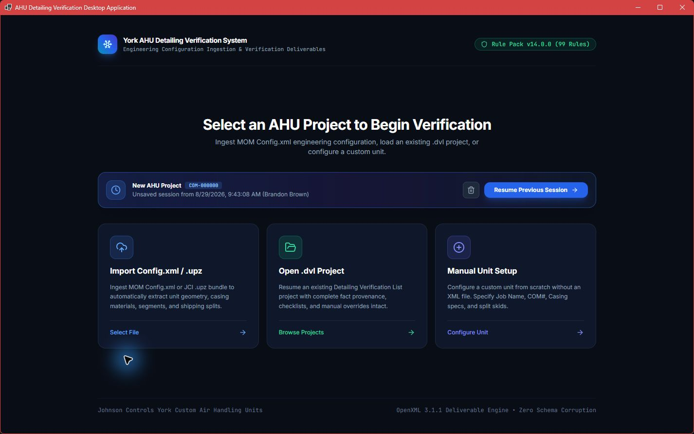
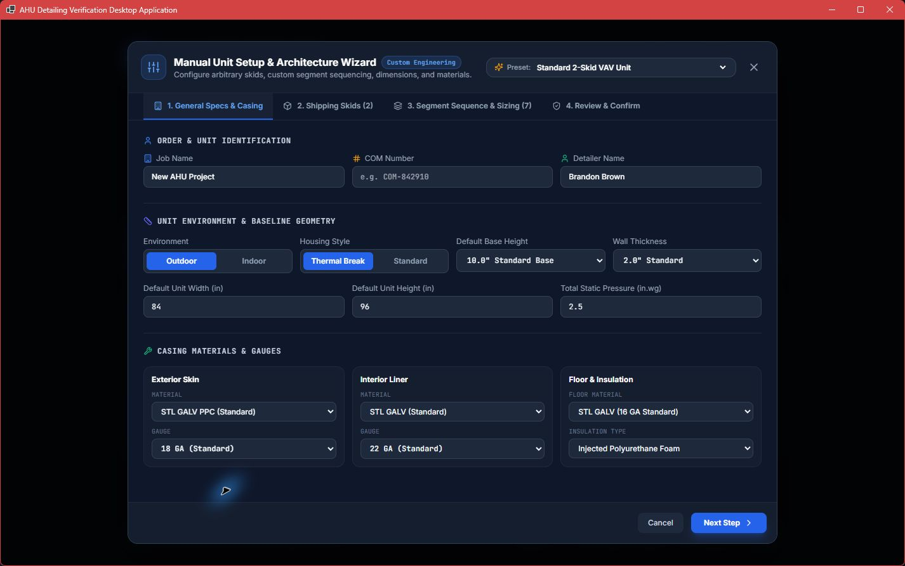
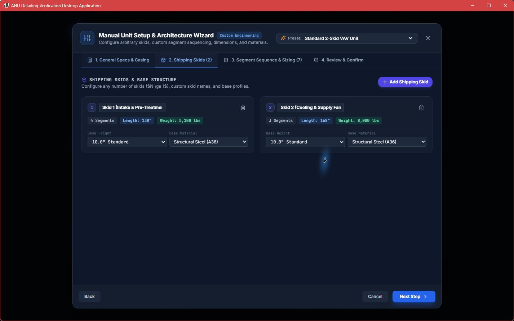
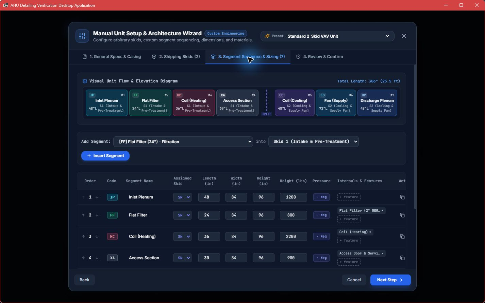
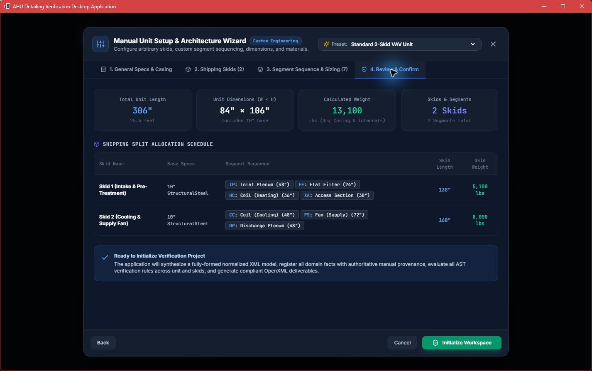
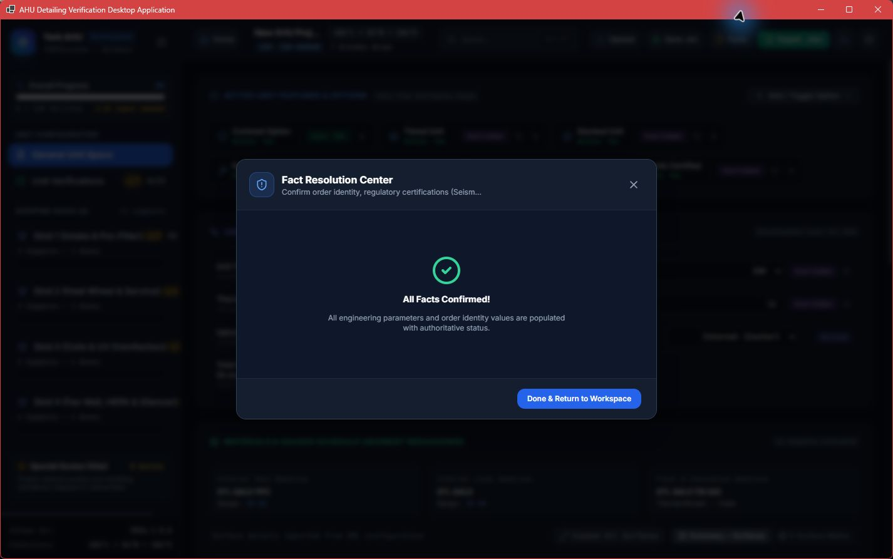
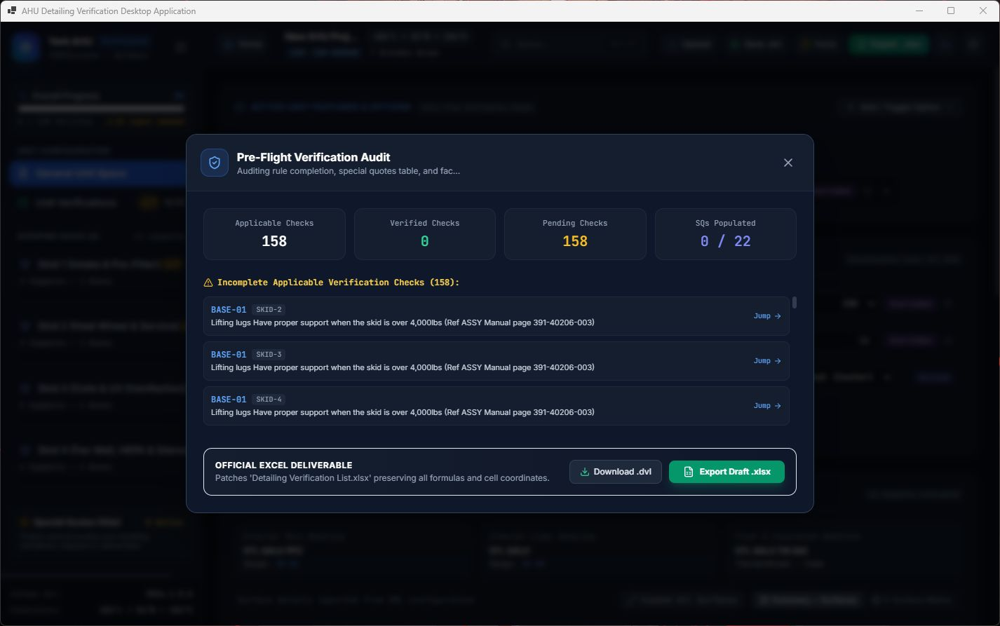

# Per-Screen Notes

## 01 — Home with autosave

- The three entry routes are understandable and the product identity is immediate.
- The stale autosave is visually dominant before the user has decided whether it is relevant.
- “OpenXML 3.1.1 Deliverable Engine • Zero Schema Corruption” reads like an internal implementation/quality claim rather than useful entry guidance.
- Secondary copy is visually subdued.

## 02 — Manual setup: General Unit

- Progressive disclosure is appropriate for a large engineering object.
- Form grouping, labels, units, and presets are strong.
- The full-width overlay is visually clear but is not exposed to UI Automation as a dialog; background content remains in the tree.

## 03 — Manual setup: Shipping Skids

- Skid cards communicate count, identity, and base data quickly.
- Literal `$N \\ge 1$` is a visible formatting defect.
- Repeated pills and bordered cards add more chrome than hierarchy.

## 04 — Manual setup: Segments

- This is one of the strongest screens: a dense, legible engineering table plus a useful unit diagram.
- Column ownership and repeated row patterns support fast scanning.
- The right edge is tight even at the main review width.

## 05 — Manual setup: Review

- Summary counts are useful before project creation.
- Shipping sequence becomes a long run of pills rather than a readable ordered structure.
- `StructuralSteel`, “normalized XML,” “domain facts,” “AST verification rules,” and “OpenXML deliverables” expose implementation vocabulary to detailers.

## 06 — Populated General Unit

- Real project state is visible immediately: progress, facts needed, skids, dimensions, and feature states.
- Materials are presented in an appropriate table.
- Sidebar shows a horizontal scrollbar; header identity truncates; compact icon actions compete with many status chips.

## 07 — Global search

- Once focused, result grouping across rules and facts is genuinely useful.
- Ctrl+K opened the surface but did not place keyboard focus in the input; typing worked only after a mouse click.

## 08 — Facts contradiction

- The success statement is crisp in isolation.
- It directly contradicts the persistent 15-input warning and per-skid fact-confirmation warnings behind it. This damages trust in completion state.
- Subtitle truncates despite the wide window.

## 09 — Export preflight

- Applicable, verified, pending, and SQ counts establish release state quickly.
- Incomplete rows and `Jump` make the preflight actionable; the tested Jump reached Skid 2.
- “Download .dvl” uses browser language in a desktop application.

## 10 — Skid verification, wide

- Grouped rules, applicability, check/N/A, comments, references, and keyboard legend are well aligned to expert work.
- The density is purposeful, not decorative.
- Long verification descriptions and reference lines truncate; users must expand or infer more often than necessary.

## 11 — Skid verification, narrow with sidebar

- The shell remains usable without overlap.
- Header labels collapse or disappear, project identity truncates, rule IDs wrap, and the grid requires horizontal scrolling.
- Keeping the full sidebar at this width leaves too little room for the primary task.

## 12 — Skid verification, narrow with collapsed sidebar

- Compact navigation materially improves the workspace and should be automatic or strongly suggested at narrow widths.
- The icon rail retains counts and active position.
- The grid still compresses description/comment space; it needs a deliberate responsive column policy, not only more canvas.

## 13 — Unit Verifications

- Mapped segments, filters, grouped checks, references, and keyboard legend create a credible expert workspace.
- The colored segment chips carry meaning, though their quantity approaches badge soup.
- The compact sidebar is a better default for this view.

## 14 — Settings: top

- Appearance, identity, rule-pack distribution, and update controls are grouped coherently.
- Modal subtitle clips at the normal review width.
- “Dark Theme — Zinc / High contrast” makes a claim that should be backed by measured contrast across secondary text and controls.

## 15 — Settings: bottom

- Shared export paths, autosave, and destructive reset are separated appropriately.
- Destructive actions use red and descriptive copy.
- Tall internal scrolling hides context and can separate users from the persistent Done action during traversal.

## 16 — Light theme

- Light mode applies consistently enough to be recognizable and the selection state is clear.
- The modal shell itself stays dark while its fields/cards become light, producing a mixed visual system that needs a dedicated light-theme QA pass.
- Dark mode was restored after capture.

## 17 — Project identity

- Field grouping and actions are straightforward.
- Subtitle truncates and newly opened modal does not receive UI Automation focus; Tab did not move focus off the root document in this host.
